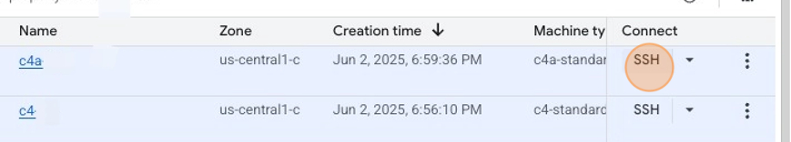
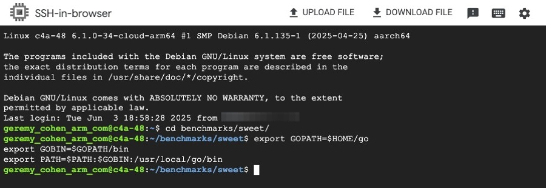

To begin, you'll run a benchmark by hand to get a feel for how `sweet` and `benchstat` work together.

### Run benchmarks on each machine

1. Navigate to the GCP [VM Instances](https://console.cloud.google.com/compute/instances) console.

2. Click on the `SSH` button next to your `c4a` instance.
An SSH terminal will open in a new tab.




3. Copy and paste the following into the SSH terminal to setup the environment and change to the sweet directory:

```bash
cd benchmarks/sweet
export GOPATH=$HOME/go
export GOBIN=$GOPATH/bin
export PATH=$PATH:$GOBIN:/usr/local/go/bin
```



{}
The above instructions assume you installed the benchmarks in the `~/benchmarks/sweet` directory. If you installed them elsewhere, adjust the path accordingly.
{} 

4. Copy and paste the following command to run the `markdown` benchmark with `sweet`:

```bash
sweet run -count 10 -run="markdown" config.toml
```
5. After the benchmark completes, cd to the `results/markdown` directory and lists the files to see the `arm-benchmarks.result` file:

```bash
cd results/markdown
ls -d $PWD/*
```
6. Copy the absolute pathname of `arm-benchmarks.result`.

7. Click `DOWNLOAD FILE`, and paste the **FULL ABSOLUTE PATH** you just copied for the filename, and then click `Download`. This will download the benchmark results to your local machine.


7. Once downloaded, on your local machine, rename this file to `c4a.result` so you can distinguish it from the x86 results you'll download later.  You'll know the file downloaded successfully if you see the file in your Downloads directory with the name `c4a.result`, as well as the confirmation dialog in your browser:


8. Repeat steps 2-7 with your `c4` (x86) instance.  Do everything the same, except after downloading the c4's `arm-benchmarks.result` file, rename it to `c4.result`.

Now that you have the results from both VMs, you can view and compare them using `benchstat`.
