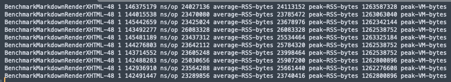
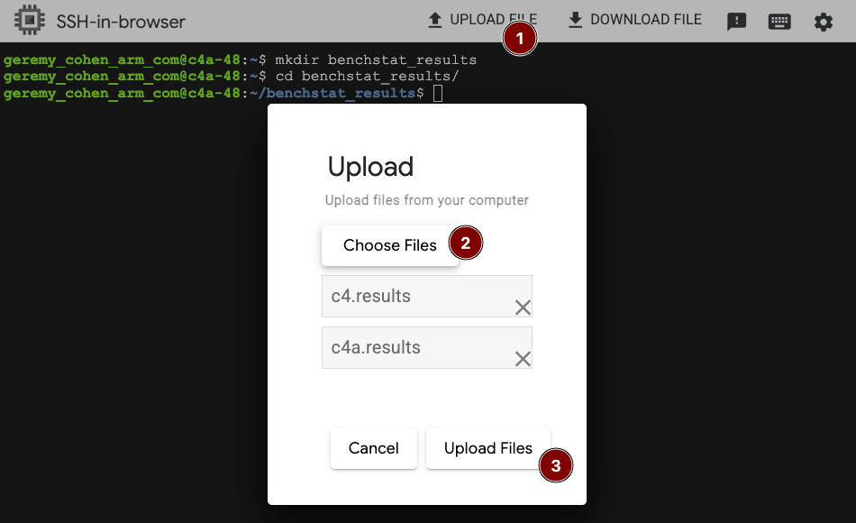
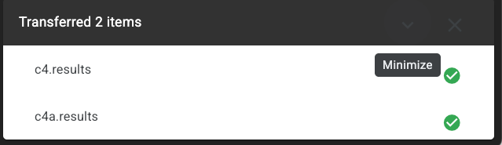

You've successfully run and downloaded the benchmark results from both your Arm-based and x86-based VMs. In this section, you'll use Benchstat to compare performance between the two instances.


## Inspecting the results files

If you're curious about the format of the results files, you can open them to better understand what `benchstat` is analyzing.

1. View raw results

Open the `c4a.result` file in a text editor, and you'll see something like this:

   

The file contains the results of the `markdown` benchmark run on the Arm-based c4a VM, showing time and memory stats taken for each iteration. If you open the `c4.result` file, you'll see similar results for the x86-based c4 VM.

2. Close the editor

Close the text editor when done.

## Run Benchstat to compare results

To compare the results, you'll use `benchstat` to analyze the two result files you downloaded. Since all the prerequisites are already installed on the `c4` and `c4a` instances, benchstat will be run from one of those instances.


1. Create working directory

Make a temporary benchstat directory to hold the results files on either the c4a or c4 instance, and change directory into it:

   ```bash
   mkdir benchstat_results
   cd benchstat_results
   ```

2. Upload result files

Click the `UPLOAD FILE` button in the GCP console, and upload the `c4a.results` AND `c4.results` files you downloaded earlier. (This uploads them to your home directory, not to the current directory.)

   

3. Verify upload

You'll know it worked correctly via the confirmation dialog in your terminal:

   

4. Move files to working directory

Move the results files to the `benchstat_results` directory, and confirm their presence:

   ```bash
   mv ~/c4a.results ~/c4.results .
   ls -al
   ```

   You should see both files in the `benchstat_results` directory:

   ```bash
   c4.results  c4a.results
   ```

5. Run benchstat

Now you can run `benchstat` to compare the two results files:

   ```bash
   export GOPATH=$HOME/go
   export GOBIN=$GOPATH/bin
   export PATH=$PATH:$GOBIN:/usr/local/go/bin
   benchstat c4a.results c4.results > c4a_vs_c4.txt
   ```

6. View comparison results

Run the `cat` command to view the results:

   ```bash
   cat c4a_vs_c4.txt
   ```

   You should see output similar to the following:

   ```output
                          │ c4a.results │     c4.results     │
                          │   sec/op    │   sec/op     vs base   │
   MarkdownRenderXHTML-48   143.9m ± 1%
   MarkdownRenderXHTML-96                 158.3m ± 0%
   geomean                  143.9m        158.3m       ? ¹ ²
   ¹ benchmark set differs from baseline; geomeans may not be comparable
   ² ratios must be >0 to compute geomean

                          │    c4a.results    │        c4.results        │
                          │ average-RSS-bytes │ average-RSS-bytes  vs base   │
   MarkdownRenderXHTML-48        22.49Mi ± 6%
   MarkdownRenderXHTML-96                            24.78Mi ± 2%
   geomean                       22.49Mi             24.78Mi       ? ¹ ²
   ¹ benchmark set differs from baseline; geomeans may not be comparable
   ² ratios must be >0 to compute geomean

                          │  c4a.results   │      c4.results       │
                          │ peak-RSS-bytes │ peak-RSS-bytes  vs base   │
   MarkdownRenderXHTML-48     23.67Mi ± 4%
   MarkdownRenderXHTML-96                      25.11Mi ± 7%
   geomean                    23.67Mi          25.11Mi       ? ¹ ²
   ¹ benchmark set differs from baseline; geomeans may not be comparable
   ² ratios must be >0 to compute geomean

                          │  c4a.results  │      c4.results      │
                          │ peak-VM-bytes │ peak-VM-bytes  vs base   │
   MarkdownRenderXHTML-48    1.176Gi ± 0%
   MarkdownRenderXHTML-96                    1.176Gi ± 0%
   geomean                   1.176Gi         1.176Gi       ? ¹ ²
   ¹ benchmark set differs from baseline; geomeans may not be comparable
   ² ratios must be >0 to compute geomean
   ```

   This output shows the performance differences between the two VMs for the `markdown` benchmark in text format. The key metrics to observe are:
   
   - **sec/op**: Shows the execution time per operation (lower is better)
   - **average-RSS-bytes**: Shows the average resident set size memory usage (lower is better)
   - **peak-RSS-bytes**: Shows the maximum resident set size memory usage (lower is better)
   - **peak-VM-bytes**: Shows the maximum virtual memory usage (lower is better)
   
   In this example, you can see that the c4a (Arm) instance completed the markdown benchmark in 143.9m seconds, while the c4 (x86) instance took 158.3m seconds, indicating better performance on the Arm system for this particular workload.
   
   If you wanted the results in CSV format, you could run the `benchstat` command with the `-format csv` option instead.

At this point, you can download the `c4a_vs_c4.txt` for further analysis or reporting. You can also run the same or different benchmarks with the same, or different combinations of VMs, and continue comparing results using `benchstat`.

In the next section, you will learn how to automate and gain enhanced visuals with sweet and benchstat.
