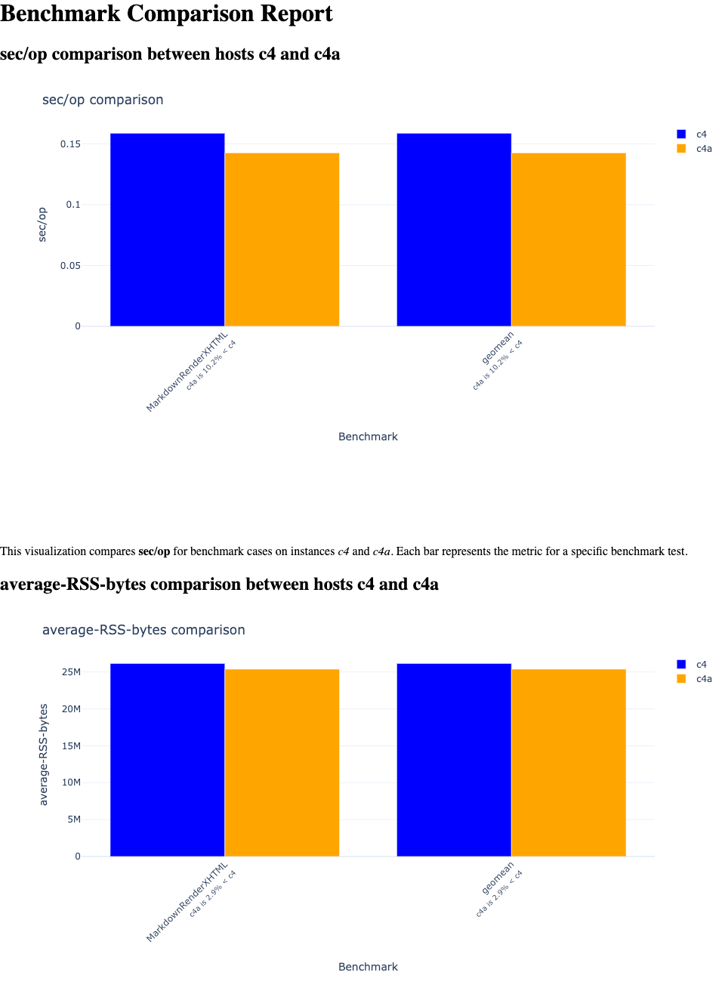

With `rexec_sweet.py` installed, your benchmarking instances running, and your localhost authenticated with GCP, you can now run `rexec_sweet.py`.

### Run an automated benchmark and analysis

1. Run the script:


```bash
python rexec_sweet.py
```
2. The script will prompt you for the name of the benchmark you want to run. Press enter to run the default benchmark, which is `markdown` (this is the reccomended benchmark to run the first time.)

3. The script will call into GCP to detect all running VMs, and will prompt you to select the first VM you want to run the benchmark on. Select the first VM (which you installed sweet and benchstat on previously) and press enter.

4. The script will prompt you to select the path to sweet.  If you followed the directions exactly, you can accept the default by hitting Enter, otherwise, choose the path manually, and press enter.

5. Repeat the process for the second VM.  If you are only running two VMs, the script will automatically select the second VM for you.

Upon entering the info for the second VM, the script will automatically run the benchmark on both VMs, and then run `benchstat` to compare the results.

```output
$ python rexec_sweet.py

=== Benchmark Runner ===

Select a benchmark (default is markdown):
1. biogo-igor
2. biogo-krishna
3. bleve-index
4. cockroachdb
5. esbuild
6. etcd
7. go-build
8. gopher-lua
9. markdown (default)
10. tile38
Enter number (1-10) [9]:

--- System 1 ---
Please wait while fetching the instances list...
Select an instance:
  1. c4-96 (default)
  2. c4a-48
Enter number (1-2) [1]:
Remote directory [~/benchmarks/sweet]:

--- System 2 ---
Only one instance available: c4a-48. Selecting it by default.
Remote directory [~/benchmarks/sweet]:

Running benchmarks on the selected instances...
[c4a-48] [sweet] Work directory: /tmp/gosweet1696486699
[c4a-48] [sweet] Benchmarks: markdown (10 runs)
[c4a-48] [sweet] Setting up benchmark: markdown
[c4-96] [sweet] Work directory: /tmp/gosweet2013611383
[c4-96] [sweet] Benchmarks: markdown (10 runs)
[c4-96] [sweet] Setting up benchmark: markdown
[c4a-48] [sweet] Running benchmark markdown for arm-benchmarks: run 1
[c4-96] [sweet] Running benchmark markdown for arm-benchmarks: run 1
...
[c4-96] [sweet] Running benchmark markdown for arm-benchmarks: run 9
[c4-96] [sweet] Running benchmark markdown for arm-benchmarks: run 10
[c4a-48] ✅ benchmark completed
[c4-96] ✅ benchmark completed
```
Once the benchmarks are complete, the script will run `benchstat` to compare the results from both VMs:

```output
Created remote temp dir on c4a-48: /tmp/tmp.uGNVwNF0dl
...
Generated report at results/c4-96-c4a-48-markdown-20250603T172114/report.html
Report generated in results/c4-96-c4a-48-markdown-20250603T172114
```
{}
If you see output messages from `rexec_sweet.py` similar to "geomeans may not be comparable" or "Dn: ratios must be >0 to compute geomean", this is expected and can be ignored. These messages indicate that the benchmark sets differ between the two VMs, which is common when running benchmarks on different hardware or configurations.
{}

Upon completion, the script will generate a report in the `results` subdirectory of the current working directory of the `rexec_sweet.py` script, which opens automatically in your web browser to view the benchmark results and comparisons.


