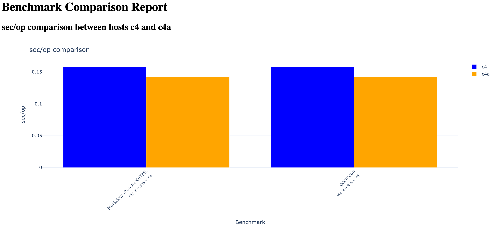

With `rexec_sweet` installed, your benchmarking instances running, and your local machine authenticated with GCP, you're ready to run automated benchmarks across your configured environments.

## Run an automated benchmark and generate results

To begin, open a terminal on your local machine and run:

```bash
rexec_sweet
```
The script will prompt you to choose a benchmark. 

Press **Enter** to run the default benchmark, markdown, which is a good starting point for your first run.

```bash
Available benchmarks:
1. biogo-igor
2. biogo-krishna
3. bleve-index
4. cockroachdb
5. esbuild
6. etcd
7. go-build
8. gopher-lua
9. markdown (default)
10. tile38
Enter number (1-10) [default: markdown]:
```

The script then detects your running GCP instances and displays them. You’ll be asked whether you want to use the first two instances it finds and the default install paths.

```output
Available instances:
1. c4 (will be used as first instance)
2. c4a (will be used as second instance)

Do you want to run the first two instances found with default install directories? [Y/n]:
```
You can accept the defaults by pressing **Enter**, which uses the instances listed and assumes Go and Sweet were installed to ~/benchmarks/sweet.

If you're running more than two instances or installed Go and Sweet to a non-default location, enter n and follow the prompts to manually select instances and specify custom install paths.

In this example, you'll manually select the instances and paths as shown below:

```output
Available instances:
1. c4 (will be used as first instance)
2. c4a (will be used as second instance)

Do you want to run the first two instances found with default install directories? [Y/n]: n

Select 1st instance:
1. c4
2. c4a
Enter number (1-2): 1
Enter remote path for c4 [default: ~/benchmarks/sweet]:

Select 2nd instance:
1. c4
2. c4a
Enter number (1-2): 2
Enter remote path for c4a [default: ~/benchmarks/sweet]:
Output directory: /private/tmp/a/go_benchmarks/results/c4-c4a-markdown-20250610T190407
...
```

After selecting instances and paths, the script will:
   - Run the selected benchmark on both VMs
   - Run `benchstat` to compare the results
   - Push the results to your local machine

```output
Running benchmarks on the selected instances...
[c4a] [sweet] Work directory: /tmp/gosweet3216239593
[c4] [sweet] Work directory: /tmp/gosweet2073316306...
[c4a] ✅ benchmark completed
[c4] ✅ benchmark completed
...
Report generated in results/c4-c4a-markdown-20250610T190407
```

### View the report

Once on your local machine, `rexec_sweet` will generate an HTML report that will open automatically in your web browser.

   If you close the report, you can reopen it by navigating to the `results` subdirectory and opening report.html in your browser.




{}
If you see output messages from `rexec_sweet.py` similar to "geomeans may not be comparable" or "Dn: ratios must be >0 to compute geomean", this is expected and can be ignored. These messages indicate that the benchmark sets differ between the two VMs, which is common when running benchmarks on different hardware or configurations.
{}

Upon completion, the script generates a report in the `results` subdirectory of the current working directory of the `rexec_sweet.py` script, which opens automatically in your web browser to view the benchmark results and comparisons.
