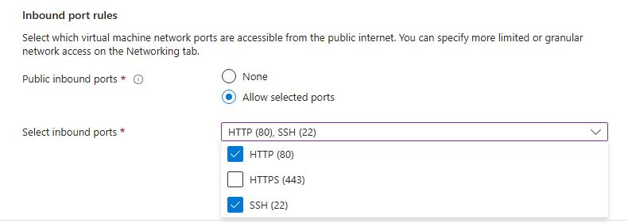

## Prerequisites and setup overview

There are several ways to create an Arm-based Cobalt 100 virtual machine: 

- The Azure Portal
- The Azure CLI
- An infrastructure as code (IaC) tool

In this section, you will launch the Azure Portal to create a virtual machine with the Arm-based Azure Cobalt 100 processor.

This Learning Path focuses on general-purpose virtual machines in the Dpsv6 series. For more information, see the [Microsoft Azure guide for the Dpsv6 size series](https://learn.microsoft.com/en-us/azure/virtual-machines/sizes/general-purpose/dpsv6-series).

While the steps to create this instance are included here for convenience, you can also refer to the [Deploy a Cobalt 100 virtual machine on Azure Learning Path](/learning-paths/servers-and-cloud-computing/cobalt/).

## Create an Arm-based Azure virtual machine

Creating a virtual machine on Azure Cobalt 100 follows the standard Azure VM flow. In the Azure portal, go to **Virtual machines**.

Select **Create**, then choose **Virtual machine** from the drop-down.

On the **Basics** tab, enter **Virtual machine name** and **Region**.

Under **Image**, choose your OS (for example, *Ubuntu Pro 24.04 LTS*) and set **Architecture** to **Arm64**.

In **Size**, select **See all sizes**, choose the **Dpsv6** series, then select **D4ps_v6**.

Under **Authentication type**, choose **SSH public key**. Azure can generate a key pair and store it for future use. For **SSH key type**, **ED25519** is recommended (RSA is also supported).

Enter the **Administrator username**.

If generating a new key, select **Generate new key pair**, choose **ED25519** (or **RSA**), and provide a **Key pair name**.

In **Inbound port rules**, select **HTTP (80)** and **SSH (22)**.

Select **Review + create** and review your configuration. It should look similar to:

When you’re ready, select **Create**, then **Download private key and create resources**.

Your virtual machine should be ready and running within no time. You can SSH into the virtual machine using the private key, along with the Public IP details.

{}To learn more about Arm-based virtual machines on Azure, see “Getting Started with Microsoft Azure” in [Get started with Arm-based cloud instances](/learning-paths/servers-and-cloud-computing/csp/azure).{}
