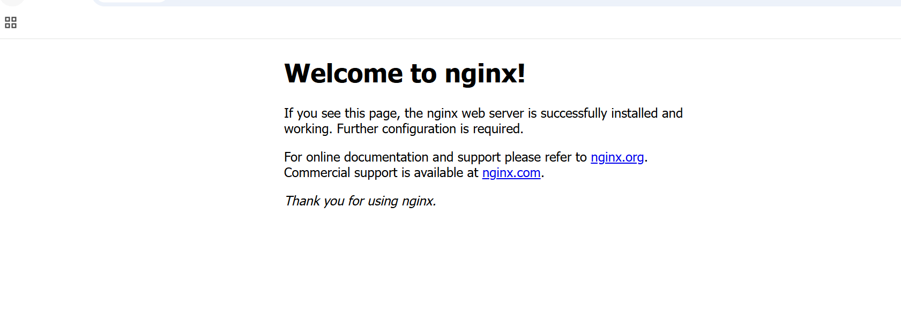

## Deploy NGINX using a custom Helm chart

This section explains how to deploy NGINX as a frontend service on Kubernetes using a custom Helm chart. After completing this section, you'll have NGINX deployed using Helm with public access through a LoadBalancer service, providing an external IP for browser access and a foundation for connecting backend services like Redis and PostgreSQL.

### Create Helm Chart
Generates a Helm chart skeleton that will be customized for NGINX.

```console
helm create my-nginx
```

### Resulting structure

```text
my-nginx/
├── Chart.yaml
├── values.yaml
└── templates/
```

### Clean templates

The default Helm chart includes several files that aren't required for a basic Nginx deployment. Remove the following files from `my-nginx/templates/` to avoid unnecessary complexity and template errors: ingress.yaml, hpa.yaml, serviceaccount.yaml, tests/, NOTES.txt, and httproute.yaml.

```console
cd ./my-nginx/templates
rm -rf hpa.yaml ingress.yaml serviceaccount.yaml tests/ NOTES.txt httproute.yaml
cd $HOME/helm-microservices
```

Only ngnix-specific templates will be maintained.

### Configure values.yaml

Replace the contents of `my-nginx/values.yaml` with the following to define configurable parameters including the NGINX image, service type, and public port:
```yaml
image:
  repository: nginx
  tag: latest

service:
  type: LoadBalancer
  port: 80
```

This configuration centralizes settings, allows service exposure without editing templates, and simplifies future changes.

### Deployment definition (deployment.yaml)

Replace the entire contents of `my-nginx/templates/deployment.yaml` with the following to define how the NGINX container runs inside Kubernetes, including the container image, pod labels, and port exposure:

```yaml
apiVersion: apps/v1
kind: Deployment
metadata:
  name: {{ include "my-nginx.fullname" . }}

spec:
  replicas: 1
  selector:
    matchLabels:
      app: {{ include "my-nginx.name" . }}

  template:
    metadata:
      labels:
        app: {{ include "my-nginx.name" . }}

    spec:
      containers:
        - name: nginx
          image: nginx
          ports:
            - containerPort: 80
```

### Service definition (service.yaml)

Replace the entire contents of `my-nginx/templates/service.yaml` with the following to expose NGINX to external traffic using a Kubernetes LoadBalancer:

```yaml
apiVersion: v1
kind: Service
metadata:
  name: {{ include "my-nginx.fullname" . }}
spec:
  type: LoadBalancer
  ports:
    - port: 80
  selector:
    app: {{ include "my-nginx.name" . }}
```

A LoadBalancer provides a public IP required for browser access and is a common pattern for frontend services.

### Install & Access

```console
cd $HOME/helm-microservices
helm install nginx ./my-nginx
```

```output
NAME: nginx
LAST DEPLOYED: Tue Jan 20 20:07:47 2026
NAMESPACE: default
STATUS: deployed
REVISION: 1
TEST SUITE: None
```

### Access NGINX from a browser

Get the external IP by running the following command:

```console
kubectl get svc
```

Wait until **EXTERNAL-IP** is assigned.

```output
NAME                       TYPE           CLUSTER-IP       EXTERNAL-IP   PORT(S)        AGE
kubernetes                 ClusterIP      34.118.224.1     <none>        443/TCP        42m
nginx-my-nginx             LoadBalancer   34.118.238.110   34.61.85.5    80:30954/TCP   69s
postgres-app-my-postgres   ClusterIP      34.118.233.240   <none>        5432/TCP       27m
redis-my-redis             ClusterIP      34.118.229.221   <none>        6379/TCP       8m24s
```

Open the external IP in your browser:

```bash
http://<EXTERNAL-IP>
```

You should see the default NGINX welcome page:



## What you've accomplished and what's next

You've successfully deployed NGINX as a frontend service using a custom Helm chart. The deployment includes public access through a LoadBalancer with an external IP, and the infrastructure is ready to route traffic to backend services.

This completes the helm-on-gcp Learning Path. You've learned how to install and configure Helm on Google Cloud C4A Arm-based virtual machines, create and manage GKE clusters, deploy applications using both official and custom Helm charts, and validate Helm workflows on Arm64-based Kubernetes infrastructure.

