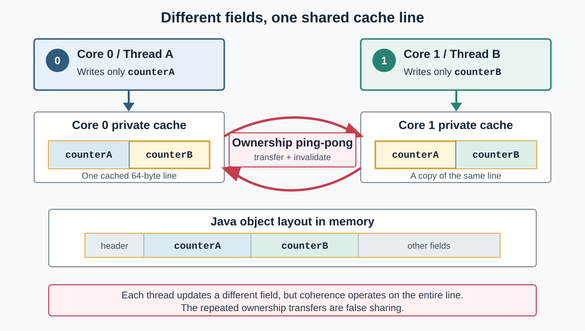

## Understand the cache-line effect

Caches transfer data between CPU cores and maintain coherence at the granularity of cache lines.
When one core writes to a location, the coherence
protocol generally grants it exclusive ownership of the complete line and
invalidates copies held by other cores. A 64-byte cache line is common on Arm Neoverse servers, but the line size is
implementation-dependent.

Processors maintain cache coherence for complete cache lines rather than
individual Java objects or fields. The JVM determines field layout, while the
allocator determines where an object resides in the heap. A moving garbage
collector can later relocate it. As a result, one cache line can contain fields
from one object or parts of multiple objects.

Cache-line sharing occurs when multiple cores access data in the same cache
line and at least one access is a write.

True sharing occurs when threads
communicate through the same variable. False sharing occurs when threads access
different variables that occupy the same cache line. The Java program treats
the variables as independent, but the hardware still maintains coherence for
their common cache line.

Java applications can encounter false sharing in three common forms:

- Independently written fields within one object
- Independently allocated objects placed on the same line
- Array elements updated by different workers

Object headers, inheritance, compressed references, field layout, object
alignment, allocation order, and garbage collection all influence the result.

## Understand the performance effect

When workers on different cores repeatedly write independent values in one
cache line, ownership of the line can move between their caches. The cores can
spend more time waiting for coherence transactions even though the Java
variables do not logically interact. This can increase latency and limit
multithreaded throughput.

Field adjacency makes false sharing possible; it does not prove that it occurs.
Object placement, thread placement, workload duration, and the processor all
affect the observed behavior. The remaining steps use Java Object Layout (JOL)
to inspect field offsets and Perf C2C to observe cache-line sharing before and
after adding padding.
