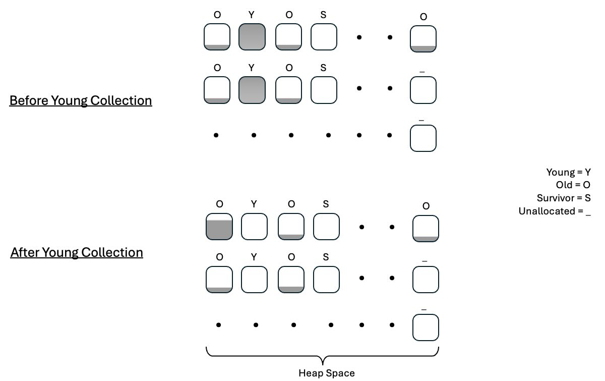

In this section, you will explore the key differences among commonly-used production GCs. You will learn about the advantages and disadvantages of each GC, along with guidance on selecting the best one for your Java application.

### Serial Garbage Collector

The Serial Garbage Collector (Serial GC) is a simple, single-threaded garbage collector, primarily designed for small applications or single-processor environments. As described earlier, Java’s heap is divided into two main generations, the new generation, to manage short-lived objects, and the old generation, to manage long-lived objects. 

In the Serial Garbage Collector, both the young and old generations are collected using a single-threaded, “stop-the-world” approach, where all application threads pause during garbage collection. This design can lead to noticeable application pauses, particularly as the heap size grows, making the Serial GC unsuitable for larger, latency-sensitive applications.

In production deployments, the Serial GC is rarely used in high-throughput or multi-threaded applications as it does not utilize the parallel processing capabilities of modern CPUs, and so has longer pause times compared to other collectors. These limitations make it inefficient for large-scale applications, where even brief pauses can disrupt user experience. However, for applications with limited memory and CPU resources, or those needing a predictable, single-threaded execution model, the Serial GC remains a straightforward and low-overhead option.

### Throughput Garbage Collector

The Parallel Garbage Collector, also called the Throughput Garbage Collector, uses the same generational heap structure as the Serial Garbage Collector, dividing memory into young and old generations to manage short-lived and long-lived objects. Unlike the Serial GC however, the Parallel GC uses multiple threads for Garbage Collection, which improves efficiency on larger heaps. When the young generation fills up, a young collection pause occurs, briefly pausing application threads to clear the young space. As shown in Figure 1, data in the young generation space is mostly freed, with surviving objects moved to the old generation.

Once the old generation is full, a full GC pause blocks all application threads for a longer duration to clean both generations. These full GC pauses can degrade performance in latency-sensitive applications, such as database management systems, where interruptions affect responsiveness. The Parallel GC’s multi-threaded approach helps reduce pause times, making it better-suited to applications that prioritize throughput and can handle occasional longer pauses for full collection.

### Garbage First Garbage Collector (G1GC)

From JDK Version 11, the G1GC is the default Garbage Collector. G1 Garbage Collector (GC) works by dividing the heap into discrete regions, typically around 2,048 by default. These regions can be part of either the old or new generation and do not need to be contiguous. The purpose of having regions in the old generation is to allow concurrent background threads to identify and target regions with a higher concentration of unreferenced objects. The trade-off of using concurrent threads is at the expense of slightly higher CPU utilization. G1GC is most effective when there is at least 20% unutilized CPU headroom. 

Although collecting a region still necessitates pausing application threads, G1GC can prioritize regions with the most garbage, thereby minimizing the time spent on garbage collection. The result is that the pause times for full GC pauses is less compared to the throughput collector. Figure 2 illustrates how the G1GC is divided into discrete chunks and how memory is freed.

### ZGC and Shenandoah Garbage Collectors

Heap compaction time in Java Garbage Collection refers to the process of reorganizing live objects in memory to eliminate fragmentation. In the G1GC, heap compaction time is determined by the time spent relocating objects within memory, which requires pausing all application threads during the process. In contrast, the ZGC and Shenandoah Garbage Collectors can perform heap compaction concurrently while the application continues running, reducing pause times. ZGC and Shenandoah GCs use a form of locking to implement concurrent heap compaction in a lightweight manner. Starting from JDK version 15, ZGC became production-ready. 

The ZGC and Shenandoah Garbage Collectors are particularly suited for applications that require ultra-low pause times and can benefit from concurrent garbage collection, making them ideal for large-scale, latency-sensitive applications such as real-time analytics, trading systems, and other interactive services. By allowing heap compaction to occur concurrently, these collectors significantly reduce application pauses compared to G1GC, which pauses all threads during compaction.

However, the trade-off with these collectors is a higher CPU overhead, as concurrent garbage collection requires additional processing while the application is running. 

### Comparison Table

You can use the following table as an approximate guide for your specific java application.

| Garbage Collector | Average Latency (ms) | Maximum Latency (ms) | Pros | Cons | When to Use | Example Application |
|-------------------|----------------------|----------------------|------|------|-------------|---------------------|
| **Serial**        | High (100-500 ms)    | Very High (500+ ms)  | Simple, low overhead | Freezes all application threads | Single-threaded environments, small heaps | Resource-constrained Docker containers |
| **Throughput**    | Moderate (50-200 ms) | High (200-500 ms)    | High throughput, uses multiple threads | Pauses application threads during GC | Applications that can tolerate pauses, need high throughput | Batch processing systems |
| **G1**            | Low to Moderate (10-100 ms) | Moderate (100-200 ms) | Focuses on regions with most garbage, concurrent collection | More complex, higher overhead | Large heaps, applications needing balanced throughput and latency | Web servers, application servers |
| **ZGC**           | Very Low (1-10 ms)   | Low (10-50 ms)       | Minimal pause times, scalable | High memory usage | Applications requiring very low latency | Financial trading systems |
| **Shenandoah**    | Very Low (1-10 ms)   | Low (10-50 ms)       | Concurrent collection, low pause times | Higher CPU usage, more complex | Applications needing low latency and large heaps | Real-time data processing |

