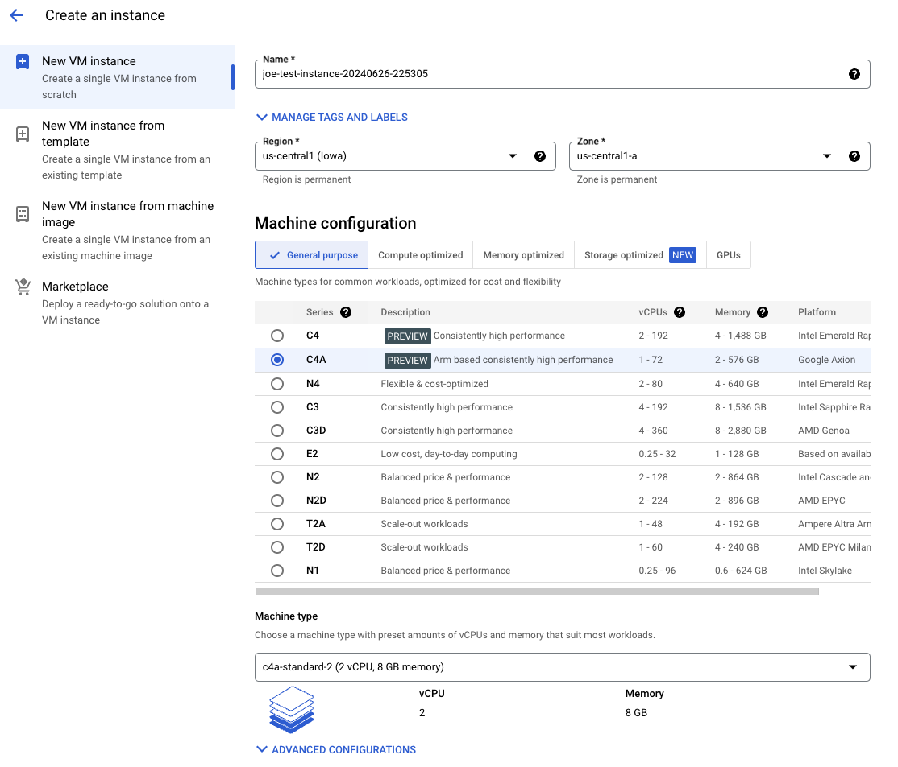
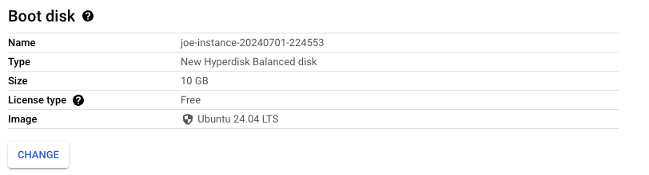

## Create an Axion instance

You can create an Axion instance from either the Google Cloud console or using your choice of IaC (Infrastructure as Code). Here are two options:

#### Option 1: Create an instance from the Google Cloud console

From [console.cloud.google.com](https://console.cloud.google.com), find "Compute Engine" on the left navigation bar. Under that menu, click "VM instances", and from the resulting page click the "CREATE INSTANCE" button at the top of the page.

From the machine configuration menu, select "C4A" as shown:



Optionally change the machine type to something with higher CPU and RAM, and then select Ubuntu 24.04 LTS as the boot disk:



All other settings can be left as defaults. The last step is to push the "CREATE" button.

#### Option 2: Create an instance using Terraform

If you already have your Google Cloud instances templated with Terraform (or any other Infrastructure as Code), all you need to do is change the machine type in your IaC.

For instance, here's the Terraform script equivalent to what was deployed from the console in the "Option 1" section above:

```tf
resource "google_compute_instance" "axion_instance" {
  name         = "c4a-instance"
  machine_type = "c4a-standard-2"
  zone         = "us-central1-a"

  boot_disk {
    initialize_params {
      image = "ubuntu-os-cloud/ubuntu-2404-lts-arm64"
    }
  }
}
```