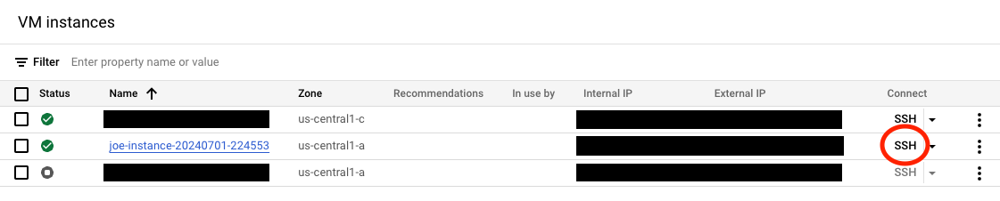

## Install Java

Now that you have an Axion instance running Ubuntu 24.04, you can SSH into it via the Google Cloud console:



This will bring up a separate window with a shell connected to your instance.

This Ubuntu image does not include Java, so you need to install it. First update `apt`:

```bash
sudo apt update
```

Then install the default Java Runtime Environment:

```bash
sudo apt install default-jre
```

Check to ensure that the JRE is properly installed:


```bash
java -version
```

Your output will look like this:

```bash
openjdk version "21.0.3" 2024-04-16
OpenJDK Runtime Environment (build 21.0.3+9-Ubuntu-1ubuntu1)
OpenJDK 64-Bit Server VM (build 21.0.3+9-Ubuntu-1ubuntu1, mixed mode, sharing)
```

Once the JRE is installed, you will want to install the default JDK:

```bash
sudo apt install default-jdk
```

After completion of the JDK installation, check the version:

```bash
javac -version
```

The output will look like this:

```bash
javac 21.0.3
```

{}
It's important to ensure that your version of OpenJDK is at least 11.0.9. There is a large performance gap between OpenJDK-11.0.8 and OpenJDK 11.0.9. A patch added in 11.0.9 reduces false-sharing cache contention. For more information you can view [patch JDK-8248214](https://bugs.openjdk.org/browse/JDK-8248214).
{}


## Deploy Spring Petclinic

spring-petclinic is an example Spring-based application that is simple to build and run.

First, download the repo:

```bash
git clone https://github.com/spring-projects/spring-petclinic.git
```

Next, enter the cloned directory and run the build script:

```bash
cd spring-petclinic
./mvnw package
```

This will build the jar file. Once built, you can test the web server by running the jar:

```bash
java -jar target/*.jar
```

Once the application is running, you can open the web app in a web browser by visiting

```bash
http://<EXTERNAL_IP>:8080
```

Where `<EXTERNAL_IP>` is the value you obtained in the [last section](/learning-paths/servers-and-cloud-computing/java-on-axion/1-create-instance/#obtain-the-ip-of-your-instance).
