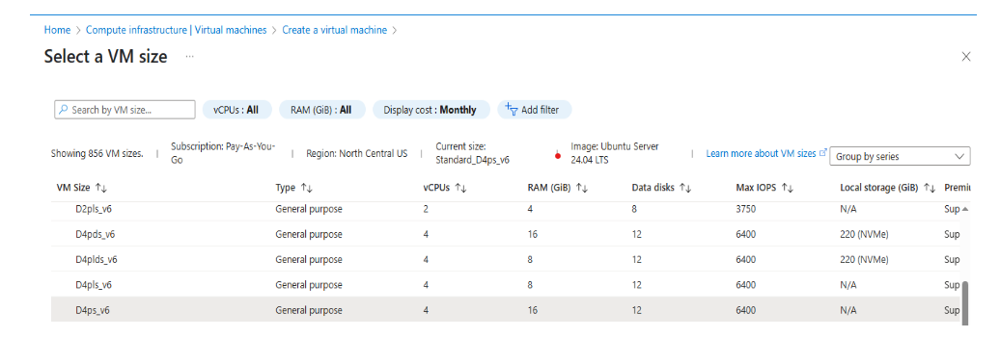

## Create an Azure Cobalt 100 Arm64 VM using the Azure portal

You can create an Azure Cobalt 100 Arm64 virtual machine in several ways, including the Azure portal, the Azure CLI, or an Infrastructure as Code (IaC) tool. 

In this Learning Path, you’ll use the Azure portal to create a VM with the Cobalt 100 processor, following a process similar to creating any other virtual machine in Azure.

## Step-by-step: create the virtual machine 

To create an Azure virtual machine, open the **Azure portal** and go to **Virtual machines**.

- Select **Create** > **Virtual machine** from the toolbar
- In **Basics**, complete **Instance details** including **Virtual machine name** and **Region**
- In **Image**, choose **Ubuntu Pro 24.04 LTS**, then set **Architecture** to **Arm64**
- In **Size**, select **See all sizes**, choose the **Dpsv6 (D‑series v6)** family, then select **D4ps_v6**
   
   
- Under **Administrator account**, set **Authentication type** to **SSH public key**
- Enter the **Username** for the VM
- Select **Generate new key pair**, choose **SSH key type** (**ED25519** or **RSA**), and provide a **Key pair name**
- In **Inbound port rules**, set **Public inbound ports** to **Allow selected ports**, then select **HTTP (80)** and **SSH (22)**
   
   
- Select **Review + create** and verify your configuration
   
   
- Select **Create**, then **Download private key and create resource**
    
    
- After deployment completes, select **Go to resource**. From **Overview**, copy the **Public IP address** and connect via SSH using your key

   

### Connect to your VM (example)

Use the command below, replacing placeholders with your values:
```bash
ssh -i <path-to-private-key> <username>@<public-ip-address>
```

{}
To learn more about Arm-based virtual machines in Azure, see "Getting started with Microsoft Azure" in [Get started with Arm-based cloud instances](/learning-paths/servers-and-cloud-computing/csp/azure).
{}
