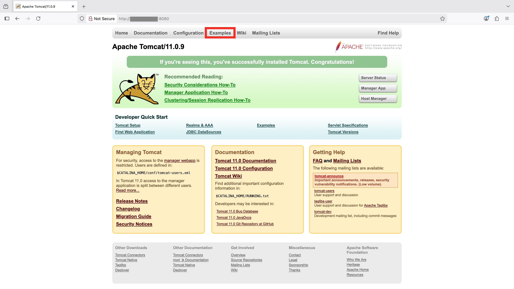
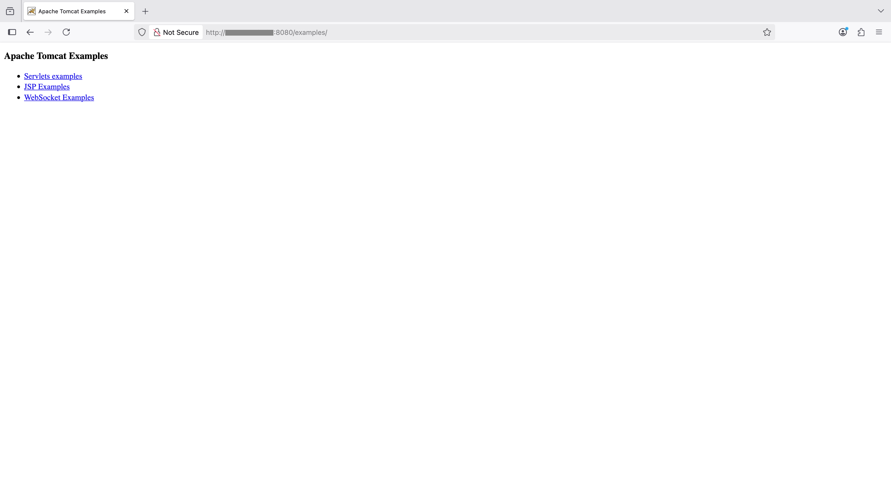

## Before You Begin 
- There are numerous performance analysis methods and tools for Java applications, among which the call stack flame graph method is regarded as a conventional entry-level approach. Therefore, generating flame graphs is considered a basic operation.
- Various methods and tools are available for generating Java flame graphs, including `async-profiler`, `Java Agent`, `jstack`, `JFR` (Java Flight Recorder), etc.
- This Learning Path focuses on introducing two simple and easy-to-use methods: `async-profiler` and `Java Agent`.


## Setup Benchmark Server - Tomcat
- [Apache Tomcat](https://tomcat.apache.org/) is an open-source Java Servlet container that enables running Java web applications, handling HTTP requests and serving dynamic content.
- As a core component in Java web development, Apache Tomcat supports Servlet, JSP, and WebSocket technologies, providing a lightweight runtime environment for web apps.

1. Start by installing Java Development Kit (JDK) on your Arm-based server:
```bash
sudo apt update
sudo apt install -y openjdk-21-jdk
```

2. Next, you can install Tomcat by either [building it from source](https://github.com/apache/tomcat) or downloading the pre-built package simply from [the official website](https://tomcat.apache.org/whichversion.html)
```bash
wget -c https://dlcdn.apache.org/tomcat/tomcat-11/v11.0.9/bin/apache-tomcat-11.0.9.tar.gz
tar xzf apache-tomcat-11.0.9.tar.gz
```

3. If you intend to access the built-in examples of Tomcat via an intranet IP or even an external IP, you need to modify a configuration file as shown:
```bash
vi apache-tomcat-11.0.9/webapps/examples/META-INF/context.xml
```
Then change the allow value as shown and save the changes:
```output
# change <Valve className="org.apache.catalina.valves.RemoteAddrValve" allow="127\.\d+\.\d+\.\d+|::1|0:0:0:0:0:0:0:1" />
# to
<Valve className="org.apache.catalina.valves.RemoteAddrValve" allow=".*" />
```
Now you can start Tomcat Server:
```bash
./apache-tomcat-11.0.9/bin/startup.sh
```

The output from starting the server should look like:

```output
Using CATALINA_BASE:   /home/ubuntu/apache-tomcat-11.0.9
Using CATALINA_HOME:   /home/ubuntu/apache-tomcat-11.0.9
Using CATALINA_TMPDIR: /home/ubuntu/apache-tomcat-11.0.9/temp
Using JRE_HOME:        /usr
Using CLASSPATH:       /home/ubuntu/apache-tomcat-11.0.9/bin/bootstrap.jar:/home/ubuntu/apache-tomcat-11.0.9/bin/tomcat-juli.jar
Using CATALINA_OPTS:
Tomcat started.
```

4. If you can access the page at "http://${tomcat_ip}:8080/examples" via a browser, you can proceed to the next benchmarking step.





## Setup Benchmark Client - [wrk2](https://github.com/giltene/wrk2)
`wrk2` is a high-performance HTTP benchmarking tool specialized in generating constant throughput loads and measuring latency percentiles for web services. `wrk2` is an enhanced version of `wrk` that provides accurate latency statistics under controlled request rates, ideal for performance testing of HTTP servers.

Currently `wrk2` is only supported on x86 machines. You will run the Benchmark Client steps shown below on an x86_64 Linux machine.


1. To use `wrk2`, you will need to install some essential tools before you can build it:
```bash
sudo apt-get update
sudo apt-get install -y build-essential libssl-dev git zlib1g-dev
```

2. Now you can clone and build it from source:
```bash
sudo git clone https://github.com/giltene/wrk2.git
cd wrk2
sudo make
```
Move the executable to somewhere in your PATH:
```bash
sudo cp wrk /usr/local/bin
```

3. Finally, you can run the benchamrk of Tomcat through wrk2.
```bash
wrk -c32 -t16 -R50000 -d60 http://${tomcat_ip}:8080/examples/servlets/servlet/HelloWorldExample
```
Shown below is the output of wrk2:

```console
Running 1m test @ http://172.26.203.139:8080/examples/servlets/servlet/HelloWorldExample
  16 threads and 32 connections
  Thread calibration: mean lat.: 0.986ms, rate sampling interval: 10ms
  Thread calibration: mean lat.: 0.984ms, rate sampling interval: 10ms
  Thread calibration: mean lat.: 0.999ms, rate sampling interval: 10ms
  Thread calibration: mean lat.: 0.994ms, rate sampling interval: 10ms
  Thread calibration: mean lat.: 0.983ms, rate sampling interval: 10ms
  Thread calibration: mean lat.: 0.989ms, rate sampling interval: 10ms
  Thread calibration: mean lat.: 0.991ms, rate sampling interval: 10ms
  Thread calibration: mean lat.: 0.993ms, rate sampling interval: 10ms
  Thread calibration: mean lat.: 0.985ms, rate sampling interval: 10ms
  Thread calibration: mean lat.: 0.990ms, rate sampling interval: 10ms
  Thread calibration: mean lat.: 0.987ms, rate sampling interval: 10ms
  Thread calibration: mean lat.: 0.990ms, rate sampling interval: 10ms
  Thread calibration: mean lat.: 0.984ms, rate sampling interval: 10ms
  Thread calibration: mean lat.: 0.991ms, rate sampling interval: 10ms
  Thread calibration: mean lat.: 0.978ms, rate sampling interval: 10ms
  Thread calibration: mean lat.: 0.976ms, rate sampling interval: 10ms
  Thread Stats   Avg      Stdev     Max   +/- Stdev
    Latency     1.00ms  454.90us   5.09ms   63.98%
    Req/Sec     3.31k   241.68     4.89k    63.83%
  2999817 requests in 1.00m, 1.56GB read
Requests/sec:  49997.08
Transfer/sec:     26.57MB
```


