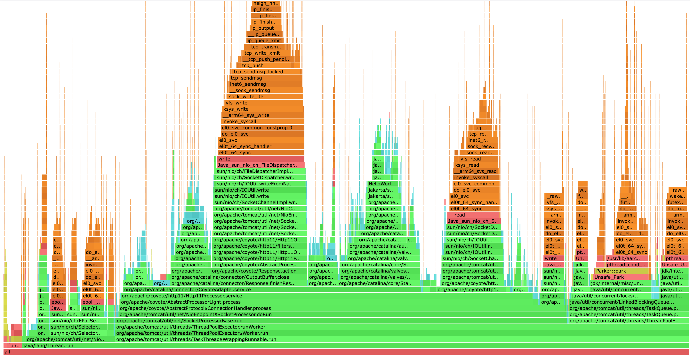

## Java Flame Graph Generation using [async-profiler](https://github.com/async-profiler/async-profiler)
`async-profiler` is a low-overhead sampling profiler for JVM applications, capable of capturing CPU, allocation, and lock events to generate actionable performance insights.
A lightweight tool for Java performance analysis, `async-profiler` produces flame graphs and detailed stack traces with minimal runtime impact, suitable for production environments. In this section, you will learn how to install and use it to profile your Tomcat instance being benchmarked.

You should deploy `async-profiler` on the same Arm Linux machine where Tomcat is running to ensure accurate performance profiling.
1. Download async-profiler-4.0 and uncompress
```bash
wget -c https://github.com/async-profiler/async-profiler/releases/download/v4.0/async-profiler-4.0-linux-arm64.tar.gz
tar xzf async-profiler-4.0-linux-arm64.tar.gz
```

2. Run async-profiler to profile the Tomcat instance under benchmarking
```bash
cd async-profiler-4.0-linux-arm64/bin
./asprof -d 10 -f profile.html $(jps | awk /Bootstrap/'{print $1}')
```
You can also run:
```
./asprof -d 10 -f profile.html ${tomcat_process_id}
```

3. Now launch `profile.html` in a browser to analyse your profiling result


