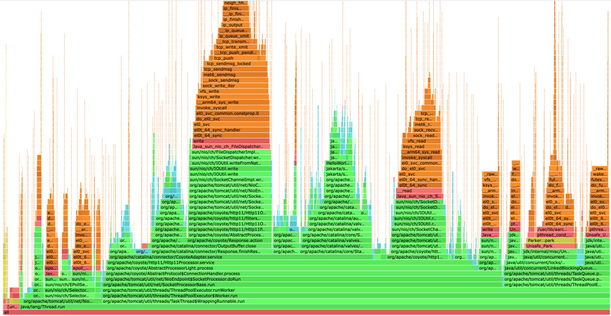

## Overview

[Async-profiler](https://github.com/async-profiler/async-profiler) is a low-overhead sampling profiler for JVM applications. It can capture CPU usage, memory allocations, and lock events to generate flame graphs and detailed stack traces.


This tool is well-suited for production environments due to its minimal runtime impact. In this section, you'll install and run `async-profiler` to analyze performance on your Tomcat instance under benchmark load.

{}
Install and run `async-profiler` on the same Arm-based Linux machine where Tomcat is running to ensure accurate profiling.
{}

## Install async-profiler

Download and extract the latest release:

```bash
wget -c https://github.com/async-profiler/async-profiler/releases/download/v4.0/async-profiler-4.0-linux-arm64.tar.gz
tar xzf async-profiler-4.0-linux-arm64.tar.gz
```

## Run the profiler

Navigate to the profiler binary directory:

```bash
cd async-profiler-4.0-linux-arm64/bin
```
Run async-profiler against the Tomcat process:

```bash
./asprof -d 10 -f profile.html $(jps | awk /Bootstrap/'{print $1}')
```
Alternatively, if you already know the process ID (PID):

```bash
./asprof -d 10 -f profile.html ${tomcat_process_id}
```
* `-d 10` sets the profiling duration to 10 seconds

* `-f profile.html` specifies the output file

## View the flame graph

Open the generated `profile.html` file in a browser to view your Java flame graph:


