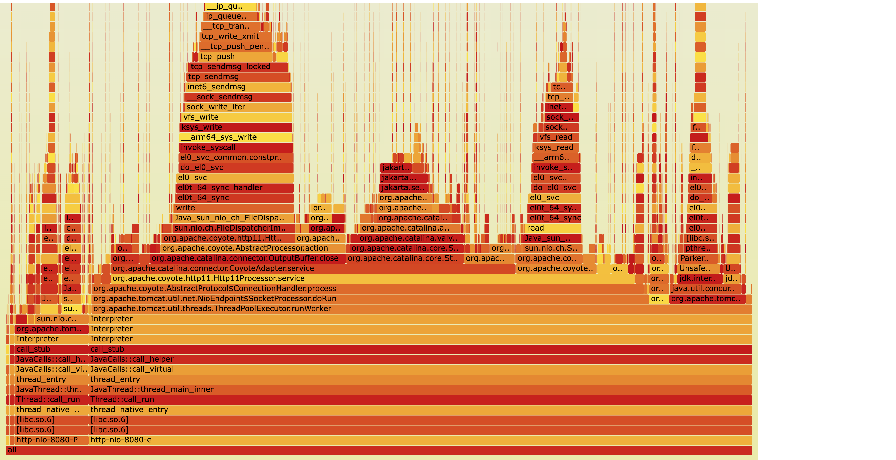

## Overview


You can profile a Java application using `perf` by including a Java agent that enables symbol resolution. This allows `perf` to capture meaningful method names instead of raw memory addresses.

The required library is `libperf-jvmti.so`, a JVM Tool Interface (JVMTI) agent that bridges `perf` and the JVM. It ensures that stack traces collected during profiling can be accurately resolved to Java methods.

In this section, you'll configure Tomcat to use this Java agent and generate a flame graph using the FlameGraph toolkit.

## Locate the Java agent

1. Find where `libperf-jvmti.so` is installed on your Arm-based Linux server: 
```bash
pushd /usr/lib
find . -name libperf-jvmti.so`
```
The output will show the path of the library that you will then include in your Tomcat setup file:
```bash
vi apache-tomcat-11.0.9/bin/catalina.sh
```
Add JAVA_OPTS="$JAVA_OPTS -agentpath:/usr/lib/linux-tools-6.8.0-63/libperf-jvmti.so -XX:+PreserveFramePointer" to `catalina.sh`. Make sure the path matches the location on your machine from the previous step.

Now shutdown and restart Tomcat:
```bash
cd apache-tomcat-11.0.9/bin
./shutdown.sh
./startup.sh
```

2. Use perf to profile Tomcat, and restart wrk that running on your x86 instance if necessary:
```bash
sudo perf record -g -k1 -p $(jps | awk /Bootstrap/'{print $1}') -- sleep 10
```
This command will record the collected data in a file named `perf.data`

3. Convert the collected `perf.data` into a Java flame graph using FlameGraph
```bash
git clone https://github.com/brendangregg/FlameGraph.git
export PATH=$PATH:`pwd`/FlameGraph
sudo perf inject -j -i perf.data | perf script | stackcollapse-perf.pl | flamegraph.pl &> profile.svg
```

4. You can now successfully launch `profile.svg` in a browser to analyse the profiling result


