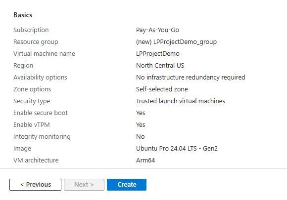

You can create an Arm-based Cobalt 100 virtual machine using the Microsoft Azure console, the Azure CLI tool, or Infrastructure as Code (IaC). For this Learning Path, you use the Azure console to create a virtual machine with an Arm-based Cobalt 100 processor. 

You'll focus on the general-purpose virtual machine of the D series. For more details, see [Dpsv6 size series](https://learn.microsoft.com/en-us/azure/virtual-machines/sizes/general-purpose/dpsv6-series) in the Microsoft Azure documentation.  

If you haven't used Microsoft Azure before, see [Create a Linux virtual machine in the Azure portal](https://learn.microsoft.com/en-us/azure/virtual-machines/linux/quick-create-portal?tabs=ubuntu). 

## Create an Arm-based Azure virtual machine 

To create an Azure virtual machine based on Cobalt 100, launch the Azure portal and navigate to **Virtual Machines**.

1. Select **Create**, and click on **Virtual Machine** from the drop-down list.
2. In the **Basic** tab, fill in the instance details such as **Virtual machine name** and **Region**.
3. Choose the image for your virtual machine (for example, **Ubuntu 24.04 LTS**) and select **Arm64** as the VM architecture.
4. In the **Size** field, click on **See all sizes** and select the **D-Series v6** family of virtual machines. Select **D4ps_v6** from the list.

5. Select **SSH public key** as an authentication type. Azure automatically generates an SSH key pair for you and allows you to store it for future use.
6. Fill in the administrator username for your virtual machine.
7. Select **Generate new key pair**, and select **RSA SSH Format** as the SSH key type. RSA offers better security with keys longer than 3072 bits. Give a key pair name to your SSH key.
8. In **Inbound port rules**, select **HTTP (80)** and **SSH (22)** as the inbound ports.

9. Click on the **Review + Create** tab and review the configuration for your virtual machine.

10. When you're confident about your selection, click on the **Create** button, and click on the **Download Private key and Create Resources** button.

11. Your virtual machine is ready and running in a few minutes. Press **Go to Resource** to view the new virtual machine details. You can SSH into the virtual machine using the private key and the public IP address.

{}

For more information about Arm-based virtual machines in Azure, see [Get started with Arm-based cloud instances](/learning-paths/servers-and-cloud-computing/csp/azure).

{}
