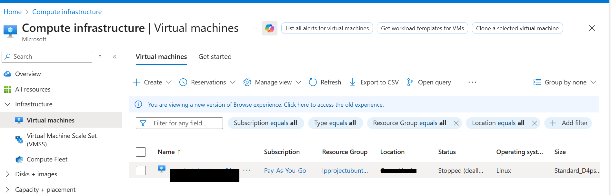
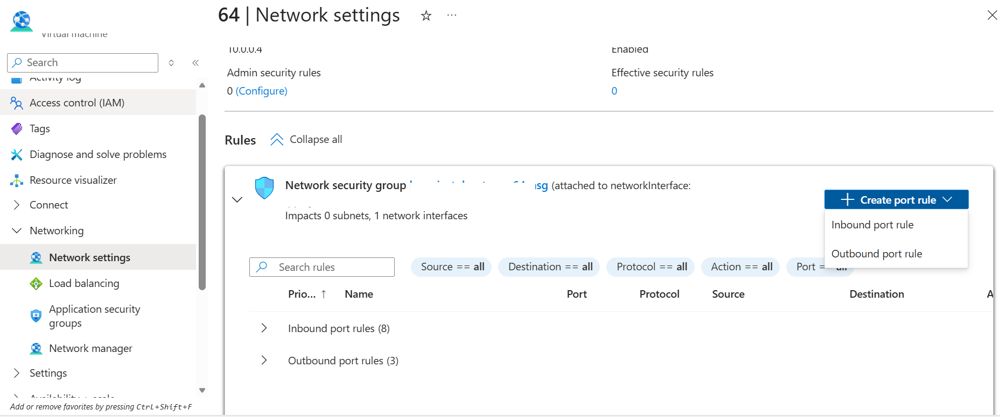
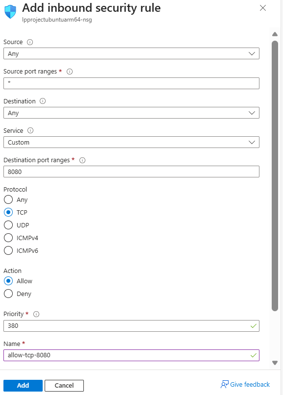

To allow external traffic on port 8080 for your application running on an Azure virtual machine, open the port in the Network Security Group (NSG) attached to the virtual machine's network interface or subnet.

{}
For more information about Azure setup, see [Getting started with Microsoft Azure Platform](/learning-paths/servers-and-cloud-computing/csp/azure/).
{}

## Create a firewall rule in Azure

To expose the TCP port 8080, create a firewall rule.

Navigate to the [Azure Portal](https://portal.azure.com), go to **Virtual Machines**, and select your virtual machine.

In the left menu, click **Networking** and in the **Networking** select **Network settings** that is associated with the virtual machine's network interface.

Navigate to **Create port rule**, and select **Inbound port rule**.

Configure it using the following details. After filling in the details, click **Add** to save the rule.

The network firewall rule is now created.
