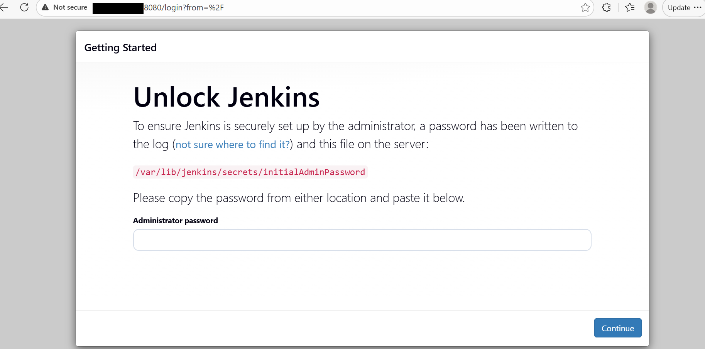
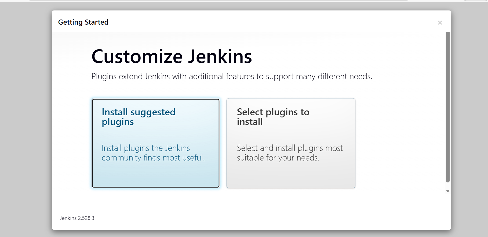
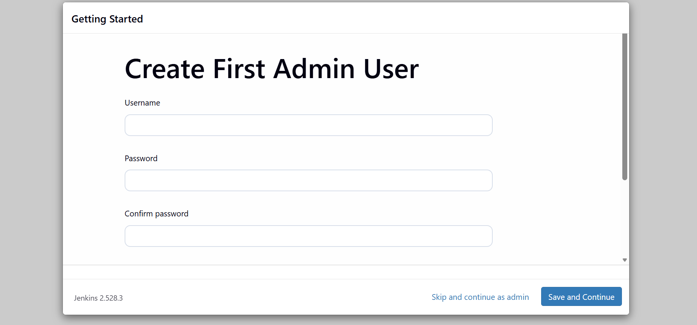
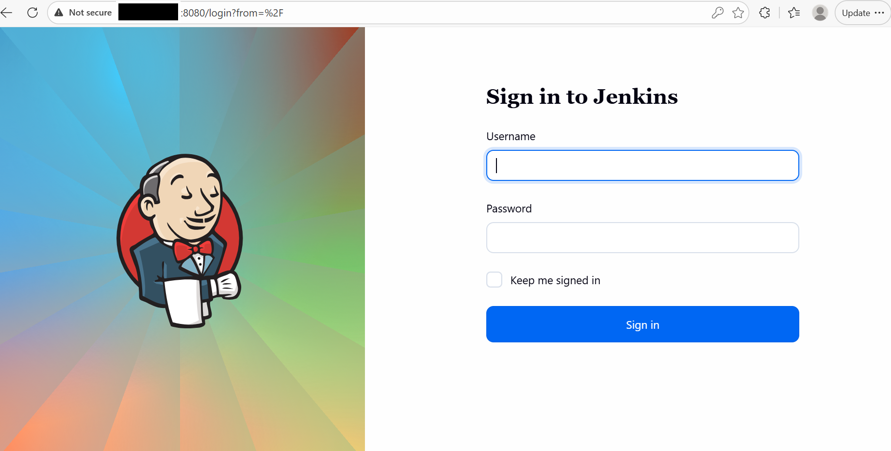
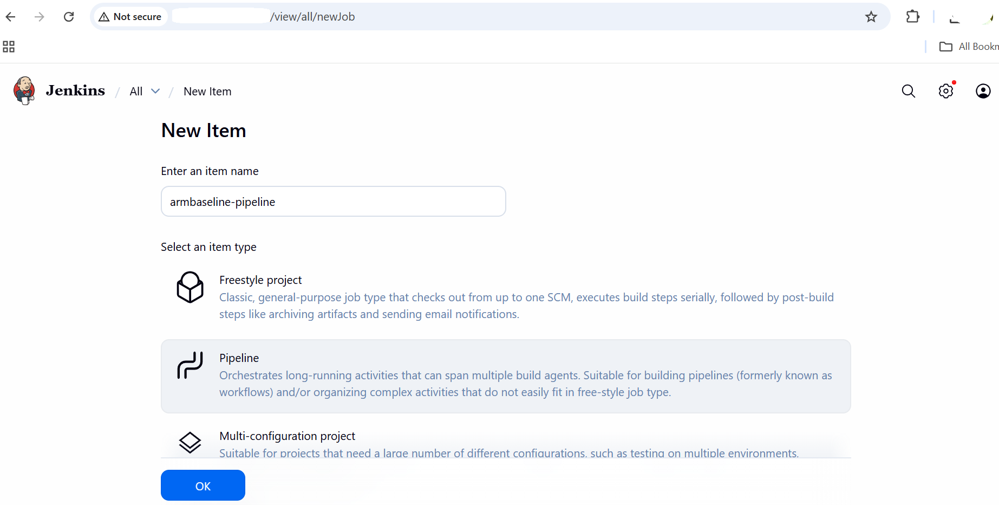
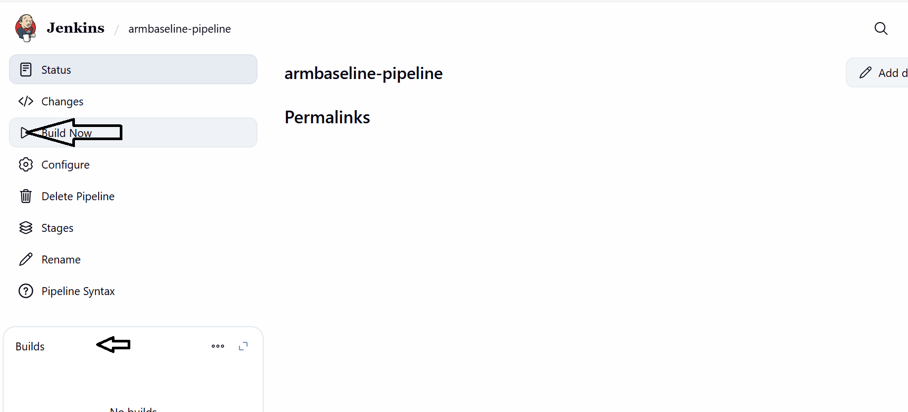

After installation completes, validate the Jenkins LTS setup on the Azure Ubuntu 24.04 Arm64 virtual machine. You'll verify service health, network access, Arm architecture, and run a first pipeline.

## Verify network configuration

Ensure Jenkins is listening on port 8080 and that the port is allowed at both the Azure and virtual machine levels.

Confirm Jenkins is actively listening on port 8080:

```console
ss -lntp | grep 8080
```

The expected output indicates Jenkins is listening:
```output
LISTEN 0 50 *:8080 *:*
```

## Retrieve the initial admin password

Retrieve the automatically generated Jenkins administrator password required for first-time login:

```console
sudo cat /var/lib/jenkins/secrets/initialAdminPassword
```

Copy and securely store this password for UI access.

## Verify Jenkins user and home directory

Validate that the Jenkins service user exists and that the Jenkins home directory is correctly configured:

```console
id jenkins
ls -ld /var/lib/jenkins
```

The output is similar to:
```output
drwxr-xr-x 12 jenkins jenkins 4096 Dec 16 06:11 /var/lib/jenkins
```

## Verify the Jenkins process

Confirm that the Jenkins process is running:

```console
ps -ef | grep jenkins
```

The output is similar to:
```output
jenkins    11986       1  9 06:04 ?        00:00:38 /usr/bin/java -Djava.awt.headless=true -jar /usr/share/java/jenkins.war --webroot=/var/cache/jenkins/war --httpPort=8080
azureus+   15126    2233  0 06:11 pts/0    00:00:00 grep --color=auto jenkins
```

## Verify Arm architecture

Ensure the virtual machine is running on Arm64 architecture:

```console
uname -m
```

The output is similar to: 
```text
aarch64
```

## Access the Jenkins UI

Open Jenkins in a local browser:

```text
http://<VM_PUBLIC_IP>:8080
```

### Complete UI setup

Complete the initial Jenkins setup using the web interface:

1. Paste the initial admin password saved previously.



2. Select **Install suggested plugins**.



3. Create an admin user.



4. Finish setup and reach the Jenkins dashboard.

## Execute a first Jenkins pipeline

Now that you've set up Jenkins, run a basic pipeline to validate that jobs can execute successfully on Arm.

### Open the Jenkins dashboard (if not already open)

Navigate to the Jenkins dashboard:

```text
http://<VM_PUBLIC_IP>:8080
```

Log in using your Jenkins credentials:



### Create a new pipeline job

Create a basic pipeline job to validate execution capability:

1. Click **New Item** (left sidebar).
2. Enter item name: `armbaseline-pipeline`.
3. Select **Pipeline**.
4. Click **OK**.



### Add the pipeline script

Configure a simple pipeline to validate Arm architecture and Java availability.

Scroll to the **Pipeline** section:

* **Definition**: Pipeline script

Paste the following script:

```groovy
pipeline {
  agent any

  stages {
    stage('Arm Validation') {
      steps {
        sh 'echo "Architecture:"'
        sh 'uname -m'

        sh 'echo "Java Version:"'
        sh 'java -version'
      }
    }
  }
}
```

Click **Save**.


### Run the pipeline

Trigger the pipeline execution:

1. On the job page, click **Build Now**.
2. A build number appears under **Build History**.



### View console output

Review the pipeline logs to confirm successful execution:

1. Click the build number (for example, `#1`).
2. Click **Console Output**.


## What you've accomplished and what's next

You've successfully validated your Jenkins LTS setup on Azure Ubuntu Arm64 using Java 17. Successful pipeline execution confirms:

* Jenkins LTS is running correctly
* Java 17 is properly configured
* Jenkins jobs execute natively on Arm64

Your system is now ready for CI/CD workloads on Arm architecture. In the next section, you'll explore more advanced CI use cases.
