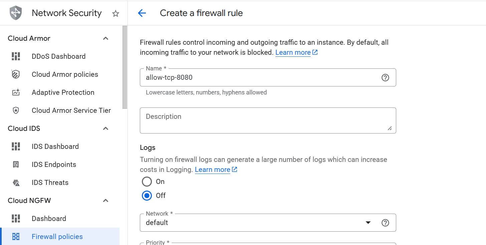
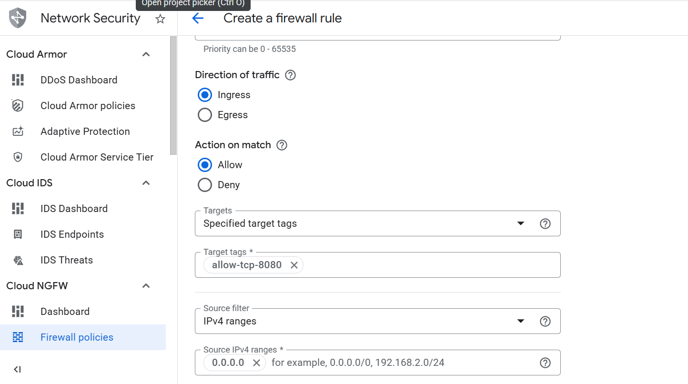

To allow inbound TCP traffic on port 8080, create a firewall rule in the Google Cloud Console.

{}
For more information about GCP setup, see [Getting started with Google Cloud Platform](/learning-paths/servers-and-cloud-computing/csp/google/).
{}

## Create a firewall rule in GCP

To expose the TCP port 8080, create a firewall rule.

Navigate to the [Google Cloud Console](https://console.cloud.google.com/), go to **VPC Network > Firewall**, and select **Create firewall rule**.

Next, create the firewall rule that exposes the TCP port 8080.
Set the **Name** of the new rule to "allow-tcp-8080". Select your network that you intend to bind to your VM (default is "autoscaling-net", but your organization might have others).

Set **Direction of traffic** to "Ingress". Set **Allow on match** to "Allow" and **Targets** to "Specified target tags".

Next, enter "allow-tcp-8080" in the **Target tags** text field. Set **Source IPv4 ranges** to "0.0.0.0/0".

Finally, select **Specified protocols and ports** under the **Protocols and ports** section. Select the **TCP** checkbox, enter "8080" in the **Ports** text field, and select **Create**.

The network firewall rule is now created, and you can continue with the VM creation.
