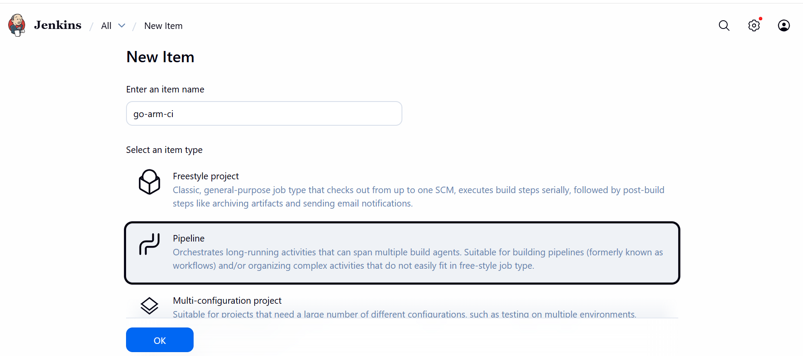
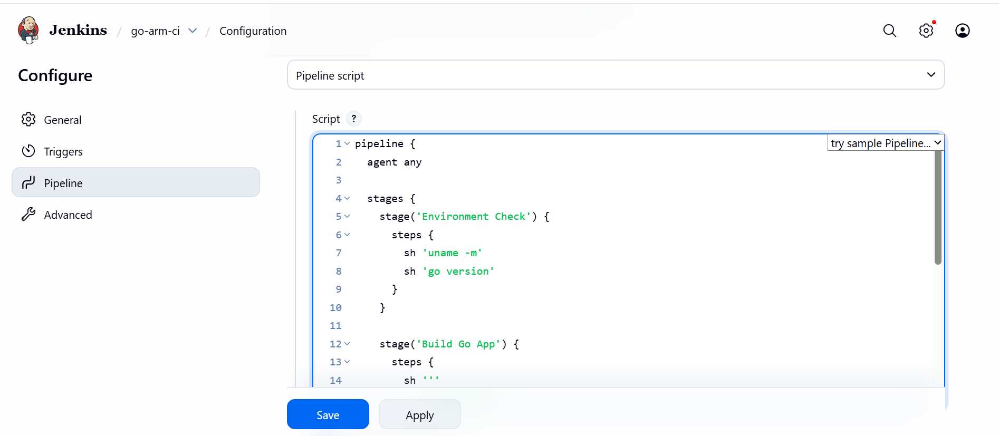
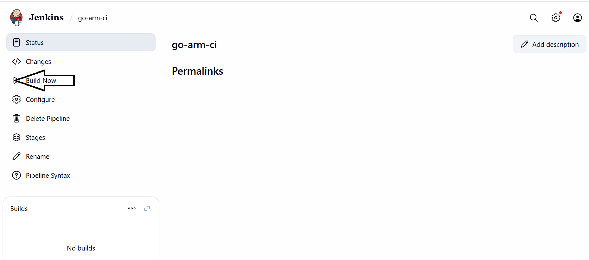
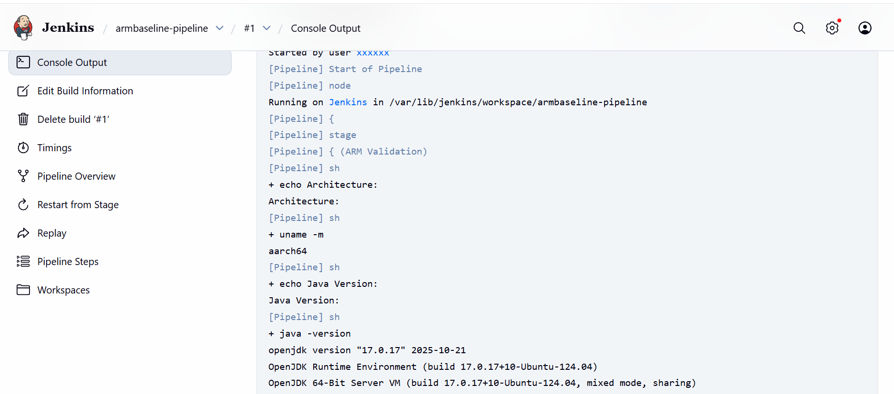

## Build an Arm-native Go CI pipeline

You can validate Arm-native CI execution on a GCP SUSE Arm64 virtual machine using Jenkins. Build and execute a simple Go application to confirm that Jenkins, Go, and the underlying system run natively on aarch64.

## Prerequisites

Before starting, ensure the following components are available:

* Jenkins installed and running on a GCP SUSE Arm64 virtual machine
* Jenkins web UI accessible

## Prepare a Go application on the GCP SUSE Arm64 virtual machine

Prepare a simple Go application that Jenkins will build and execute.

### Install Go

Install the Go programming language:

```console
sudo zypper install -y go
```

Verify Go installation:

```console
go version
```

The output is similar to:
```output
go version go1.x.x linux/arm64
```

### Create a sample Go application

Create a small Go program:

```console
mkdir -p ~/go-demo
cd ~/go-demo
```

Create `main.go`:

```console
cat <<EOF > main.go
package main

import "fmt"

func main() {
    fmt.Println("Hello from Go on Arm64 via Jenkins")
}
EOF
```

Initialize the Go module:

```console
go mod init go-demo
```

Test the application locally:

```console
go run main.go
```

The output is similar to:

```output
Hello from Go on Arm64 via Jenkins
```

## Create a Jenkins pipeline job

Create a Jenkins pipeline to build and run the Go application automatically.

### Create a new job

* Open the Jenkins UI
* Click **New Item**
* Job name: `go-arm-ci`
* Select **Pipeline**
* Select **OK**



### Configure the pipeline script

In the **Pipeline** section:

* Set **Definition** to **Pipeline script**
* Paste the following script:

{}
Update "/home/gcpuser/go-demo" in the script to reflect the actual location of your go-demo directory.
{}


```groovy
pipeline {
  agent any

  stages {
    stage('Environment Check') {
      steps {
        sh 'uname -m'
        sh 'go version'
      }
    }

    stage('Build Go App') {
      steps {
        sh '''
          cd $WORKSPACE
          cp -r /home/gcpuser/go-demo .
          cd go-demo
          go build -o app
        '''
      }
    }

    stage('Run Binary') {
      steps {
        sh '''
          cd $WORKSPACE/go-demo
          ./app
        '''
      }
    }
  }
}
```

Select **Save**.



### Run the pipeline

Trigger the pipeline:

* On the job page, select **Build Now**
* Select the build number



### View console output

Review the console logs to confirm the Go application was built and executed successfully:

* Select the build number (for example, `#1`)
* Select **Console Output**



## What you've accomplished and what's next

You've successfully validated an Arm-native Jenkins CI pipeline by building and executing a Go application on your GCP SUSE Arm64 virtual machine. Successful execution confirms:

* Jenkins jobs execute successfully on Arm64
* Go toolchain runs natively on aarch64
* Jenkins workspace and filesystem handling work correctly
* End-to-end CI execution works on GCP SUSE Arm64

Your Jenkins setup is now ready for cloud-native CI workloads on Arm architecture.
