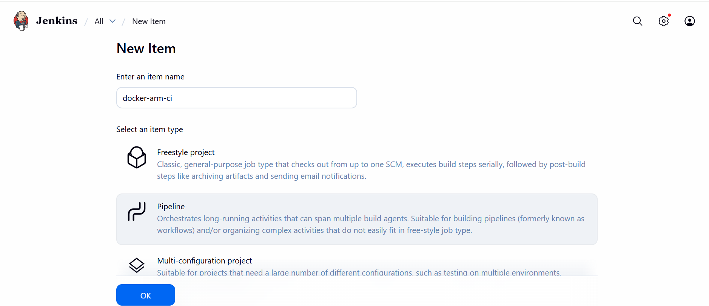
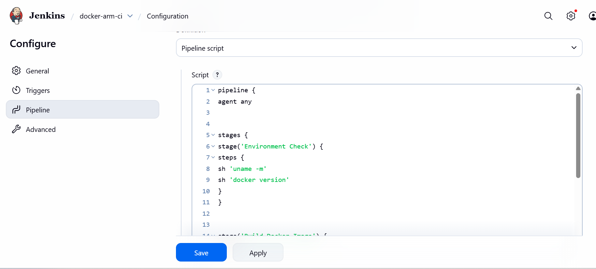
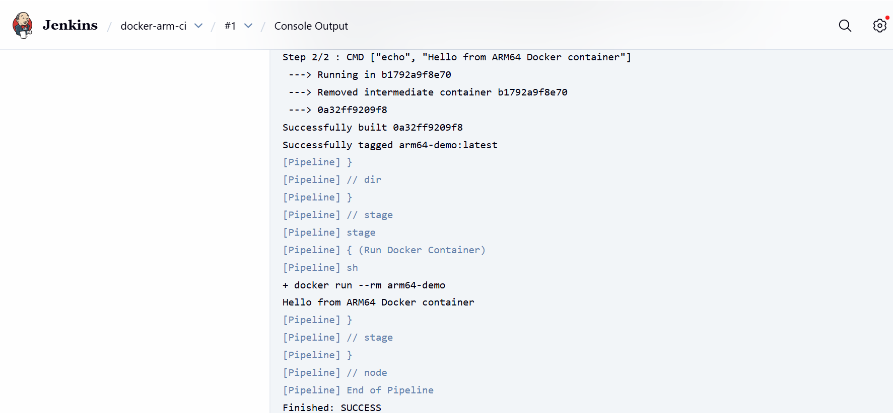

You can use Jenkins on a GCP SUSE Arm64 virtual machine to build and run a Docker container natively on Arm64. Validate Docker installation, Jenkins–Docker integration, and Arm-native container execution.

## Prerequisites

Before starting, ensure the following components are available:

* Jenkins installed and running on a GCP SUSE Arm64 virtual machine
* Jenkins web UI accessible
* Docker installed on the virtual machine
* Jenkins user added to Docker group

## Install Docker on the GCP SuSE Arm64 virtual machine

If not already installed, install Docker using the SUSE package manager:

```bash
sudo zypper refresh
sudo zypper install -y docker
```

Enable and start the Docker service:

```console
sudo systemctl enable docker
sudo systemctl start docker
```

## Allow Jenkins to use Docker

By default, Jenkins doesn't have permission to access Docker. Grant Docker access to the Jenkins user.

Add the Jenkins user to the Docker group:

```console
sudo usermod -aG docker jenkins
```

## Restart services

Restart services to ensure the new permissions take effect:

```console
sudo systemctl restart docker
sudo systemctl restart jenkins
```

## Verify Docker access as Jenkins

Confirm that Jenkins can successfully run Docker commands:

```console
sudo -u jenkins docker version
```

The output is similar to:
```output
Client:
 Version:           28.3.3-ce
 API version:       1.51
 Go version:        go1.24.5
 Git commit:        bea959c7b
 Built:             Tue Jul 29 12:00:00 2025
 OS/Arch:           linux/arm64
 Context:           default

Server:
 Engine:
  Version:          28.3.3-ce
  API version:      1.51 (minimum version 1.24)
  Go version:       go1.24.5
  Git commit:       bea959c7b
  Built:            Tue Jul 29 12:00:00 2025
  OS/Arch:          linux/arm64
  Experimental:     false
 containerd:
  Version:          v1.7.27
  GitCommit:        05044ec0a9a75232cad458027ca83437aae3f4da
 runc:
  Version:          1.2.6
  GitCommit:        v1.2.6-0-ge89a29929c77
 docker-init:
  Version:          0.2.0_catatonit
  GitCommit:
```

## Create a Docker demo directory

Create a directory to hold the Dockerfile:

```console
mkdir ~/docker-demo
cd docker-demo
pwd
```

## Create an Arm64 Dockerfile

Create a Dockerfile that uses an Arm64-native base image:

```bash
cat <<EOF > Dockerfile
FROM arm64v8/alpine:latest
CMD ["echo", "Hello from Arm64 Docker container"]
EOF
```

## Create a Jenkins pipeline job

Configure Jenkins to build and run the Docker container automatically.

### Open the Jenkins UI

```console
http://<VM_PUBLIC_IP>:8080
```

### Create a new pipeline job

* Open the Jenkins UI
* Click **New Item**
* Job name: `docker-arm-ci`
* Select **Pipeline**
* Click **OK**



### Add the pipeline script

Scroll to the **Pipeline** section:

* **Definition:** Pipeline script

Paste the following into the Pipeline script section:

{}
Update "/home/gcpuser/docker-demo" in the script to reflect the actual location of your docker-demo directory.
{}

```groovy
pipeline {
  agent any

  stages {
    stage('Environment Check') {
      steps {
        sh 'uname -m'
        sh 'docker version'
      }
    }

    stage('Build Docker Image') {
      steps {
        sh '''
          cd $WORKSPACE
          cp -r /home/gcpuser/docker-demo .
          cd docker-demo
          docker build -t arm64-docker-test .
        '''
      }
    }

    stage('Run Docker Container') {
      steps {
        sh '''
          docker run --rm arm64-docker-test
        '''
      }
    }
  }
}
```

Click **Save**.




### Execute the pipeline

Run the pipeline to verify Docker-based CI execution on Arm64:

* On the job page, click **Build Now**
* Click the build number
  


### View console output

Review the logs to confirm that each pipeline stage completed successfully:

* Click the build number (for example, `#1`)
* Click **Console Output**



## What you've accomplished and what's next

You've successfully validated Docker-based CI pipelines using Jenkins on your GCP SUSE Arm64 virtual machine. The output confirms:

- Jenkins is running on Arm64
- Docker is Arm-native
- Jenkins can build and run containers
- End-to-end Docker CI works on Arm

Your system is now ready for Arm-native containerized CI/CD workloads.
