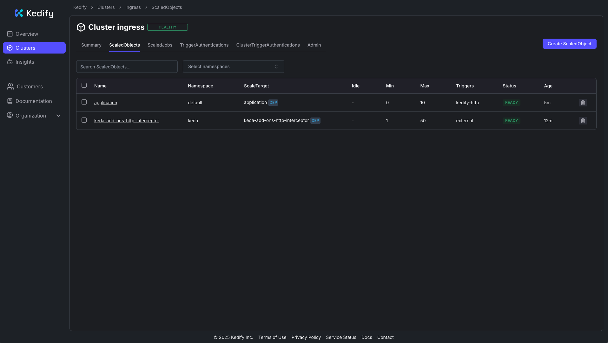
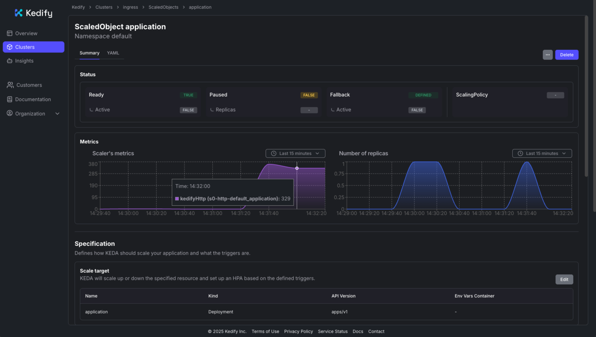

## How application autoscaling with Kedify works

Configure autoscaling for your deployed HTTP application with [Kedify’s HTTP Scaler](https://docs.kedify.io/scalers/http-scaler/). You'll then generate traffic and observe scale-out, scale-in, and scale-to-zero behavior when idle.

Kedify’s ingress autowiring routes traffic through its proxy so that requests are measured and drive scaling.

For more information, see [Scaling Deployments, StatefulSets & Custom Resources](https://keda.sh/docs/latest/concepts/scaling-deployments/) on the KEDA website.

With ingress autowiring enabled, Kedify automatically routes traffic through its proxy before it reaches your service and deployment:

```text
Ingress → kedify-proxy → Service → Deployment
```

The [Kedify proxy](https://docs.kedify.io/scalers/http-scaler/#kedify-proxy) gathers request metrics used by the scaler to make decisions.

There are three main components involved in the process:

- For the application deployment and service, there's an HTTP server with a small response delay to simulate work.
- For ingress, there's a public entry point that's configured using the `application.keda` host.
- For the `ScaledObject`, there's a Kedify HTTP scaler using `trafficAutowire: ingress`.

## Enable autoscaling with Kedify

The application is now running. Next, enable autoscaling so that it can scale dynamically between zero and 10 replicas. Kedify holds requests while the application scales from zero, subject to client timeouts. Apply the `ScaledObject` by running the following command:

```bash
cat <<'EOF' | kubectl apply -f -
apiVersion: keda.sh/v1alpha1

kind: ScaledObject
metadata:
  name: application
spec:
  scaleTargetRef:
    apiVersion: apps/v1
    kind: Deployment
    name: application
  cooldownPeriod: 5
  minReplicaCount: 0
  maxReplicaCount: 10
  fallback:
    failureThreshold: 2
    replicas: 1
  advanced:
    restoreToOriginalReplicaCount: true
    horizontalPodAutoscalerConfig:
      behavior:
        scaleDown:
          stabilizationWindowSeconds: 5
  triggers:
    - type: kedify-http
      metadata:
        hosts: application.keda
        pathPrefixes: /
        service: application-service
        port: "8080"
        scalingMetric: requestRate
        targetValue: "10"
        granularity: 1s
        window: 10s
        trafficAutowire: ingress
EOF
```

Use the following field descriptions to understand how the `ScaledObject` controls HTTP-driven autoscaling and how each setting affects traffic routing and scale decisions:

- `type: kedify-http` - Uses Kedify’s HTTP scaler.
- `hosts`, `pathPrefixes` - Define which requests are monitored for scaling decisions.
- `service`, `port` - Identify the Kubernetes Service and port that receive traffic.
- `scalingMetric: requestRate`, `granularity: 1s`, `window: 10s`, `targetValue: "10"` - Scale out when the average request rate exceeds ~10 requests per second (rps) per replica over the last 10 seconds.
- `minReplicaCount: 0` - Enables scale to zero when there is no traffic.
- `trafficAutowire: ingress` - Automatically wires your ingress to the Kedify proxy for seamless traffic management.

After applying the settings, the `ScaledObject` will appear in the [Kedify dashboard](https://dashboard.kedify.io/).



## Send traffic and observe scaling

Because no traffic is currently being sent to the application, it'll eventually scale down to zero replicas.

### Verify scale to zero

To confirm that the application has scaled down, run the following command and watch until the number of replicas reaches zero:

```bash
watch kubectl get deployment application -n default
```

The output is similar to:

```output
Every 2,0s: kubectl get deployment application -n default

NAME          READY   UP-TO-DATE   AVAILABLE   AGE
application   0/0     0            0           110s
```

This continuously monitors the deployment status in the `default` namespace. After traffic stops and the idle window has passed, you should see the application deployment report `0/0` replicas. `0/0` replicas indicates that the application has successfully scaled to zero.

### Verify that the app can scale from zero

Send a request to trigger scale-up:

```bash
curl -I -H "Host: application.keda" http://$INGRESS_ADDRESS
```

The application scales from zero to one replica automatically. You should receive an HTTP `200 OK` response, confirming that the service is reachable again.

### Generate load and observe scale-out

Now, generate a heavier, sustained load against the application. You can use `hey`, or a similar benchmarking tool:

```bash
hey -n 40000 -c 200 -t 60 -host "application.keda" http://$INGRESS_ADDRESS
```

While the load test is running, open another terminal and monitor the deployment replicas in real time:

```bash
watch kubectl get deployment application -n default
```

You'll see that the number of replicas change dynamically. 

The output is similar to:

```output
Every 2,0s: kubectl get deployment application -n default

NAME          READY   UP-TO-DATE   AVAILABLE   AGE
application   5/5     5            5           23m
```

The following is the expected behavior:
- On bursty load, Kedify scales the deployment up toward `maxReplicaCount`.
- When traffic subsides, replicas scale down. After the cooldown, they can return to zero.

You can also monitor traffic and scaling in the Kedify dashboard:



## Clean up resources

When you've finished testing, remove the resources that you created to free up your cluster:

```bash
kubectl delete scaledobject application
kubectl delete ingress application-ingress
kubectl delete service application-service
kubectl delete deployment application
```
This will delete the `ScaledObject`, Ingress, Service, and Deployment associated with the demo application.

## What you've accomplished

You've configured a Kedify `ScaledObject` and tested scale-to-zero, scale-up, and replica changes under load. You've monitored scaling in the dashboard. After testing, you removed the sample application resources.

You can further explore the [Kedify How-To Guides](https://docs.kedify.io/how-to/) for more configurations such as Gateway API, Istio VirtualService, or OpenShift Routes.
