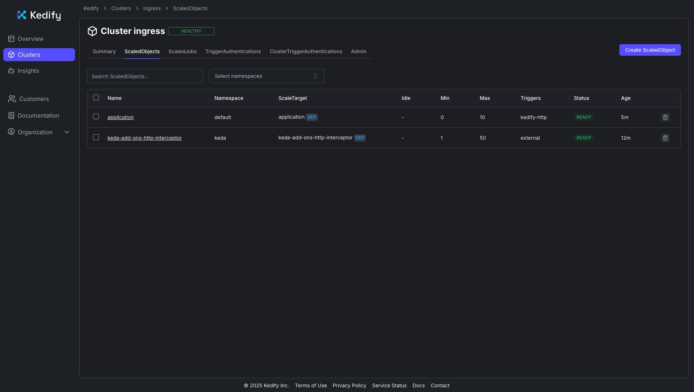

## Overview

In this section, you’ll gain hands-on experience with Kedify HTTP autoscaling. You will deploy a small web service, expose it through a standard Kubernetes Ingress, and rely on Kedify’s autowiring to route traffic through its proxy so that requests are measured and drive scaling.

You will scale a real HTTP app exposed through Kubernetes Ingress using [Kedify’s HTTP Scaler](https://docs.kedify.io/scalers/http-scaler/), and then move on to deploy a simple application, enable autoscaling with a scaled object, generate load, and observe the system scale out and back in (including scale-to-zero when idle). 

For more information, see [Scaling Deployments, StatefulSets & Custom Resources](https://keda.sh/docs/latest/concepts/scaling-deployments/) on the KEDA website.  

## How it works

With ingress autowiring enabled, Kedify automatically routes traffic through its proxy before it reaches your service and deployment:

```output
Ingress → kedify-proxy → Service → Deployment
```

The [Kedify proxy](https://docs.kedify.io/scalers/http-scaler/#kedify-proxy) gathers request metrics used by the scaler to make decisions.

## Deployment overview

There are three main components involved in the process:
* For the application deployment and service, there is an HTTP server with a small response delay to simulate work.
* For ingress, there is a public entry point that is configured using the `application.keda` host.
* For the ScaledObject, there is a Kedify HTTP scaler using `trafficAutowire: ingress`.

## Configure the Ingress IP environment variable

Before testing the application, make sure the `INGRESS_IP` environment variable is set to your ingress controller’s external IP address or hostname.

If you followed the [Install Ingress Controller](../install-ingress/) guide, you should already have this set. If not, or if you're using an existing ingress controller, run this command:

```bash
export INGRESS_IP=$(kubectl get service ingress-nginx-controller --namespace=ingress-nginx -o jsonpath='{.status.loadBalancer.ingress[0].ip}{.status.loadBalancer.ingress[0].hostname}')
echo "Ingress IP/Hostname: $INGRESS_IP"
```
This will store the correct IP or hostname in the $INGRESS_IP environment variable. If no value is returned, wait a short while and try again.

{}
If your ingress controller service uses a different name or namespace, update the command accordingly. For example, some installations use `nginx-ingress-controller` or place it in a different namespace.
{}

## Deploy the application and configure Ingress

Now you will deploy a simple HTTP server and expose it using an Ingress resource. The source code for this application is available on the [Kedify GitHub repository](https://github.com/kedify/examples/tree/main/samples/http-server).

Run the following command to deploy your application:

```bash
cat <<'EOF' | kubectl apply -f -
apiVersion: apps/v1
kind: Deployment
metadata:
  name: application
spec:
  replicas: 1
  selector:
    matchLabels:
      app: application
  template:
    metadata:
      labels:
        app: application
    spec:
      nodeSelector:
        kubernetes.io/arch: arm64
      tolerations:
        - key: "kubernetes.io/arch"
          operator: "Equal"
          value: "arm64"
          effect: "NoSchedule"
      containers:
        - name: application
          image: ghcr.io/kedify/sample-http-server:latest
          imagePullPolicy: Always
          ports:
            - name: http
              containerPort: 8080
              protocol: TCP
          env:
            - name: RESPONSE_DELAY
              value: "0.3"
---
apiVersion: v1
kind: Service
metadata:
  name: application-service
spec:
  ports:
    - name: http
      protocol: TCP
      port: 8080
      targetPort: http
  selector:
    app: application
  type: ClusterIP
---
apiVersion: networking.k8s.io/v1
kind: Ingress
metadata:
  name: application-ingress
spec:
  ingressClassName: nginx
  rules:
    - host: application.keda
      http:
        paths:
          - path: /
            pathType: Prefix
            backend:
              service:
                name: application-service
                port:
                  number: 8080
EOF
```

## Key settings explained

The manifest includes a few key options that affect scaling behavior:

- `RESPONSE_DELAY` is set in the Deployment manifest above and adds approximately 300 ms latency per request; this slower response time increases the number of concurrent requests, making scaling effects easier to observe.
- The ingress uses the host `application.keda`. To access this app, use your Ingress controller’s IP with a `Host:` header.

## Verify the application is running

Run the following command to check that 1 replica is ready:

```bash
kubectl get deployment application
```

Expected output includes 1 available replica:
```output
NAME          READY   UP-TO-DATE   AVAILABLE   AGE
application   1/1     1            1           3m44s
```

## Test the application

Once the application and Ingress are deployed, verify that everything is working correctly by sending a request to the exposed endpoint. Run the following command:

```bash
curl -I -H "Host: application.keda" http://$INGRESS_IP
```

If the routing is set up properly, you should see a response similar to:
```output
HTTP/1.1 200 OK
Date: Thu, 11 Sep 2025 14:11:24 GMT
Content-Type: text/html
Content-Length: 301
Connection: keep-alive
```

## Enable autoscaling with Kedify

The application is now running. Next, you will enable autoscaling so that it can scale dynamically between 0 and 10 replicas. Kedify ensures that no requests are dropped during scaling. Apply the `ScaledObject` by running the following command:

```bash
cat <<'EOF' | kubectl apply -f -
apiVersion: keda.sh/v1alpha1

kind: ScaledObject
metadata:
  name: application
spec:
  scaleTargetRef:
    apiVersion: apps/v1
    kind: Deployment
    name: application
  cooldownPeriod: 5
  minReplicaCount: 0
  maxReplicaCount: 10
  fallback:
    failureThreshold: 2
    replicas: 1
  advanced:
    restoreToOriginalReplicaCount: true
    horizontalPodAutoscalerConfig:
      behavior:
        scaleDown:
          stabilizationWindowSeconds: 5
  triggers:
    - type: kedify-http
      metadata:
        hosts: application.keda
        pathPrefixes: /
        service: application-service
        port: "8080"
        scalingMetric: requestRate
        targetValue: "10"
        granularity: 1s
        window: 10s
        trafficAutowire: ingress
EOF
```

## Key fields explained

Use the following field descriptions to understand how the `ScaledObject` controls HTTP-driven autoscaling and how each setting affects traffic routing and scale decisions:

- `type: kedify-http` - Uses Kedify’s HTTP scaler.
- `hosts`, `pathPrefixes` - Define which requests are monitored for scaling decisions.
- `service`, `port` - Identify the Kubernetes Service and port that receive traffic.
- `scalingMetric: requestRate`, `granularity: 1s`, `window: 10s`, `targetValue: "10"` - Scales out when the average request rate exceeds ~10 requests/second (rps) per replica over the last 10 seconds.
- `minReplicaCount: 0` - Enables scale to zero when there is no traffic.
- `trafficAutowire: ingress` - Automatically wires your Ingress to the Kedify proxy for seamless traffic management.

After applying, the `ScaledObject` will appear in the Kedify dashboard (https://dashboard.kedify.io/).



## Send traffic and observe scaling

Since no traffic is currently being sent to the application, it will eventually scale down to zero replicas.

## Verify scale to zero

To confirm that the application has scaled down, run the following command and watch until the number of replicas reaches 0:

```bash
watch kubectl get deployment application -n default
```

You should see output similar to:
```output
Every 2,0s: kubectl get deployment application -n default

NAME          READY   UP-TO-DATE   AVAILABLE   AGE
application   0/0     0            0           110s
```
This continuously monitors the deployment status in the default namespace. Once traffic stops and the idle window has passed, you should see the application deployment report 0/0 replicas, indicating that it has successfully scaled to zero.

## Verify the app can scale from zero

Send a request to trigger scale-up:

```bash
curl -I -H "Host: application.keda" http://$INGRESS_IP
```
You should receive an HTTP 200 OK response, confirming that the service is reachable again.

The application scales from 0 → 1 replica automatically, and you should receive an HTTP `200 OK` response.

Now, generate a heavier, sustained load against the application. You can use `hey` (or a similar benchmarking tool):

```bash
hey -n 40000 -c 200 -host "application.keda" http://$INGRESS_IP
```

While the load test is running, open another terminal and monitor the deployment replicas in real time:

```bash
watch kubectl get deployment application -n default
```

You will see the number of replicas change dynamically. For example:

```output
Every 2,0s: kubectl get deployment application -n default

NAME          READY   UP-TO-DATE   AVAILABLE   AGE
application   5/5     5            5           23m
```

Expected behavior:
- On bursty load, Kedify scales the Deployment up toward `maxReplicaCount`.
- When traffic subsides, replicas scale down. After the cooldown, they can return to zero.

You can also monitor traffic and scaling in the Kedify dashboard:


## Clean up

When you have finished testing, remove the resources created in this Learning Path to free up your cluster:

```bash
kubectl delete scaledobject application
kubectl delete ingress application-ingress
kubectl delete service application-service
kubectl delete deployment application
```
This will delete the `ScaledObject`, Ingress, Service, and Deployment associated with the demo application.

## Next steps

To go further, you can explore the [Kedify How-To Guides](https://docs.kedify.io/how-to/) for more configurations such as Gateway API, Istio VirtualService, or OpenShift Routes.
