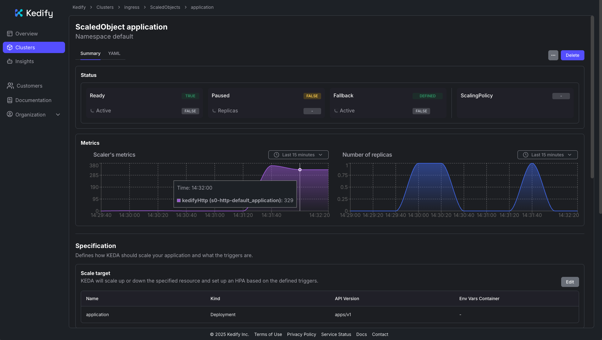

Use this section to get a quick, hands-on feel for Kedify HTTP autoscaling. We’ll deploy a small web service, expose it through a standard Kubernetes Ingress, and rely on Kedify’s autowiring to route traffic via its proxy so requests are measured and drive scaling.

Scale a real HTTP app exposed through Kubernetes Ingress using Kedify’s [kedify-http](https://docs.kedify.io/scalers/http-scaler/) scaler. You will deploy a simple app, enable autoscaling with a [ScaledObject](https://keda.sh/docs/latest/concepts/scaling-deployments/), generate load, and observe the system scale out and back in (including scale-to-zero when idle).

## How it works

With ingress autowiring enabled, Kedify automatically routes traffic through its proxy before it reaches your Service/Deployment:

```
Ingress → kedify-proxy → Service → Deployment
```

The [Kedify Proxy](https://docs.kedify.io/scalers/http-scaler/#kedify-proxy) gathers request metrics used by the scaler to make decisions.

## What you’ll deploy

- Deployment & Service: an HTTP server with a small response delay to simulate work
- Ingress: public entry using host `application.keda`
- ScaledObject: Kedify HTTP scaler with `trafficAutowire: ingress`

## Step 1 — Create the application and Ingress

Save the following as `application.yaml` and apply it:

```bash
kubectl apply -f application.yaml
```

```yaml
# application.yaml
apiVersion: apps/v1
kind: Deployment
metadata:
	name: application
spec:
	replicas: 1
	selector:
		matchLabels:
			app: application
	template:
		metadata:
			labels:
				app: application
		spec:
			containers:
				- name: application
					image: ghcr.io/kedify/sample-http-server:latest
					imagePullPolicy: Always
					ports:
						- name: http
							containerPort: 8080
							protocol: TCP
					env:
						- name: RESPONSE_DELAY
							value: '0.3'
---
apiVersion: v1
kind: Service
metadata:
	name: application-service
spec:
	ports:
		- name: http
			protocol: TCP
			port: 8080
			targetPort: http
	selector:
		app: application
	type: ClusterIP
---
apiVersion: networking.k8s.io/v1
kind: Ingress
metadata:
	name: application-ingress
spec:
	rules:
		- host: application.keda
			http:
				paths:
					- path: /
						pathType: Prefix
						backend:
							service:
								name: application-service
								port:
									number: 8080
```

Notes:
- `RESPONSE_DELAY` adds ~300ms latency per request, making scaling effects easier to see.
- The Ingress uses host `application.keda`. If you don’t have DNS set up, use your ingress controller’s IP with a `Host:` header (shown below).

## Step 2 — Enable autoscaling with Kedify

Save the following as `scaledobject.yaml` and apply it:

```bash
kubectl apply -f scaledobject.yaml
```

```yaml
# scaledobject.yaml
kind: ScaledObject
apiVersion: keda.sh/v1alpha1
metadata:
	name: application
spec:
	scaleTargetRef:
		apiVersion: apps/v1
		kind: Deployment
		name: application
	cooldownPeriod: 5
	minReplicaCount: 0
	maxReplicaCount: 10
	fallback:
		failureThreshold: 2
		replicas: 1
	advanced:
		restoreToOriginalReplicaCount: true
		horizontalPodAutoscalerConfig:
			behavior:
				scaleDown:
					stabilizationWindowSeconds: 5
	triggers:
		- type: kedify-http
			metadata:
				hosts: application.keda
				pathPrefixes: /
				service: application-service
				port: '8080'
				scalingMetric: requestRate
				targetValue: '1000'
				granularity: 1s
				window: 10s
				trafficAutowire: ingress
```

What the key fields do:
- `type: kedify-http` — Use Kedify’s HTTP scaler.
- `hosts`, `pathPrefixes` — Which requests to observe for scaling.
- `service`, `port` — The Service and port receiving traffic.
- `scalingMetric: requestRate` and `targetValue: 1000` — Target 1000 req/s (per granularity/window) before scaling out.
- `minReplicaCount: 0` — Allows scale-to-zero when idle.
- `trafficAutowire: ingress` — Lets Kedify auto-wire your Ingress to the kedify-proxy.

After applying, the ScaledObject will appear in the Kedify dashboard (https://dashboard.kedify.io/).


## Step 3 — Send traffic and observe scaling

First, hit the app to confirm routing works. Replace the address with your ingress endpoint if needed:

```bash
curl -I -H "Host: application.keda" http://localhost:9080
```

You should see a 200 OK response. Next, generate sustained load. You can use `hey` (or a similar tool):

```bash
hey -n 10000 -c 150 -host "application.keda" http://localhost:9080
```

While the load runs, watch replicas change:

```bash
kubectl get deploy application -w
```

Expected behavior:
- On bursty load, Kedify scales the Deployment up toward `maxReplicaCount`.
- When traffic subsides, replicas scale down. After the cooldown, they can return to zero.

You can also observe traffic and scaling in the Kedify dashboard:



## Clean up

```bash
kubectl delete -f scaledobject.yaml
kubectl delete -f application.yaml
```

## Next steps

Explore the official Kedify [How-to guides](https://docs.kedify.io/how-to/) for more configurations such as Gateway API, Istio VirtualService, or OpenShift Routes.

### See also

- Kedify documentation: https://docs.kedify.io
