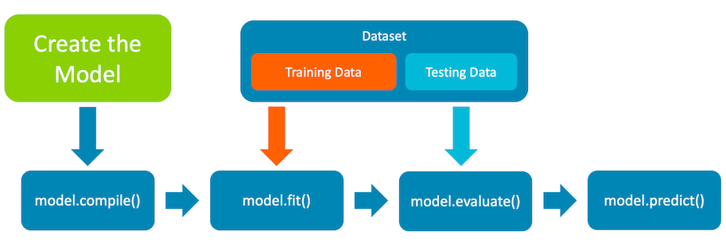

Keras is a multi-backend framework that provides a high-level API to build
Machine Learning models.


It provides the common blocks used to create models, such as:
* Model abstractions
* Layers
* Activation functions
* Objectives
* Optimizers
* Initializers

In 2023, a new library, Keras Core, was announced. It's a full rewrite of the library which rebases it on top of a
multi-backend architecture covering the following:

* TensorFlow: https://www.tensorflow.org
* PyTorch: https://pytorch.org
* JAX: https://jax.readthedocs.io/en/latest/

The Keras API was integrated in TensorFlow (under `tf.keras`) and Keras Core
API compatibility was maintained. This means that if you have a model that uses
Keras in TensorFlow, you can also use the model with PyTorch and JAX.

## Keras model life-cycle overview

The life-cycle of a Keras model has the following steps:
* model creation
* model compilation
* model training
* model evaluation
* model prediction



In the following sections you will see how to use Keras to implement each step.

### Creating models in Keras

A Model is a collection of layers organized in a graph. Keras supports two
main APIs to create graphs, sequential and functional.

#### Sequential API

The sequential API is a list or chain of layers and it has a more user-friendly
interface. There is a limitation of one output and one input between layers.

Here is an example of the sequential API:

```python
import keras_core as keras
from keras_core import layers

def create_model():
  model = keras.Sequential()
  model.add(keras.Input(shape=(784,)))
  model.add(layers.Dense(64, activation="relu"))
  model.add(layers.Dense(10))
  return model

model = create_model()
```

Feel free to explore the [official documentation](https://keras.io/guides/sequential_model/) of the sequential API.

#### Functional API

The functional API is more flexible and allows non-linear
topology of the graph. It also allows shared layers and
multiple inputs and outputs between layers.

Here is an example of the functional API:

```python
import keras_core as keras
from keras_core import layers

def create_model():
  inputs = keras.Input(shape=(784,))
  x = layers.Dense(64, activation="relu")(inputs)
  outputs = layers.Dense(10)(x)

  return keras.Model(inputs=inputs, outputs=outputs, name="my_model")

model = create_model()
```

Feel free to explore the [official documentation](https://keras.io/guides/functional_api/) of the functional API.

### Changing the backend in Keras

Keras is a multi-backend framework which can be changed at runtime. You
can change the backend using an environment variable or by using Python.

Here is an example of changing the backend using an environment variable:

```bash
# Possible values are tensorflow, torch, jax
export KERAS_BACKEND=torch
```

Here is an example of changing the backend using Python:

```python
import os

os.environ["KERAS_BACKEND"] = "jax" # or tensorflow or torch
```

After you set the backend, it will be used in subsequent executions of Keras. 

The default backend is tensorflow.


### Compiling models in Keras

The compilation step in Keras configures the model for the training step.

During the compilation step you define:
* The optimizer: possible values are `SGD` (Gradient Descend), `Adam`, and `RMSProp`. Available optimizers: https://keras.io/api/optimizers/
* The loss function: possible values are `Categorical Cross-entropy` and `Mean Squared Error`. Available loss functions: https://keras.io/api/losses/
* The metrics to guide training: possible values are `Accuracy` and `Crossentropy`. Available metrics: https://keras.io/api/metrics/

Below is an example of compiling a model:

```python
model.compile(
  loss=keras.losses.SparseCategoricalCrossentropy(from_logits=True),
  optimizer=keras.optimizers.RMSprop(),
  metrics=["accuracy"],
)
```

The compile step is the same for both the functional and the sequential APIs.

### Datasets

After the compilation of the model, you are ready to train the model using a dataset. 
A dataset consists of data needed for training, evaluation, and testing of the model.

{}
Datasets are very specific to a model or an application. You need to have full
knowledge of the model input layout as it needs to be compatible with the
dataset structure. Keras provides some common datasets for experimentation, e.g., MNIST, CIFAR10, CIFAR100, and IMDB. The full list of datasets provided by Keras is available here - https://keras.io/api/datasets/ 
{}

As part of the Machine Learning development workflow, it is common to partition the dataset
into two parts, train and test. This makes it possible to test a trained model with data that was not used
during the training phase.
You also need to *normalize* the dataset before using it for training.

The following example uses the MNIST dataset. MNIST is a large
database of handwritten digits used for training image
processing systems.


```python
import keras_core as keras

(x_train, y_train), (x_test, y_test) = keras.datasets.mnist.load_data()

x_train = x_train.reshape(60000, 784).astype("float32") / 255
x_test = x_test.reshape(10000, 784).astype("float32") / 255
```

The number 784 denotes the size of the images. Each image is a square of 28 pixels
hence 28x28=784.

### Training models with Keras

Once you have access to the dataset, you are ready to train the model which
is going to approximate the input data.

The resulting object, history, contains information about how the training is progressing over
incremental epochs (each round of sweeping over training data). 
Training uses the configuration set during the `compile()` phase and 
is guided by two pieces of information:
* **loss**: the value that the model seeks to minimize
* **accuracy (or another metric)**: the ratio of correct predictions

To train the model, you need to call the `.fit()` method of the model. 

Here is an example:

```python
history = model.fit(
  x_train, y_train, batch_size=64, epochs=2, validation_split=0.2
)
```

### Evaluating models with Keras

After the training step is complete, it is important to provide the model with unseen data (test data)
for evaluation. This helps prevent problems such as overfitting.
You should use the slice of the dataset that you saved for testing.

```python
test_scores = model.evaluate(x_test, y_test, verbose=2)
print(”Loss:", test_scores[0])
print(”Accuracy:", test_scores[1])
```

The returned test scores are the ones set at `compile()` time.

### Generating predictions with Keras

Once the model is trained and accuracy levels are acceptable, the model can be
used to generate predictions.

Here is an example of generating predictions:

```python
test_scores = model.predict(x_test)
```

In this case an array of 10 values is printed. Every value represents the probability that the image represents the index of the value, with the first value being the probability of the image being a zero.


```output
[ -6.1369014  -8.772338   -1.5029577   0.8902472 -10.76559    -4.302728
 -15.749295    7.22214    -4.3954177  -3.5787518]
```

In the output above, the largest value is 7.22214 at position 7 so the model
thinks the input image is the digit 7.
