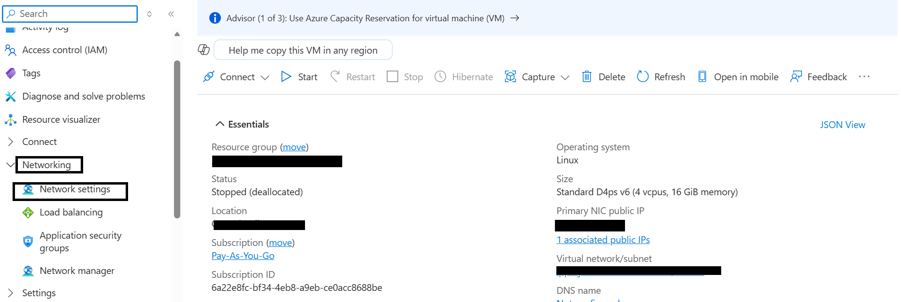
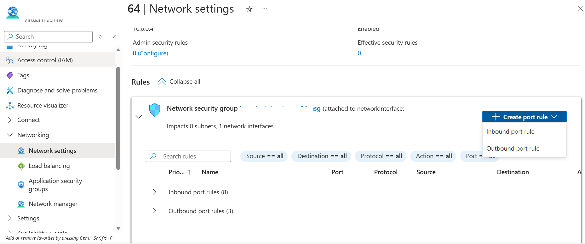

## Configure external traffic for Keycloak and Flask application

To allow external traffic for Keycloak and the Flask OAuth2 demo application on an Azure virtual machine, open the required ports in the Network Security Group (NSG). The NSG can be attached to the virtual machine's network interface or subnet.

{}
For more information about Azure setup, see [Getting started with Microsoft Azure Platform](/learning-paths/servers-and-cloud-computing/csp/azure/).
{}

### Add inbound firewall rules in Azure

To expose the required ports for Keycloak and the Flask application, create firewall rules.

1. Navigate to the [Azure portal](https://portal.azure.com), go to **Virtual Machines**, and select your virtual machine.

2. In the left menu, select **Networking**, then select **Network settings**.

3. Navigate to **Create port rule**, and select **Inbound port rule**.

4. Configure inbound security rules for the following ports:

| Port | Purpose |
|---|---|
| 8080 | Keycloak Admin Console |
| 9000 | Keycloak health and management endpoint |
| 5000 | Flask OAuth2 demo application |

Use the following settings for each rule:

- **Source:** My IP address  
- **Source IP addresses:** *(auto-populated with your current public IP)*  
- **Source port ranges:** *  
- **Destination:** Any  
- **Protocol:** TCP  
- **Action:** Allow  

Use these names:

| Port | Rule Name |
|---|---|
| 8080 | allow-keycloak-8080 |
| 9000 | allow-keycloak-9000 |
| 5000 | allow-flask-5000 |

{}
Setting **Source** to **My IP address** restricts access to the ports to your current machine only. If your public IP changes or you need to access the services from another machine, update the source IP in the NSG rule.
{}

5. After filling in the details, select **Add** to save each rule.

You can now access:

- Keycloak Admin Console on port **8080**
- Keycloak health endpoint on port **9000**
- Flask OAuth2 demo application on port **5000**

## What you've learned and what's next

You've now configured the Azure Network Security Group to allow incoming traffic for Keycloak and the Flask OAuth2 demo application.

Next, you'll deploy Keycloak, configure PostgreSQL integration, and validate OAuth2/OpenID Connect authentication workflows using the Flask application.
