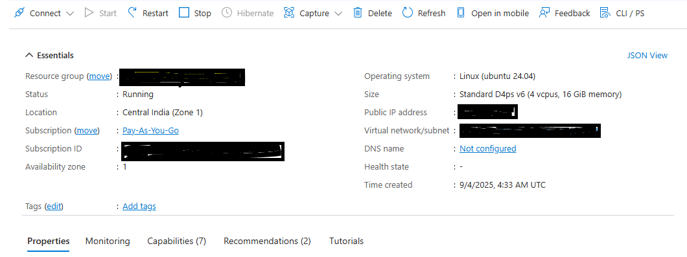

## Set up an Arm-based Azure virtual machine

In this section, you'll launch the Azure portal to create a virtual machine (VM) powered by the Arm-based Azure Cobalt 100 processor.

You'll create a general-purpose VM in the Dpsv6 series. For more information about this series of VMs, see the [Microsoft Azure guide for the Dpsv6 size series](https://learn.microsoft.com/en-us/azure/virtual-machines/sizes/general-purpose/dpsv6-series).

For more detailed steps to create a VM, see the [Deploy a Cobalt 100 virtual machine on Azure Learning Path](/learning-paths/servers-and-cloud-computing/cobalt/).

### Use the Azure portal to create a virtual machine 

To create an Azure virtual machine using the Azure portal:

1. Launch the Azure portal and navigate to **Virtual Machines**.
2. Select **Create**, and select **Virtual Machine** from the drop-down list.
3. In the **Basics** tab, provide instance details such as **Virtual machine name** and **Region**.
4. Select **Ubuntu Pro 24.04 LTS** as the image for your virtual machine, and select **Arm64** as the VM architecture.
5. In the **Size** field, select **See all sizes** and select the D-Series v6 family of virtual machines.
6. Select **D4ps_v6** from the list as shown in the following screenshot:


7. For **Authentication type**, select **SSH public key**.

{}
Azure generates an SSH key pair for you that you can save for future use. This method is fast, secure, and easy for connecting to your VM.
{}

8. Fill in the **Administrator username** for your VM.
9. Select **Generate new key pair**, and select **RSA SSH Format** as the **SSH key type**.

{}
RSA offers better security with keys longer than 3072 bits.
{}

10. Give your SSH key a key pair name.
11. Under **Inbound port rules**, select **HTTP (80)** and **SSH (22)** as the inbound ports, as shown in the following screenshot:


12. Select the **Review + Create** tab and review the configuration for your virtual machine. It should look like the following:


13. When you're happy with your selection, select the **Create** button and then **Download private key and create resource**.


Your VM should be ready and running in a few minutes. You can SSH into the virtual machine using the private key, along with the public IP details.



{}To learn more about Arm-based virtual machines in Azure, see the Azure section in the [Get started with Arm-based cloud instances](/learning-paths/servers-and-cloud-computing/csp/azure/) Learning Path.{}

## Connect to your virtual machine

Use the private key file you downloaded and the public IP address shown in the Azure portal to connect to your virtual machine.

```bash
ssh -i <your-key-name>.pem azureuser@YOUR_PUBLIC_IP
```

Replace `<your-key-name>` with the name of your SSH key pair and `YOUR_PUBLIC_IP` with the public IP address shown in the Azure portal after deployment.

## What you've accomplished and what's next

You've now created an Azure Cobalt 100-based Arm64 virtual machine running Ubuntu 24.04 LTS with SSH authentication configured. The virtual machine is ready for installing PostgreSQL, Keycloak, and the Flask OAuth2 demo application.

Next, you'll set up firewall rules to allow external traffic for Keycloak and the demo Flask application. 
