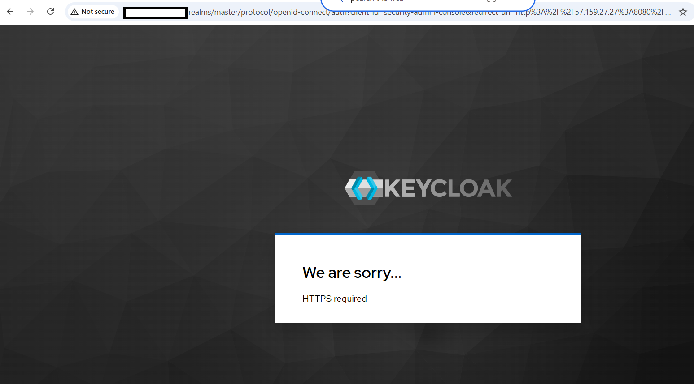
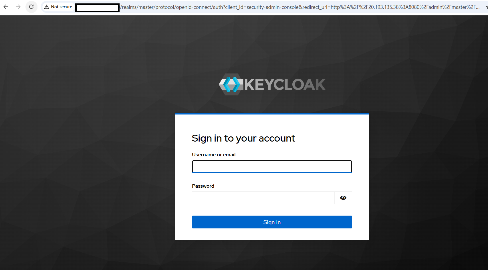
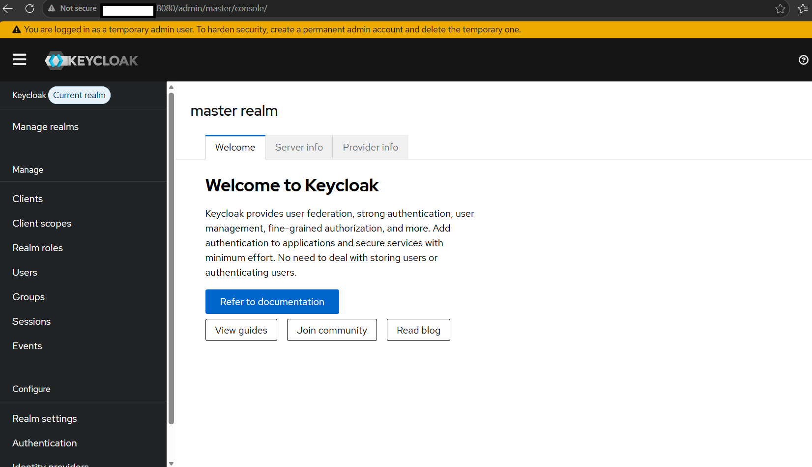

## Set up Keycloak and dependencies on the virtual machine

In this section, you'll install Keycloak on the virtual machine (VM) that you created earlier. You'll configure PostgreSQL as the backend database.

### Update your system

Start by updating the package index and installing the latest available package updates on the VM:

```bash
sudo apt update && sudo apt upgrade -y
```

### Install required dependencies

Install Java, PostgreSQL, Python, and utility packages required for running Keycloak and the Flask demo application:

```bash
sudo apt install -y \
openjdk-21-jdk \
postgresql \
postgresql-contrib \
python3-pip \
python3-venv \
curl \
wget \
tar
```

### Verify Java installation

Keycloak requires Java, so verify that Java 21 is installed correctly:

```bash
java -version
```

The output is similar to:
```output
openjdk version "21.0.11" 2026-04-21
OpenJDK Runtime Environment (build 21.0.11+10-1-24.04.2-Ubuntu)
OpenJDK 64-Bit Server VM (build 21.0.11+10-1-24.04.2-Ubuntu, mixed mode, sharing)
```


### Configure PostgreSQL database

Keycloak needs a persistent database to store realms, users, clients, roles, and authentication configuration.

#### Create the Keycloak database and user

Log in to PostgreSQL as the default `postgres` user:

```bash
sudo -u postgres psql
```

Create a database for Keycloak:

```sql
CREATE DATABASE keycloak;
```

Create a PostgreSQL user for Keycloak:

```sql
CREATE USER keycloakuser WITH PASSWORD 'StrongPassword123!';
```

Grant database access to the Keycloak user:

```sql
GRANT ALL PRIVILEGES ON DATABASE keycloak TO keycloakuser;
```

Connect to the Keycloak database:

```sql
\c keycloak
```

Grant schema permissions so Keycloak can create and manage its internal database tables:

```sql
GRANT ALL ON SCHEMA public TO keycloakuser;
ALTER SCHEMA public OWNER TO keycloakuser;
GRANT ALL PRIVILEGES ON ALL TABLES IN SCHEMA public TO keycloakuser;
GRANT ALL PRIVILEGES ON ALL SEQUENCES IN SCHEMA public TO keycloakuser;
```

Exit PostgreSQL:

```sql
\q
```

### Download Keycloak

Download the Keycloak release archive, extract it, and move it to `/opt/keycloak`:

{}
The following commands use Keycloak version 26.2.5. The same commands work with other versions. Replace the file names in these steps with the file for your version of choice. To find the latest version, see [Keycloak releases on GitHub](https://github.com/keycloak/keycloak/releases).
{}

```bash
cd ~
wget https://github.com/keycloak/keycloak/releases/download/26.2.5/keycloak-26.2.5.tar.gz
tar -xzf keycloak-26.2.5.tar.gz
sudo mv keycloak-26.2.5 /opt/keycloak
```

### Create Keycloak Linux user

Create a dedicated Linux user to run Keycloak securely as a system service:

```bash
sudo useradd -r -s /bin/false keycloak
sudo chown -R keycloak:keycloak /opt/keycloak
```

### Configure Keycloak

Create the Keycloak configuration file and connect it to the PostgreSQL database:

Replace `YOUR_PUBLIC_IP` with the public IP address of your Azure VM.

{}
The `db-password` value must match the password you set for `keycloakuser` during the PostgreSQL setup step. Replace `StrongPassword123!` with your actual database password.
{}

Create configuration:

```bash
sudo tee /opt/keycloak/conf/keycloak.conf > /dev/null <<EOF
db=postgres
db-url=jdbc:postgresql://localhost:5432/keycloak
db-username=keycloakuser
db-password=StrongPassword123!

hostname=http://YOUR_PUBLIC_IP:8080
hostname-strict=false

http-enabled=true
http-port=8080

health-enabled=true
metrics-enabled=true
EOF
```

{}
Don't use `proxy=edge` with this setup because it can cause hostname and admin console loading issues in newer Keycloak versions.
{}

### Build the Keycloak server

Build Keycloak so the server configuration is optimized and persisted before startup:

```bash
sudo /opt/keycloak/bin/kc.sh build
```

### Create the Keycloak admin user

Bootstrap the initial admin user that you'll use to log in to the Keycloak admin console:

```bash
sudo KC_BOOTSTRAP_ADMIN_USERNAME=admin \
KC_BOOTSTRAP_ADMIN_PASSWORD=AdminPassword123! \
/opt/keycloak/bin/kc.sh bootstrap-admin user --optimized
```

The output is similar to:

```output
Enter username [temp-admin]:
Enter password:
Enter password again:
```

For the username, press Enter.

For the password, enter the following password twice:

```text
AdminPassword123!
```
The output is similar to:

```text
Created temporary admin user with username admin
```

### Configure Keycloak as a systemd service

Create a systemd service so Keycloak starts automatically and runs in the background:

```bash
sudo tee /etc/systemd/system/keycloak.service > /dev/null <<EOF
[Unit]
Description=Keycloak Server
After=network.target postgresql.service
Requires=postgresql.service

[Service]
Type=simple
User=keycloak
Group=keycloak
WorkingDirectory=/opt/keycloak
ExecStart=/opt/keycloak/bin/kc.sh start --optimized
Restart=always
RestartSec=10

[Install]
WantedBy=multi-user.target
EOF
```

### Configure Keycloak runtime directories

Create writable runtime directories required by Keycloak for temporary files, logs, and cache:

```bash
sudo mkdir -p /opt/keycloak/data/tmp
sudo mkdir -p /opt/keycloak/data/log
sudo mkdir -p /opt/keycloak/data/cache
```

Set the correct ownership for the Keycloak service user:

```bash
sudo chown -R keycloak:keycloak /opt/keycloak/data
```

Set directory permissions:

```bash
sudo chmod -R 755 /opt/keycloak/data
```

## Start and verify Keycloak

Start Keycloak and verify that the service is running correctly.

Reload systemd, enable the service, and start Keycloak:

```bash
sudo systemctl daemon-reload
sudo systemctl enable keycloak
sudo systemctl start keycloak
```

Check the service status:

```bash
sudo systemctl status keycloak
```

The output is similar to:

```output
Active: active (running) since Thu 2026-06-04 15:26:27 UTC; 7s ago
```

View live Keycloak logs to confirm it started without errors, then press Ctrl+C to exit:

```bash
sudo journalctl -u keycloak -f
```

You can also optionally check whether Keycloak is listening on the expected ports:

```bash
sudo ss -tulpn | grep -E '8080|9000'
```

### Access the Keycloak admin console

Open the Keycloak admin console in your browser. Replace `YOUR_PUBLIC_IP` with the public IP address of your Azure VM:

```text
http://YOUR_PUBLIC_IP:8080/admin/
```

#### Troubleshoot HTTPS required error

If the browser shows the following message, disable SSL enforcement for the master realm for this HTTP-based Learning Path setup:

```text
HTTPS required
```



Log in to the Keycloak database:

```bash
sudo -u postgres psql -d keycloak
```

Disable SSL enforcement for the master realm:

```sql
UPDATE realm
SET ssl_required = 'NONE'
WHERE name = 'master';
```

Exit PostgreSQL:

```sql
\q
```

Restart Keycloak:

```bash
sudo systemctl restart keycloak
```

After restarting, open the admin console again and log in:



Enter the admin credentials that you created earlier:

```text
Username: admin
Password: AdminPassword123!
```



### Verify health endpoint

Call the health endpoint:

```bash
curl http://localhost:9000/health
```

The output is similar to:

```output
{
    "status": "UP",
    "checks": [
        {
            "name": "Keycloak database connections async health check",
            "status": "UP"
        }
    ]
}
```

## What you've accomplished and what's next

You now have Keycloak running on an Azure Cobalt 100-based Arm64 VM with PostgreSQL integration, a systemd service, and a working admin console.

Next, you'll configure a Flask application and integrate it with Keycloak using OAuth2/OpenID Connect authentication.
