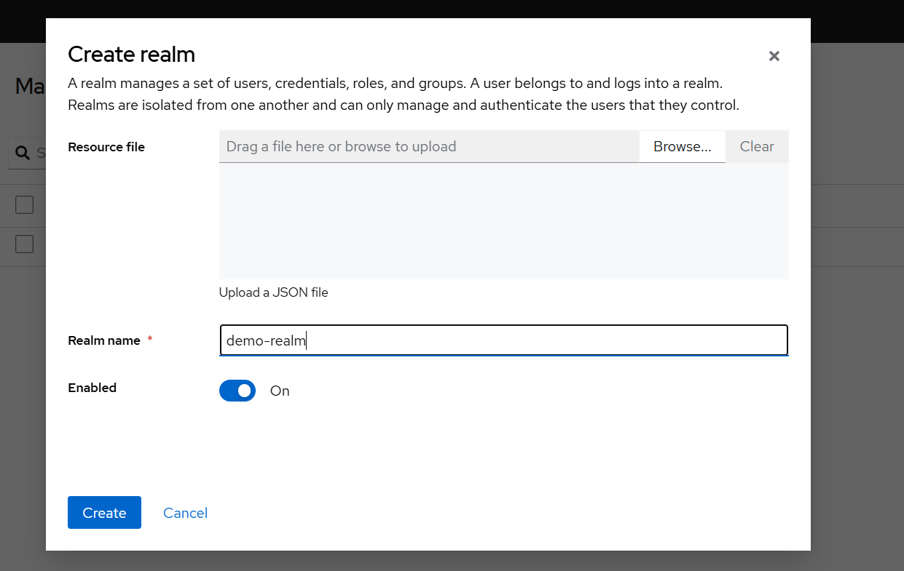
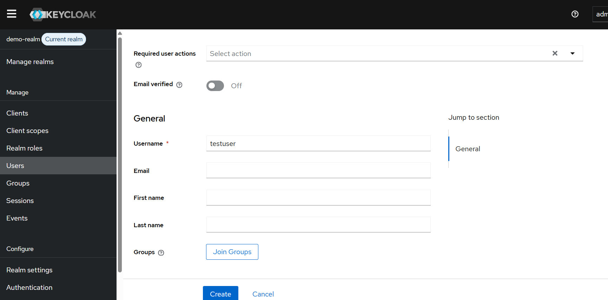
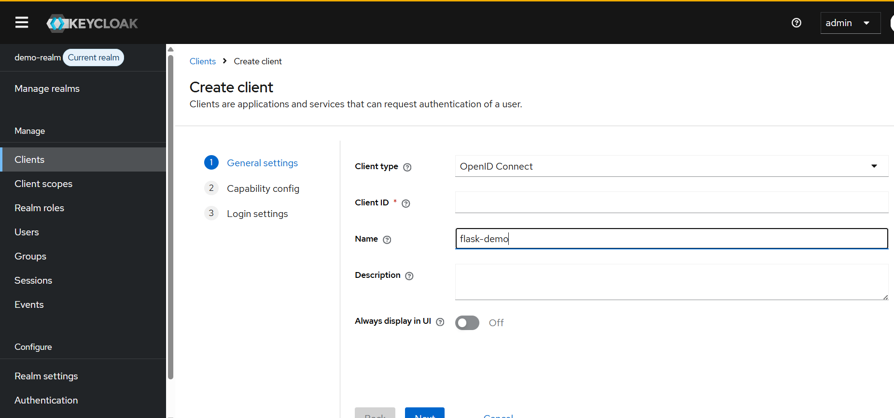
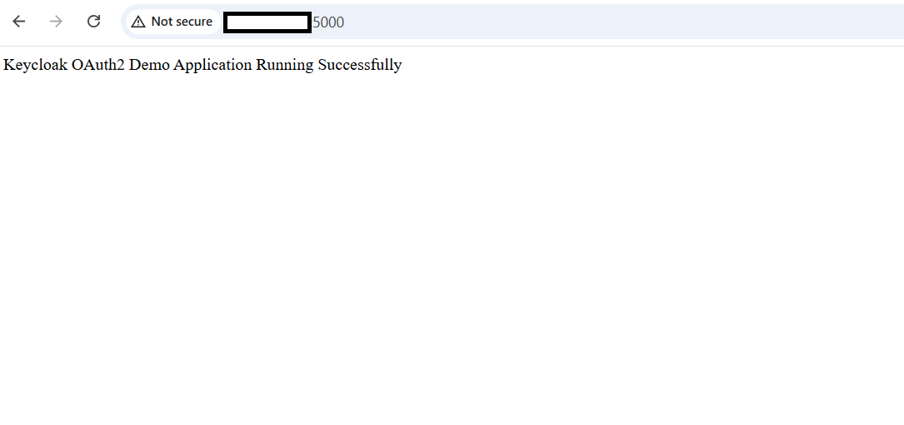

## Integrate Flask OAuth2 Application with Keycloak

## Overview

In this section, you'll configure Keycloak realms, users, and OAuth2/OpenID Connect clients, then integrate a Flask application with Keycloak authentication.

You will learn how to:

- Create realms and users
- Configure OpenID Connect clients
- Build a Flask demo application
- Validate OAuth2/OpenID Connect integration
- Test authentication workflows

## Create a Realm
Create a dedicated realm for the Flask OAuth2 demo application.

Inside Admin Console:

1. Click realm dropdown
2. Click Create realm
3. Enter:

```text
demo-realm
```

4. Click Create



## Create a User
Create a dedicated realm for the Flask OAuth2 demo application.

Navigate:

```text
Users > Add user
```

Create:

```text
Username: testuser
```

Go to:

```text
Credentials > Set password
```

Disable temporary password.



## OAuth2 Login for Flask Application

This section demonstrates how to use Keycloak as an OAuth2/OpenID Connect provider for a Flask application.

## Create OpenID Connect Client
Create a Keycloak client for the Flask application.

Navigate:

```text
Clients > Create client
```

Use:

```text
Client type: OpenID Connect
Client ID: flask-demo
```

Enable:

```text
Client authentication: Off
Authorization: Off
```

Valid redirect URI:

```text
http://YOUR_PUBLIC_IP:5000/*
```

Save the client.



## Create Flask Demo Application
Create a project directory for the Flask OAuth2 application.

```bash
mkdir ~/flask-keycloak-demo
cd ~/flask-keycloak-demo
```

## Create Python virtual environment
Create and activate a Python virtual environment for dependency isolation.

```bash
python3 -m venv venv
```

Activate environment:

```bash
source venv/bin/activate
```

## Install Flask dependencies
Install Flask and OAuth-related Python packages.

```bash
pip install flask authlib requests
```

## Create Flask Application
Create a simple Flask application for testing Keycloak integration.

```bash
cat > app.py <<'EOF'
from flask import Flask

app = Flask(__name__)

@app.route('/')
def home():
    return 'Keycloak OAuth2 Demo Application Running Successfully'

if __name__ == '__main__':
    app.run(host='0.0.0.0', port=5000)
EOF
```

## Run Flask Application
Start the Flask application.

```bash
python app.py
```

Open browser:

```text
http://YOUR_PUBLIC_IP:5000
```

The output is similar to:

```output
Keycloak OAuth2 Demo Application Running Successfully
```



## Useful Commands

Restart Keycloak:

```bash
sudo systemctl restart keycloak
```

View Keycloak logs:

```bash
sudo journalctl -u keycloak -f
```

Check listening ports:

```
sudo ss -tulpn | grep -E '8080|9000|5000'
```

## Common Troubleshooting

**Admin console stuck loading:**

Recreate temporary directories and restart Keycloak.

```bash
sudo mkdir -p /opt/keycloak/data/tmp
sudo chown -R keycloak:keycloak /opt/keycloak/data
sudo systemctl restart keycloak
```

## HTTPS required issue

Disable SSL enforcement for the master realm.

```bash
UPDATE realm
SET ssl_required='NONE'
WHERE name='master';
```

## PostgreSQL schema permission issue

If logs show:

```text
permission denied for schema public
```

grant schema permissions again.

## What you've learned

You now have a Flask application integrated with Keycloak using OAuth2/OpenID Connect authentication.
