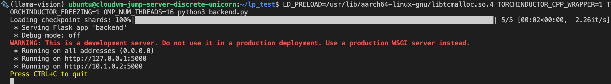

## Backend Script for Vision Chatbot LLM Server
Once the virtual environment is activated, create a `backend.py` script using the following content. This script downloads the Llama 3.2 Vision model from Hugging Face, performs 4-bit quantization on the model and then serves it with PyTorch on Arm:

```python
from flask import Flask, request, Response, stream_with_context
from transformers import MllamaForConditionalGeneration, AutoProcessor, TextIteratorStreamer
from threading import Thread
from PIL import Image
import torch
import json
import time
import io
import base64

app = Flask(__name__)

# Load model and processor
model_id = "meta-llama/Llama-3.2-11B-Vision-Instruct"
model = MllamaForConditionalGeneration.from_pretrained(model_id, torch_dtype=torch.float32)

# Apply torchao quantization
from torchao.dtypes import PlainLayout
from torchao.experimental.packed_linear_int8_dynamic_activation_intx_weight_layout import (
    PackedLinearInt8DynamicActivationIntxWeightLayout,
)
from torchao.experimental.quant_api import int8_dynamic_activation_intx_weight
from torchao.quantization.granularity import PerGroup
from torchao.quantization.quant_api import quantize_
from torchao.quantization.quant_primitives import MappingType

quantize_(
    model,
    int8_dynamic_activation_intx_weight(
        weight_dtype=torch.int4,
        granularity=PerGroup(32),
        has_weight_zeros=True,
        weight_mapping_type=MappingType.SYMMETRIC_NO_CLIPPING_ERR,
        layout=PackedLinearInt8DynamicActivationIntxWeightLayout(target="aten"),
    ),
)

processor = AutoProcessor.from_pretrained(model_id)
model.eval()

@app.route("/v1/chat/completions", methods=["POST"])
def chat_completions():
    image = None
    prompt = ""

    if "image" in request.files:
        file = request.files["image"]
        image = Image.open(file.stream).convert("RGB")
        prompt = request.form.get("prompt", "")
    elif request.is_json:
        data = request.get_json()
        if "image" in data:
            image_bytes = base64.b64decode(data["image"])
            image = Image.open(io.BytesIO(image_bytes)).convert("RGB")
        if "prompt" in data:
            prompt = data["prompt"]
        elif "messages" in data:
            for msg in data["messages"]:
                if msg.get("role") == "user":
                    prompt = msg.get("content", "")
                    break

    if image is None or not prompt:
        return {"error": "Both image and prompt are required."}, 400

    # Format the prompt
    formatted_prompt = (
        f"<|begin_of_text|><|image|>\n"
        f"<|user|>\n{prompt.strip()}<|end_of_text|>\n"
        "<|assistant|>\n"
    )

    inputs = processor(image, formatted_prompt, return_tensors="pt").to(model.device)
    tokenizer = processor.tokenizer if hasattr(processor, "tokenizer") else processor

    # Initialize the TextIteratorStreamer
    text_streamer = TextIteratorStreamer(tokenizer, skip_prompt=True, skip_special_tokens=True)

    # Define generation arguments
    gen_kwargs = {
        "max_new_tokens": 512,
        "do_sample": False,
        "temperature": 1.0,
        "streamer": text_streamer,
        "eos_token_id": tokenizer.eos_token_id,
    }

    # Run generation in a separate thread
    generation_thread = Thread(target=model.generate, kwargs={**inputs, **gen_kwargs})
    generation_thread.start()

    def stream_response():
        assistant_role_chunk = {
            "id": f"chatcmpl-{int(time.time()*1000)}",
            "object": "chat.completion.chunk",
            "created": int(time.time()),
            "model": model_id,
            "choices": [{"index": 0, "delta": {"role": "assistant"}, "finish_reason": None}]
        }
        yield f"data: {json.dumps(assistant_role_chunk)}\n\n"

        for token in text_streamer:
            if token.strip():
                content_chunk = {
                    "id": assistant_role_chunk["id"],
                    "object": "chat.completion.chunk",
                    "created": int(time.time()),
                    "model": model_id,
                    "choices": [{"index": 0, "delta": {"content": token}, "finish_reason": None}]
                }
                yield f"data: {json.dumps(content_chunk)}\n\n"

        finish_chunk = {
            "id": assistant_role_chunk["id"],
            "object": "chat.completion.chunk",
            "created": int(time.time()),
            "model": model_id,
            "choices": [{"index": 0, "delta": {}, "finish_reason": "stop"}]
        }
        yield f"data: {json.dumps(finish_chunk)}\n\n"
        yield "data: [DONE]\n\n"

    return Response(stream_with_context(stream_response()), mimetype='text/event-stream')

if __name__ == "__main__":
    app.run(host="0.0.0.0", port=5000, threaded=True)
```

## Run the Backend Server

You are now ready to run the backend server for the Vision Chatbot.
Use the following command in a terminal to start the backend server:

```python
LD_PRELOAD=/usr/lib/aarch64-linux-gnu/libtcmalloc.so.4 TORCHINDUCTOR_CPP_WRAPPER=1 TORCHINDUCTOR_FREEZING=1 OMP_NUM_THREADS=16 python3 backend.py
```

You should see output similar to the image below when the backend server starts successfully:

