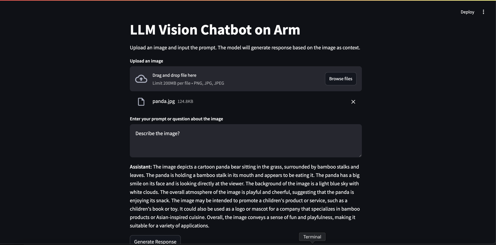

## Access the Web Application

You can now open the web application in your browser using the external URL:

```bash
http://[your instance ip]:8501
```

{}

To access the application,  you might need to allow inbound TCP traffic in your instance's security rules. Always review these permissions with caution as they might introduce security vulnerabilities.

For an Axion instance, you can do this from the gcloud cli:

gcloud compute firewall-rules create allow-my-ip \
    --direction=INGRESS \
    --network=default \
    --action=ALLOW \
    --rules=tcp:8501 \
    --source-ranges=[your IP]/32 \
    --target-tags=allow-my-ip

For this to work, you must ensure that the allow-my-ip tag is present on your Axion instance.

{}
## Interact with the LLM

You can upload an image and enter the prompt in the UI to generate response.

You should see the LLM generating a response based on the prompt with the image as the context as shown below:


## Further Interaction and Custom Applications

You can continue to experiment with different images and prompts and observe the response of Vision model on Arm Neoverse based CPUs.

This setup demonstrates how you can create various applications and configure your vision based LLMs. This Learning Path serves as a guide and example to showcase the LLM inference of vision models on Arm CPUs, highlighting the optimized inference on CPUs.
