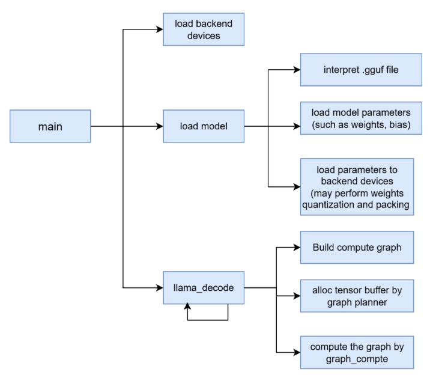
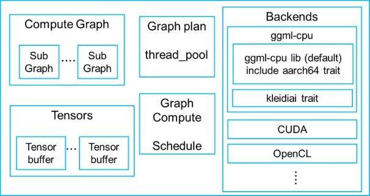
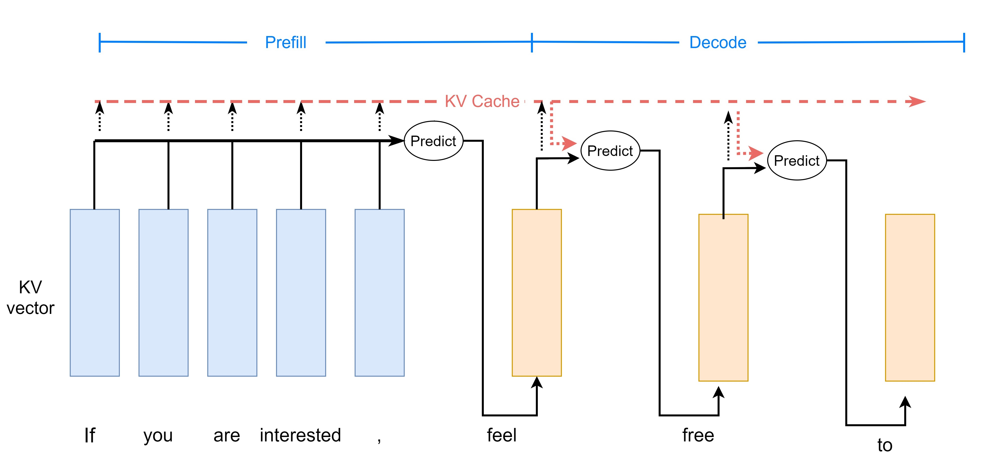
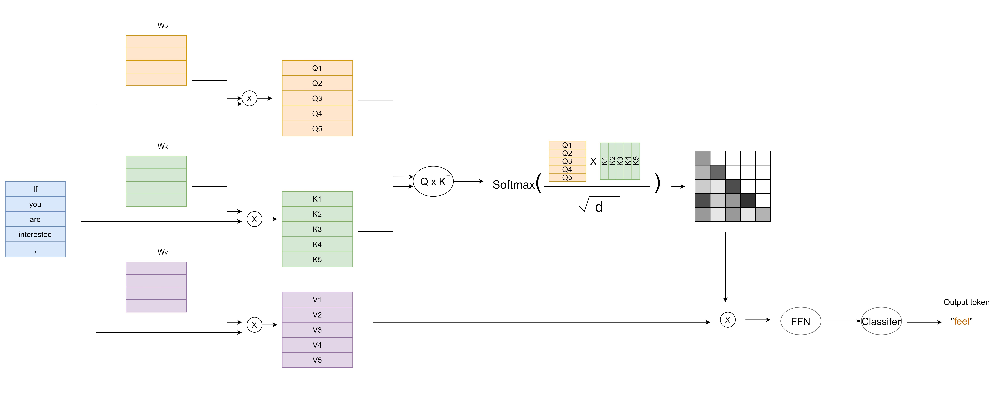
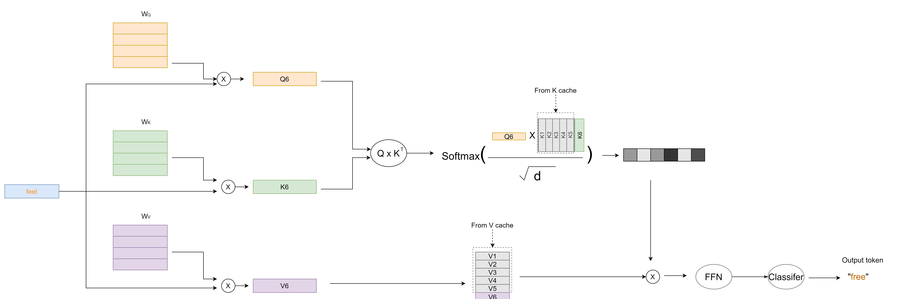

## Key concepts and architecture overview

llama.cpp is an open-source LLM framework implemented in C++ that supports both training and inference. This Learning Path focuses specifically on inference performance on Arm CPUs.

The `llama-cli` tool provides a command-line interface to run LLMs with the llama.cpp inference engine. It supports text generation, chat mode, and grammar-constrained output directly from the terminal.

{}
These are some key terms used in this Learning Path:
- *Inference*: the process of generating text from a trained model
- *GGUF format*: a file format optimized for storing and loading LLM models efficiently
- *Tokenization*: converting text into numerical tokens that the model can process
{}

## The llama-cli workflow

The following diagram shows the high-level workflow of llama-cli during inference:

The workflow begins when you provide an input prompt to `llama-cli`. The tool loads the specified GGUF model file and tokenizes your prompt. It then processes the prompt through two distinct stages:

- Prefill stage: the entire prompt is processed in parallel to generate the first output token
- Decode stage: additional tokens are generated sequentially, one at a time

This process continues until the model generates a complete response or reaches a stopping condition.

## How does llama-cli process requests? 

Here are the steps performed by `llama-cli` during inference:

- Load and interpret LLMs in GGUF format

- Build a compute graph based on the model structure:
   - A compute graph defines the mathematical operations required for inference
   - The graph is divided into subgraphs to optimize execution across available hardware backends
   - Each subgraph is assigned to the most suitable backend device; in this Learning Path, all subgraphs are assigned to the Arm CPU backend
   
- Allocate memory for tensor nodes using the graph planner
   - Tensor nodes represent data and operations in the compute graph

- Execute tensor nodes in the graph during the `graph_compute` stage
   - This stage traverses nodes and forwards work to backend devices

The compute graph building and tensor node execution stages are wrapped inside the function `llama_decode`. During both Prefill and Decode stages, `llama-cli` repeatedly calls `llama_decode` to generate tokens. The parameter `llama_batch` passed to `llama_decode` differs between stages. It contains input tokens, their count, and their positions.  

## What are the components of llama.cpp?

The architecture of llama.cpp includes several key components that work together to provide efficient LLM inference, as shown in the diagram: 

llama.cpp provides optimized support for Arm CPUs through its `ggml-cpu` library, which leverages Arm-specific vector instructions such as NEON and SVE, and includes an AArch64 trait that accelerates inference using 8-bit integer multiply (i8mm) instructions. The `ggml-cpu` library also integrates the Arm [KleidiAI](https://github.com/ARM-software/kleidiai) library as an additional trait. In addition to Arm CPU support, llama.cpp offers backends for GPU, CUDA, and OpenCL to enable inference on a variety of hardware platforms.

## Prefill and Decode in autoregressive LLMs

An autoregressive LLM is a type of Large Language Model that generates text by predicting the next token based on all the previously-generated tokens. A token represents a word or word piece in the sequence.

The term *autoregressive* means the model uses its own previous outputs as inputs for generating subsequent outputs, creating a sequential generation process. For example, when generating the sentence "The cat sat on the...", an autoregressive LLM takes the input prompt as context and predicts the next most likely token, such as "mat". The model then uses the entire sequence including "mat" to predict the following token, continuing this process token by token until completion, which is why autoregressive LLMs have two distinct computational phases: Prefill (processing the initial prompt) and Decode (generating tokens one by one).

Most autoregressive LLMs are decoder-only models. This refers to the transformer architecture, which consists only of decoder blocks from the original transformer paper. The alternatives to decoder-only models include encoder-only models used for tasks like classification and encoder-decoder models used for tasks like translation. 

Decoder-only models like LLaMA have become dominant for text generation because they are simpler to train at scale, can handle both understanding and generation tasks, and are more efficient for text generation. 

This diagram introduces the idea of Prefill and Decode stages of autoregressive LLMs:

The Prefill stage is shown below, and as you can see, multiple input tokens of the prompt are processed simultaneously.

In the context of Large Language Models (LLMs), a *matrix* is a two-dimensional array of numbers representing data such as model weights or token embeddings, while a *vector* is a one-dimensional array often used to represent a single token or feature set.

This stage mainly performs GEMM operations (General Matrix Multiply; where one matrix is multiplied by another matrix) to generate the first output token.

At the Decode stage, the model utilizes the [KV cache](https://huggingface.co/blog/not-lain/kv-caching) (Key-Value cache; which is stored attention information from previous tokens). This stage mainly performs GEMV operations (General Matrix-Vector multiply - where a vector is multiplied by a matrix) to generate subsequent output tokens one by one.

## Summary

In this section, you learned about llama.cpp architecture and its inference workflow. The framework uses a two-stage process where the Prefill stage is compute-bound and dominated by large GEMM operations that process multiple tokens in parallel, while the Decode stage is memory-bound and dominated by KV cache access and GEMV operations that process one token at a time. You will see this distinction between Prefill and Decode stages reflected in the performance metrics and visualizations. In the next section, you'll integrate Streamline annotations into llama.cpp to enable detailed performance profiling of these stages.
