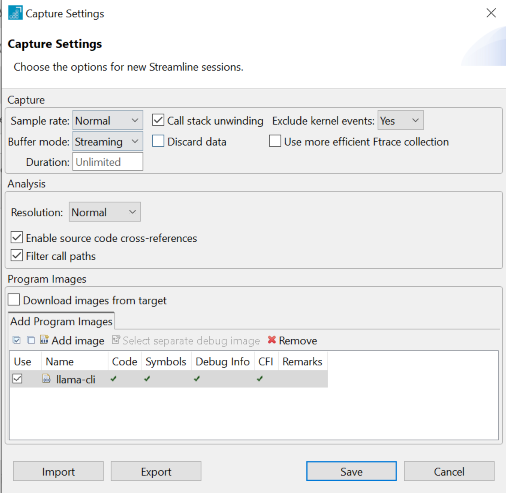
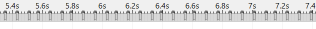
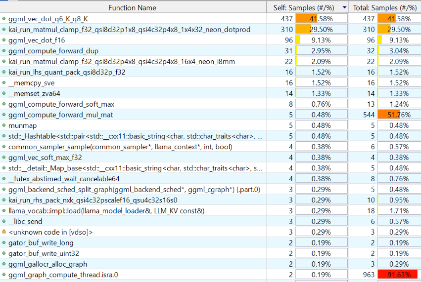

## Set up the profiling environment

After successfully building llama-cli, the next step is to set up the runtime environment on your Arm platform. This can be on your development machine or another Arm system. You'll configure the gator daemon for performance data collection and prepare your target system with the necessary executables and model files. This setup enables comprehensive performance analysis of both the compute-intensive Prefill stage and memory-bound Decode operations during LLM inference.

## Set up the gator daemon

 Start with setting up the gator daemon. The setup process depends on your llama.cpp build method.

{}
The daemon must be running on your target device before you can capture performance data.
{}

### For cross-compiled builds:
Copy the required files to your Arm target system:
- Transfer the `llama-cli` executable to your target device
- Copy the `gatord` binary from your Arm Performance Studio installation:
  - Linux targets: Use `streamline\bin\linux\arm64\gatord`
  - Android targets: Use `streamline\bin\android\arm64\gatord`

Place both programs in your home directory on the target system.

### For native builds:
Use the locally built binaries:
- The `llama-cli` executable from `llama.cpp/build/bin`
- The `gatord` binary you compiled earlier at `~/gator/build-native-gcc-rel/gatord`

Both programs are now ready for profiling on your target Arm system.

## Download a lightweight model

You can download the LLM model to the target platform.

For demonstration, use the lightweight `Qwen1_5-0_5b-chat-q4_0.gguf` model, which can run on both Arm servers and resource-constrained edge devices:

```bash
cd ~
wget https://huggingface.co/Qwen/Qwen1.5-0.5B-Chat-GGUF/resolve/main/qwen1_5-0_5b-chat-q4_0.gguf
```

## Run the gator daemon

Start the gator daemon on your Arm target:

```bash
./gatord
```

You should see similar messages to those shown below:

``` bash
Streamline Data Recorder v9.6.0 (Build oss)
Copyright (c) 2010-2025 Arm Limited. All rights reserved.

Gator ready
```

## Connect Streamline

Next, you can use Streamline to set up the collection of CPU performance data.

If you're accessing the Arm server via SSH, you need to forward port `8080` from the host platform to your local machine:

``` bash
ssh -i <key.pem> user@arm-server -L 8080:localhost:8080 -N
```

Append `-L 8080:localhost:8080 -N` to your original SSH command to enable local port forwarding. This allows Arm Streamline on your local machine to connect to the Arm server. 

Then launch the Streamline application on your host machine and connect to the gatord running on your Arm target with either TCP or ADB connection. 
You can select PMU events to be monitored at this point. 

{}
If you are using ssh port forwarding, you need to select TCP `127.0.0.1:8080`.
{}


Set the path of llama-cli executable for Streamline so that its debug info can be used for analysis:


Click the **Start Capture** button on Streamline to start collecting data from the Arm target.

{}
This Learning Path focuses on analyzing llama.cpp performance data. If you encounter issues with gatord or Streamline setup, check the [Streamline User Guide](https://developer.arm.com/documentation/101816/latest/?lang=en) for detailed troubleshooting steps.
{}

## Run llama-cli

Run the `llama-cli` executable as shown below:

``` bash
cd ~/llama.cpp/build/bin
./llama-cli -m qwen1_5-0_5b-chat-q4_0.gguf -p "<|im_start|>system\nYou are a helpful AI assistant.<|im_end|>\n<|im_start|>user\nTell me a story about a fox and a crow? Please do not tell the traditional story in Aesop's fables. Please tell me a positive story about friendship and love. The story should have no more than 400 words<|im_end|>\n<|im_start|>assistant\n" -st -t 1
``` 

After a while, you can stop the Streamline data collection by clicking the **Stop** button on Streamline. 

Streamline running on your host PC will start the data analysis.

## Analyze the data with Streamline

From the timeline view of Streamline, you can see some annotation markers. Since an Annotation Marker is added before the llama_decode function, each Annotation Marker marks the start time of a token generation. 


You can view the annotation details by clicking on any Annotation Marker in the timeline. This displays the marker string with token position and processing information:


The number after **past** indicates the position of input tokens, the number after **n_eval** indicates the number of tokens to be processed this time.

By checking the string of Annotation Marker, the first token generation at Prefill stage has `past 0, n_eval 78`, which means that the position of input tokens starts at 0 and there are 78 input tokens to be processed.

You can see that the first token generated at the Prefill stage takes more time since 78 input tokens have to be processed at the Prefill stage, performing lots of GEMM operations. At the Decode stage, tokens are generated one by one at mostly equal speed; one token takes less time than that of the Prefill stage, thanks to the effect of KV cache. At the Decode stage, it performs many GEMV operations.

You can further investigate it with PMU event counters that are captured by Streamline. At the Prefill stage, the amount of computation, which is indicated by PMU event counters that count the number of Advanced SIMD (NEON), floating-point, and integer data processing instructions, is large. However, the memory access is relatively low. Especially, the number of L3 cache refill/miss is much lower than that of the Decode stage.

At Decode stage, the amount of computation is relatively less (since the time of each token is less), but the number of L3 cache refills/misses increases significantly.


You can see that at Prefill stage, Backend Stall Cycles due to Memory stall are only about 10% of total Backend Stall Cycles. However, at Decode stage, Backend Stall Cycles due to Memory stall are around 50% of total Backend Stall Cycles.
All those PMU event counters indicate that it is compute-bound at Prefill stage and memory-bound at Decode stage.

Now, you can further profile the code execution with Streamline. In the **Call Paths** view of Streamline, you can see the percentage of running time of functions that are organized in form of call stack.


In the Functions view of Streamline, you can see the overall percentage of running time of functions.



As you can see, the function, graph_compute, takes the largest portion of the running time. It shows that large amounts of GEMM and GEMV operations take most of the time. With the `Qwen1_5-0_5b-chat-q4_0` model, the computation (GEMM and GEMV) of Q, K, V vectors and most of FFN layers: their weights are with Q4_0 data type and the input activations are with FP32 data type. The computation is forwarded to KleidiAI trait by `ggml_cpu_extra_compute_forward`. KleidiAI microkernels implemented with NEON dot product and i8mm vector instructions accelerate the computation.

At the Prefill stage, `kai_run_matmul_clamp_f32_qsi8d32p4x8_qsi4c32p4x8_16x4_neon_i8mm` KleidiAI ukernel is used for GEMM (Matrix Multiply) operators. It takes advantage of i8mm instructions. Since the Prefill stage only takes a small percentage of the whole time, the percentage of this function is small as shown in figures above. However, if you focus only on the Prefill stage with Samplings view in Timeline, you see `kai_run_matmul_clamp_f32_qsi8d32p4x8_qsi4c32p4x8_16x4_neon_i8mm` takes the largest portion of the Prefill stage.


At the Decode stage, `kai_run_matmul_clamp_f32_qsi8d32p1x8_qsi4c32p4x8_1x4x32_neon_dotprod` KleidiAI ukernel is used for GEMV operators. It takes advantage of dot product instructions. If you look only at the Decode stage, you can see this function takes the second largest portion. 


There is a `result_output` linear layer in the Qwen1_5-0_5b-chat-q4_0 model where the weights use Q6_K data type. The layer computes a huge [1, 1024] x [1024, 151936] GEMV operation, where 1024 is the embedding size and 151936 is the vocabulary size. This operation cannot be handled by KleidiAI yet, so it is handled by the `ggml_vec_dot_q6_K_q8_K` function in the ggml-cpu library.

The tensor nodes for Multi-Head attention computation are represented as three-dimensional matrices with FP16 data type (KV cache also holds FP16 values). These are computed by the `ggml_vec_dot_f16` function in the ggml-cpu library.

The computation of RoPE, Softmax, and RMSNorm layers does not take a significant portion of the running time.

## Analyze results

The profiling data reveals clear differences between Prefill and Decode stages:

- Annotation Markers show token generation start points. The Prefill stage shows `past 0, n_eval 78`, indicating 78 input tokens processed simultaneously. During Decode, tokens are generated one at a time.

- Performance characteristics differ significantly between stages. Prefill demonstrates compute-bound behavior with high SIMD, floating-point, and integer instruction counts but relatively few L3 cache misses. Decode shows memory-bound behavior with lighter compute workloads but frequent L3 cache accesses.

- PMU events confirm this analysis. Backend stall cycles due to memory account for only ~10% of total stalls during Prefill, but increase to ~50% during Decode. This pattern indicates efficient compute utilization during Prefill and memory bottlenecks during Decode.

| Stage   | Main Operations | Bottleneck     | Key Observations                                |
|---------|----------------|----------------|-------------------------------------------------|
| Prefill | GEMM           | Compute-bound  | Heavy SIMD/FP/INT ops, few cache refills       |
| Decode  | GEMV           | Memory-bound   | Light compute, many L3 cache misses, ~50% stalls |

The results demonstrate how KV caching transforms the computational profile from matrix-matrix operations during Prefill to vector-matrix operations during Decode, fundamentally changing the performance characteristics.

## Summary

You have successfully captured and analyzed LLM inference performance using Streamline. Use this data to optimize your applications by identifying the distinct characteristics between Prefill (compute-bound) and Decode (memory-bound) stages. Leverage the function execution time data and PMU event correlations to pinpoint performance bottlenecks in your inference pipeline. Apply these insights to make informed decisions about hardware selection and code optimization strategies. Take advantage of this foundation to dive deeper into operator-level analysis in the next section, where you'll gain even more granular control over your LLM performance optimization efforts.
