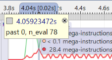
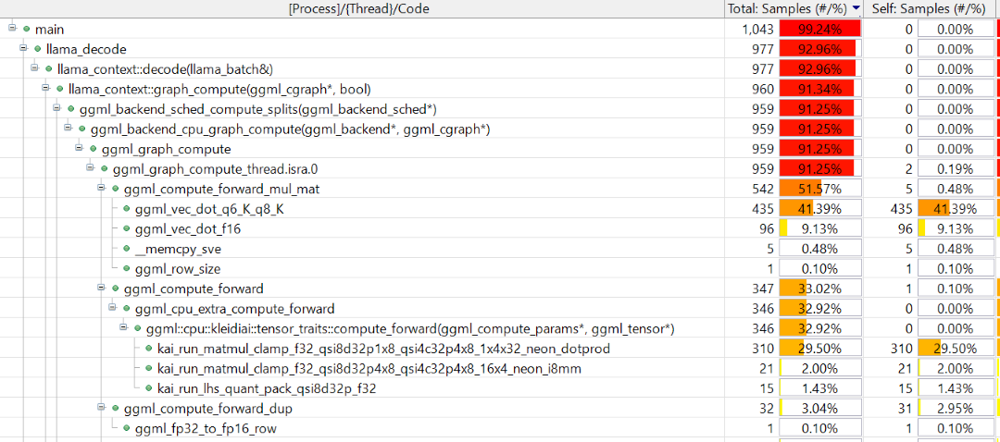

## Run llama-cli and analyze the data with Streamline

After successfully building llama-cli, the next step is to set up the runtime environment on your Arm platform. This can be your development machine or another Arm system.

### Set up the gator daemon

The gator daemon, `gatord`, is the Streamline collection agent that runs on the target device. It captures performance data including CPU metrics, PMU events, and annotations, then sends this data to the Streamline analysis tool running on your host machine. The daemon needs to be running on your target device before you can capture performance data.

Depending on how you built llama.cpp:

For the cross-compiled build flow:

  - Copy the `llama-cli` executable to your Arm target. 
  - Copy the `gatord` binary from the Arm Performance Studio release. If you are targeting Linux, take it from `streamline\bin\linux\arm64` and if you are targeting Android take it from `streamline\bin\android\arm64`.

Put both of these programs in your home directory on the target system. 

For the native build flow:
  - Use the `llama-cli` from your local build in `llama.cpp/build/bin` and the `gatord` you compiled earlier at `~/gator/build-native-gcc-rel/gatord`.  

You now have the `gatord` and the `llama-cli` on the computer you want to run and profile. 

### Download a lightweight model

You can download the LLM model to the target platform.

For demonstration, use the lightweight `Qwen1_5-0_5b-chat-q4_0.gguf` model, which can run on both Arm servers and resource-constrained edge devices:

```bash
cd ~
wget https://huggingface.co/Qwen/Qwen1.5-0.5B-Chat-GGUF/resolve/main/qwen1_5-0_5b-chat-q4_0.gguf
```

### Run the Gator daemon

Start the gator daemon on your Arm target:

```bash
./gatord
```

You should see similar messages to those shown below:

``` bash
Streamline Data Recorder v9.6.0 (Build oss)
Copyright (c) 2010-2025 Arm Limited. All rights reserved.

Gator ready
```

### Connect Streamline

Next, you can use Streamline to set up the collection of CPU performance data.

If you're accessing the Arm server via SSH, you need to forward port `8080` from the host platform to your local machine.

``` bash
ssh -i <key.pem> user@arm-server -L 8080:localhost:8080 -N
```

Append `-L 8080:localhost:8080 -N` to your original SSH command to enable local port forwarding, this allows Arm Streamline on your local machine to connect to the Arm server. 

Then launch the Streamline application on your host machine, connect to the gatord running on your Arm target with either TCP or ADB connection. 
You can select PMU events to be monitored at this point. 

{}
If you are using ssh port forwarding, you need to select TCP `127.0.0.1:8080`.
{}


Set the path of llama-cli executable for Streamline so that its debug info can be used for analysis.


Click `Start Capture` button on Streamline to start collecting data from the Arm target.

{}
This guide is not intended to introduce how to use Streamline, if you encounter any issues with gatord or Streamline, please refer to the [Streamline User Guide](https://developer.arm.com/documentation/101816/latest/?lang=en)
{}

### Run llama-cli

Run the `llama-cli` executable as below:

``` bash
cd ~/llama.cpp/build/bin
./llama-cli -m qwen1_5-0_5b-chat-q4_0.gguf -p "<|im_start|>system\nYou are a helpful AI assistant.<|im_end|>\n<|im_start|>user\nTell me a story about a fox and a crow? Please do not tell the traditional story in Aesop's fables. Please tell me a positive story about friendship and love. The story should have no more than 400 words<|im_end|>\n<|im_start|>assistant\n" -st -t 1
``` 

After a while, you can stop the Streamline data collection by clicking the `Stop` button on Streamline. 

Streamline running on your host PC will start the data analysis.

### Analyze the data with Streamline

From the timeline view of Streamline, you can see some Annotation Markers. Since an Annotation Marker is added before the llama_decode function, each Annotation Marker marks the start time of a token generation. 


The string in the Annotation Marker can be shown when clicking those Annotation Markers. For example,


The number after `past` indicates the position of input tokens, the number after `n_eval` indicates the number of tokens to be processed this time.

By checking the string of Annotation Marker, the first token generation at Prefill stage has `past 0, n_eval 78`, which means that the position of input tokens starts at 0 and there are 78 input tokens to be processed.

You can see that the first token generated at Prefill stage takes more time, since 78 input tokens have to be processed at Prefill stage, it performs lots of GEMM operations. At Decode stage, tokens are generated one by one at mostly equal speed, one token takes less time than that of Prefill stage, thanks to the effect of KV cache. At Decode stage, it performs many GEMV operations.

You can further investigate it with PMU event counters that are captured by Streamline. At Prefill stage, the amount of computation, which are indicated by PMU event counters that count number of Advanced SIMD (NEON), Floating point, Integer data processing instruction, is large. However, the memory access is relatively low. Especially, the number of L3 cache refill/miss is much lower than that of Decode stage.

At Decode stage, the amount of computation is relatively less (since the time of each token is less), but the number of L3 cache refill/miss goes much higher.


You can see that at Prefill stage, Backend Stall Cycles due to Memory stall are only about 10% of total Backend Stall Cycles. However, at Decode stage, Backend Stall Cycles due to Memory stall are around 50% of total Backend Stall Cycles.
All those PMU event counters indicate that it is compute-bound at Prefill stage and memory-bound at Decode stage.

Now, you can further profile the code execution with Streamline. In the Call Paths view of Streamline, you can see the percentage of running time of functions that are organized in form of call stack.



In the Functions view of Streamline, you can see the overall percentage of running time of functions.


As you can see, the function, graph_compute, takes the largest portion of the running time. 

It shows that large amounts of GEMM and GEMV operations take most of the time. 

With the `Qwen1_5-0_5b-chat-q4_0` model, the computation (GEMM and GEMV) of Q, K, V vectors and most of FFN layers: their weights are with Q4_0 data type and the input activations are with FP32 data type. 

The computation is forwarded to KleidiAI trait by `ggml_cpu_extra_compute_forward`. KleidiAI microkernels implemented with NEON dot product and i8mm vector instructions accelerate the computation.

At the Prefill stage, `kai_run_matmul_clamp_f32_qsi8d32p4x8_qsi4c32p4x8_16x4_neon_i8mm` KleidiAI ukernel is used for GEMM (Matrix Multiply) operators. It takes advantage of i8mm instructions. Since the Prefill stage only takes a small percentage of the whole time, the percentage of this function is small as shown in figures above. However, if you focus only on the Prefill stage with Samplings view in Timeline, you see `kai_run_matmul_clamp_f32_qsi8d32p4x8_qsi4c32p4x8_16x4_neon_i8mm` takes the largest portion of the Prefill stage.


At the Decode stage, `kai_run_matmul_clamp_f32_qsi8d32p1x8_qsi4c32p4x8_1x4x32_neon_dotprod` KleidiAI ukernel is used for GEMV operators. It takes advantage of dot product instructions. If you look only at the Decode stage, you can see this function takes the second largest portion. 


There is a result_output linear layer in Qwen1_5-0_5b-chat-q4_0 model, the weights are with Q6_K data type. The layer computes a huge [1, 1024] x [1024, 151936] GEMV operation, where 1024 is the embedding size and 151936 is the vocabulary size. This operation cannot be handled by KleidiAI yet, it is handled by the ggml_vec_dot_q6_K_q8_K function in ggml-cpu library.

The tensor nodes for computation of Multi-Head attention are presented as three-dimension matrices with FP16 data type (KV cache also holds FP16 values), they are computed by ggml_vec_dot_f16 function in ggml-cpu library.

The computation of RoPE, Softmax, RMSNorm layers does not take significant portion of the running time.

### Analyzing results
- Annotation Markers show token generation start points.
- Prefill stage: past 0, n_eval 78 → compute-bound (large GEMM).
- Decode stage: one token at a time → memory-bound (KV cache, GEMV).
- PMU events: SIMD/FP/INT instructions high in Prefill, L3 cache misses high in Decode.
- Backend stalls: ~10% memory stalls in Prefill vs ~50% in Decode.

| Stage   | Main Ops | Bottleneck     | Observations                                     |
|---------|----------|----------------|--------------------------------------------------|
| Prefill | GEMM     | Compute-bound  | Heavy SIMD/FP/INT ops, few cache refills         |
| Decode  | GEMV     | Memory-bound   | Light compute, many L3 cache misses, ~50% stalls |
| Prefill | GEMM     | Compute-bound  | Heavy SIMD/FP/INT ops, few cache refills         |
| Decode  | GEMV     | Memory-bound   | Light compute, many L3 cache misses, ~50% stalls |
|---------|----------|----------------|--------------------------------------------------|
| Prefill | GEMM     | Compute-bound  | Heavy SIMD/FP/INT ops, few cache refills         |
| Decode  | GEMV     | Memory-bound   | Light compute, many L3 cache misses, ~50% stalls |
