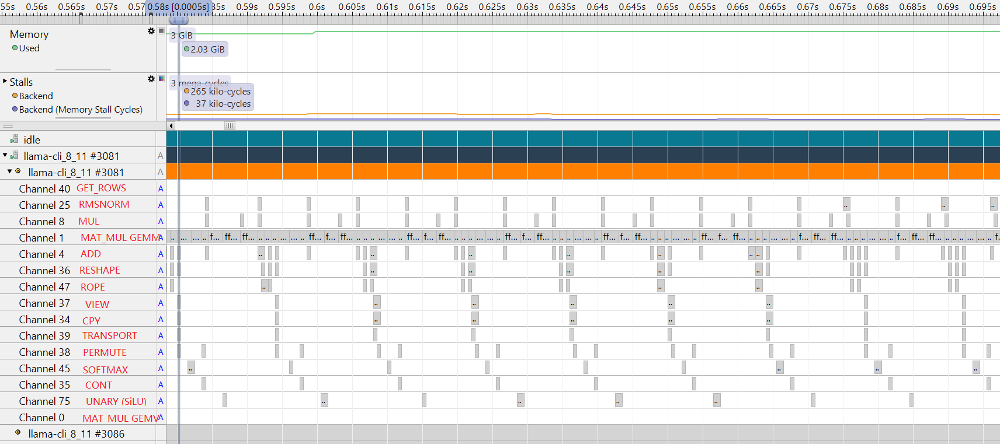

## Overview of Annotation Channels

You can use Streamline Annotation Channels to analyze the execution time of each node in the compute graph, which is especially valuable for understanding and optimizing performance on Arm-based systems. Annotation Channels are specialized annotations that group related operations into separate visual channels in Streamline. Unlike simple markers, channels allow you to track multiple concurrent operations and see their relationships over time.

More details on Annotation Channels can be found in the [Group and Channel annotations](https://developer.arm.com/documentation/101816/9-7/Annotate-your-code/User-space-annotations/Group-and-Channel-annotations?lang=en) section of the Streamline User Guide.

## Integrate Annotation Channels into llama.cpp

In llama.cpp, tensor nodes are executed in the CPU backend inside the function `ggml_graph_compute_thread()` in the file `~/llama.cpp/ggml/src/ggml-cpu/ggml-cpu.c`.  

In the selected release tag, the loop over tensor nodes looks like this (around line 2862):

```c
for (int node_n = 0; node_n < cgraph->n_nodes && atomic_load_explicit(&tp->abort, memory_order_relaxed) != node_n; node_n++) {
        struct ggml_tensor * node = cgraph->nodes[node_n];

        ggml_compute_forward(&params, node);
```

To monitor operator execution time, you can create annotation channels for each type of operators such as `GGML_OP_MUL_MAT`, `GGML_OP_SOFTMAX`, `GGML_OP_ROPE`, and `GGML_OP_MUL`. Matrix operations (`GGML_OP_MUL_MAT`) take a significant portion of execution time. These operations include both GEMM (General Matrix Multiply) and GEMV (General Matrix-Vector multiply) operations. You'll create two dedicated annotation channels for GEMM and GEMV respectively to analyze their performance separately. The annotation starts at the beginning of `ggml_compute_forward()` and stops at the end. This approach allows you to monitor the computation time of each tensor node/operator. 

## Add annotation code to monitor operators 

First, add the Streamline annotation header file to `ggml-cpu.c`:

```c
#include "streamline_annotate.h" 
```

Edit the `ggml_graph_compute_thread()` function in the file `~/llama.cpp/ggml/src/ggml-cpu/ggml-cpu.c`. 

Add the following code in front and after the `ggml_compute_forward(&params, node)`. 

Your code now looks like:

```c
for (int node_n = 0; node_n < cgraph->n_nodes && atomic_load_explicit(&tp->abort, memory_order_relaxed) != node_n; node_n++) {
        struct ggml_tensor * node = cgraph->nodes[node_n];
        
    // +++ Start Annotation Channel for Streamline
    {
        char printf_buf[256];
        sprintf(printf_buf," %s, %s", node->name, ggml_get_name(node)); 

        if(node->op==GGML_OP_MUL_MAT ) {
            if (node->src[1]->ne[1] == 1)
                ANNOTATE_CHANNEL(0, printf_buf);    //It is GEMV
            else    
                ANNOTATE_CHANNEL(1, printf_buf);    //It is GEMM
        }
        else
            ANNOTATE_CHANNEL((node->op)+2, printf_buf);
    }
    // --- Start Annotation Channel for Streamline

    ggml_compute_forward(&params, node);

    // +++ End Annotation Channel for Streamline
    {
        if(node->op==GGML_OP_MUL_MAT) {
            if (node->src[1]->ne[1] == 1)
                ANNOTATE_CHANNEL_END(0);
            else
                ANNOTATE_CHANNEL_END(1);
        }
        else
            ANNOTATE_CHANNEL_END((node->op)+2);
    }
    // --- End Annotation Channel for Streamline
```

## Include tensor shape information (optional) 

You can also add information about the shape and size of source tensors by replacing the sprintf function as follows:

```c
        sprintf(printf_buf,"%s %s %d_%d_%d %d_%d_%d",  node->name, ggml_get_name(node), \
            node->src[0]? node->src[0]->ne[0] : 0,  \
            node->src[0]? node->src[0]->ne[1] : 0 , \
            node->src[0]? node->src[0]->ne[2] : 0 ,\
            node->src[1]? node->src[1]->ne[0] : 0, \
            node->src[1]? node->src[1]->ne[1] : 0, \
            node->src[1]? node->src[1]->ne[2] : 0 \
        ); 
```

## Update build configuration 

Edit `~/llama.cpp/ggml/src/ggml-cpu/CMakeLists.txt` to include the Streamline Annotation header file and `libstreamline_annotate.a` library by adding these lines:

```bash
   set(STREAMLINE_LIB_PATH "${CMAKE_SOURCE_DIR}/streamline_annotation/libstreamline_annotate.a")
   target_include_directories( ${GGML_CPU_NAME} PRIVATE "${CMAKE_SOURCE_DIR}/streamline_annotation")
   target_link_libraries(${GGML_CPU_NAME} PRIVATE ${STREAMLINE_LIB_PATH} )
```

Then, build `llama-cli` again.

## Examine operator performance patterns

Run `llama-cli` and collect profiling data with Streamline as you did in the previous section.

Arm Streamline displays string annotations as text overlays in the relevant channels in the Timeline view, such as Channel 0, as shown in the following screenshot.


The letter `A` is displayed in the process list to indicate the presence of annotations. 

String annotations are also displayed in the **Message** column in the Log view.


## Compare GEMM operations during prefill

The screenshot of annotation channel view at prefill stage is shown as below:


The operator name in the screenshot above is manually edited. If you want the operator name to be shown instead of the Channel number by Streamline, you can add ANNOTATE_NAME_CHANNEL to the `ggml_graph_compute_thread` function. 

This annotation macro is defined as:  

```c
ANNOTATE_NAME_CHANNEL(channel, group, string)
```

For example:

```c
   ANNOTATE_NAME_CHANNEL(0, 0, "MUL_MAT_GEMV");
   ANNOTATE_NAME_CHANNEL(1, 0, "MUL_MAT_GEMM"); 
```

The code above sets the name of annotation channel 0 as `MUL_MAT_GEMV` and channel 1 as `MUL_MAT_GEMM`.

Zoom into the timeline view to examine additional details:



When moving the cursor over an annotation channel, Streamline shows:  

- The tensor node name  
- The operator type  
- The shape and size of the source tensors  


The example above shows a `GGML_OP_MUL_MAT` operator for the `FFN_UP` node.
The source tensors have shapes [1024, 2816] and [1024, 68].  

This view makes it clear that:  
- The majority of time at the Prefill stage is spent on `MUL_MAT GEMM` operations in the attention and FFN layers.  
- There is also a large `MUL_MAT GEMV` operation in the `result_output` linear layer.  
- Other operators, such as MUL, Softmax, Norm, RoPE, consume only a small portion of execution time.

## Analyze GEMV operations during Decode

The annotation channel view for the Decode stage is shown below:


Zooming in provides additional details:


This view reveals that the majority of time in Decode is spent on `MUL_MAT GEMV` operations within the attention and FFN layers. Unlike the Prefill stage, no GEMM operations are executed in these layers during Decode. The `result_output` linear layer contains a large GEMV operation that takes an even larger proportion of runtime in Decode compared to Prefill. This pattern is expected since each token generation at Decode is shorter due to KV cache reuse, making the `result_output` layer more dominant in the overall execution profile. 

## Summary

You have successfully implemented Annotation Channels to analyze individual operators within llama.cpp. This detailed view reveals how different operators contribute to overall execution time and shows the stark differences between Prefill (GEMM-dominated) and Decode (GEMV-dominated) stages. The next section will explore how these operations utilize multiple CPU cores and threads. 
