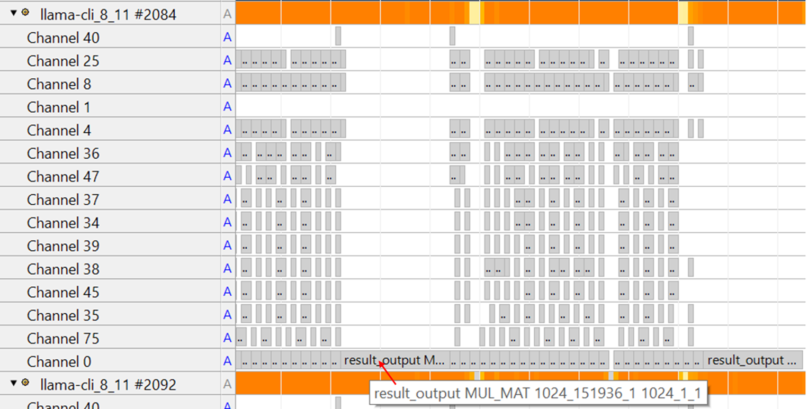

## Deep Dive Into Individual Operator

This module shows how to use **Streamline Annotation Channels** to analyze the execution time of each node in the compute graph. More details on Annotation Channels can be found [here](https://developer.arm.com/documentation/101816/9-7/Annotate-your-code/User-space-annotations/Group-and-Channel-annotations?lang=en).

## Integrating Annotation Channels into llama.cpp

In llama.cpp, tensor nodes are executed in the CPU backend inside the function `ggml_graph_compute_thread` (`~/llama.cpp/ggml/src/ggml-cpu/ggml-cpu.c`).  

In our selected release tag, the loop over tensor nodes looks like this (around line 2862):

```c
for (int node_n = 0; node_n < cgraph->n_nodes && atomic_load_explicit(&tp->abort, memory_order_relaxed) != node_n; node_n++) {
        struct ggml_tensor * node = cgraph->nodes[node_n];

        ggml_compute_forward(&params, node);
```

To monitor operator execution time, let's create annotation channels for each type of operators (such as `GGML_OP_MUL_MAT`, `GGML_OP_SOFTMAX`, `GGML_OP_ROPE` and `GGML_OP_MUL`).

Since `GGML_OP_MUL_MAT` including both GEMM and GEMV operation takes significant portion of execution time, two dedicated annotation channels are created for GEMM and GEMV respectively. 

The annotation starts at the beginning of `ggml_compute_forward` and stops at the end, so that the computation of tensor node/operator can be monitored. 

### Step 1: Add Annotation Code 

Firstly, add Streamline annotation header file to ggml-cpu.c,

```c
#include "streamline_annotate.h" 
```

Edit `ggml_graph_compute_thread` function in `~/llama.cpp/ggml/src/ggml-cpu/ggml-cpu.c`. 

Add following code in front and after the **ggml_compute_forward(&params, node)**. 

Your code will be looks like:

```c

for (int node_n = 0; node_n < cgraph->n_nodes && atomic_load_explicit(&tp->abort, memory_order_relaxed) != node_n; node_n++) {
        struct ggml_tensor * node = cgraph->nodes[node_n];
        
    // +++ Start Annotation Channel for Streamline
    {
        char printf_buf[256];
        sprintf(printf_buf," %s, %s", node->name, ggml_get_name(node)); 

        if(node->op==GGML_OP_MUL_MAT ) {
            if (node->src[1]->ne[1] == 1)
                ANNOTATE_CHANNEL(0, printf_buf);    //It is GEMV
            else    
                ANNOTATE_CHANNEL(1, printf_buf);    //It is GEMM
        }
        else
            ANNOTATE_CHANNEL((node->op)+2, printf_buf);
    }
    // --- Start Annotation Channel for Streamline

    ggml_compute_forward(&params, node);

    // +++ End Annotation Channel for Streamline
    {
        if(node->op==GGML_OP_MUL_MAT) {
            if (node->src[1]->ne[1] == 1)
                ANNOTATE_CHANNEL_END(0);
            else
                ANNOTATE_CHANNEL_END(1);
        }
        else
            ANNOTATE_CHANNEL_END((node->op)+2);
    }
    // --- End Annotation Channel for Streamline
```

### Step 2: Add Tensor Shape Info (Optional) 

You can also add information of the shape and size of source tensor by replace sprintf funcation as follow:

```c
        sprintf(printf_buf,"%s %s %d_%d_%d %d_%d_%d",  node->name, ggml_get_name(node), \
            node->src[0]? node->src[0]->ne[0] : 0,  \
            node->src[0]? node->src[0]->ne[1] : 0 , \
            node->src[0]? node->src[0]->ne[2] : 0 ,\
            node->src[1]? node->src[1]->ne[0] : 0, \
            node->src[1]? node->src[1]->ne[1] : 0, \
            node->src[1]? node->src[1]->ne[2] : 0 \
        ); 
```

### Step 3: Update CMakeLists 

Edit `~/llama.cpp/ggml/src/ggml-cpu/CMakeLists.txt` to include Streamline Annotation header file and libstreamline_annotate.a library by adding codes, copy following lines inside ggml_add_cpu_backend_variant_impl function.

```bash
   set(STREAMLINE_LIB_PATH "${CMAKE_SOURCE_DIR}/streamline_annotation/libstreamline_annotate.a")
   target_include_directories( ${GGML_CPU_NAME} PRIVATE "${CMAKE_SOURCE_DIR}/streamline_annotation")
   target_link_libraries(${GGML_CPU_NAME} PRIVATE ${STREAMLINE_LIB_PATH} )
```

Then, build `llama-cli` again.

### Analyze the data with Streamline

Run llama-cli and collect profiling data with Streamline as previous session.

String annotations are displayed as text overlays inside the relevant channels in the details panel of the `Timeline` view.

For example, inside Channel 0 in the following screenshot. 


The letter A is displayed in the process list to indicate the presence of annotations. 
String annotations are also displayed in the Message column in the Log view.


### View of individual operators at Prefill stage

The screenshot of annotation channel view at Prefill stage is shown as below,


Note that the name of operator in the screenshot above is manually edited. If the name of operator needs to be shown instead of Channel number by Streamline, ANNOTATE_NAME_CHANNEL can be added to ggml_graph_compute_thread function. 
This annotation macro is defined as,  

```c
ANNOTATE_NAME_CHANNEL(channel, group, string)
```

For example, 
```c
   ANNOTATE_NAME_CHANNEL(0, 0, "MUL_MAT_GEMV");
   ANNOTATE_NAME_CHANNEL(1, 0, "MUL_MAT_GEMM"); 
```

The code above sets the name of annotation channel 0 as **MUL_MAT_GEMV** and channel 1 as **MUL_MAT_GEMM**.
By zooming into the timeline view, you can see more details:


When moving the cursor over an annotation channel, Streamline shows:  
- The tensor node name  
- The operator type  
- The shape and size of the source tensors  


In the example above, we see a `GGML_OP_MUL_MAT` operator for the **FFN_UP** node.  
Its source tensors have shapes **[1024, 2816]** and **[1024, 68]**.  

This view makes it clear that:  
- The majority of time at the **Prefill stage** is spent on **MUL_MAT GEMM** operations in the attention and FFN layers.  
- There is also a large **MUL_MAT GEMV** operation in the `result_output` linear layer.  
- Other operators, such as **MUL, Softmax, Norm, RoPE**, consume only a small portion of execution time.

### View of individual operators at Decode stage
The annotation channel view for the **Decode stage** is shown below:


Zooming in provides additional details:


From this view, we observe:  
- The majority of time in **Decode** is spent on **MUL_MAT GEMV** operations in the attention and FFN layers.  
- In contrast to Prefill, **no GEMM operations** are executed in these layers.  
- The `result_output` linear layer has a **large GEMV operation**, which takes an even larger proportion of runtime in Decode.  
- This is expected, since each token generation at Decode is shorter due to KV cache reuse, making the result_output layer more dominant.  
