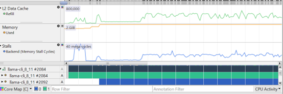
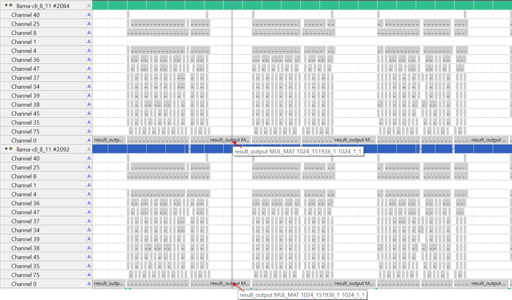

## Understand llama.cpp multi-threading architecture

The CPU backend in llama.cpp uses multiple cores and threads to accelerate operator execution. Understanding how work is distributed across threads helps you optimize performance on Arm processors.

llama.cpp creates a threadpool where the number of threads is controlled by the `-t` option. If `-t` is not specified, it defaults to the number of CPU cores in the system. The `-C` option controls thread affinity, which determines which specific cores threads run on.

The entry point for secondary threads is the function `ggml_graph_compute_secondary_thread()`. When computing a tensor node/operator with a large workload, llama.cpp splits the computation into multiple parts and distributes these parts across threads for parallel execution.  

## Example: MUL_MAT operator parallelization

For the MUL_MAT operator, the output matrix C can be divided across threads:


In this example, four threads each compute one quarter of matrix C.

## Profile thread execution with Streamline

The execution of multiple threads on CPU cores can be observed using Core Map and Cluster Map modes in the Streamline Timeline. These visualization modes show how threads are distributed across CPU cores and help identify performance bottlenecks in parallel execution.  

Learn more about these modes in the [Core Map and Cluster Map modes](https://developer.arm.com/documentation/101816/9-7/Analyze-your-capture/Viewing-application-activity/Core-Map-and-Cluster-Map-modes) section of the Streamline User Guide.

## Configure thread affinity for analysis

Run llama-cli with `-t 2 -C 0x3` to specify two threads and thread affinity as CPU core0 and core1. Thread affinity ensures threads run on specific cores, making performance analysis more predictable.

```bash
./llama-cli -m qwen1_5-0_5b-chat-q4_0.gguf -p "<|im_start|>system\nYou are a helpful AI assistant.<|im_end|>\n<|im_start|>user\nTell me a story about a fox and a crow? Please do not tell the traditional story in Aesop's fables. Please tell me a positive story about friendship and love. The story should have no more than 400 words<|im_end|>\n<|im_start|>assistant\n" -st -t 2 -C 0x3
```

## Analyze Streamline results

Collect profiling data with Streamline, then select Core Map and Cluster Map modes in the Timeline view.



In the screenshot above, you can observe that two threads are created and they are running on CPU core0 and CPU core1, respectively. This confirms that the thread affinity configuration is working correctly.

You can also use the Annotation Channel view to analyze operator execution on a per-thread basis. Each thread generates its own annotation channel independently, allowing you to see how work is distributed across parallel execution units.



In the screenshot above, at the highlighted time, both threads are executing the same node. In this particular case, the node is the result_output linear layer. You can see how the workload is distributed across threads, with each thread processing a different portion of the matrix computation. This visualization helps identify load balancing issues and optimization opportunities in parallel execution.

## Summary

You have successfully completed the walkthrough of profiling an LLM model on an Arm CPU using advanced multi-threading analysis techniques.

You now understand how to integrate Streamline annotations into LLM inference code for detailed profiling, capture and analyze performance data showing the distinct characteristics of Prefill and Decode stages, and use Annotation Channels to analyze individual operators and their execution patterns. Additionally, you can configure thread affinity and examine multi-threaded execution patterns across CPU cores while identifying performance bottlenecks and work distribution issues in parallel execution.

These skills enable you to optimize LLM performance on Arm CPUs by understanding where computational resources are spent and how to leverage multi-core parallelism effectively. By combining Arm Streamline with a solid understanding of llama.cpp threading architecture, you can visualize model execution, analyze code efficiency, and identify opportunities for optimization.

