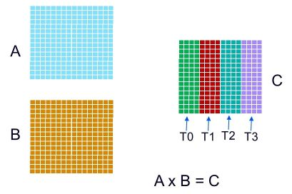
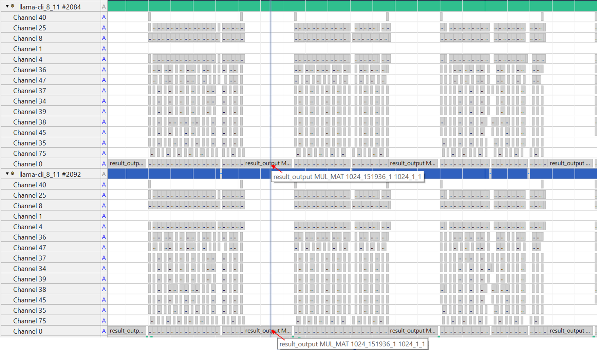

## Analyze multi-threaded performance

The CPU backend in llama.cpp uses multiple cores and threads to accelerate operator execution.

It creates a threadpool, where:  
- The number of threads is controlled by the `-t` option  
- If `-t` is not specified, it defaults to the number of CPU cores in the system

The entrypoint for secondary threads is the function `ggml_graph_compute_secondary_thread()`.  

When computing a tensor node/operator with a large workload, llama.cpp splits the computation into multiple parts and distributes them across threads.  

### Example: MUL_MAT Operator

For the MUL_MAT operator, the output matrix C can be divided across threads:



In this example, four threads each compute one quarter of matrix C.  

### Observing thread execution with Streamline

The execution of multiple threads on CPU cores can be observed using Core Map and Cluster Map modes in the Streamline Timeline.  

Learn more about these modes in the [Core Map and Cluster Map modes](https://developer.arm.com/documentation/101816/9-7/Analyze-your-capture/Viewing-application-activity/Core-Map-and-Cluster-Map-modes) section of the Streamline User Guide.

Run llama-cli with `-t 2 -C 0x3` to specify two threads and thread affinity as CPU core0 and core1.

```bash
./llama-cli -m qwen1_5-0_5b-chat-q4_0.gguf -p "<|im_start|>system\nYou are a helpful AI assistant.<|im_end|>\n<|im_start|>user\nTell me a story about a fox and a crow? Please do not tell the traditional story in Aesop's fables. Please tell me a positive story about friendship and love. The story should have no more than 400 words<|im_end|>\n<|im_start|>assistant\n" -st -t 2 -C 0x3
```

### Streamline results

Collect profiling data with Streamline, then select Core Map and Cluster Map modes in the Timeline view.


In the screenshot above:  
- Two threads are created  
- They are running on CPU core0 and CPU core1, respectively  

In addition, you can use the Annotation Channel view to analyze operator execution on a per-thread basis. Each thread generates its own annotation channel independently.



In the screenshot above, at the highlighted time:  
- Both threads are executing the same node  
- In this case, the node is the result_output linear layer

You have completed the walkthrough of profiling an LLM model on an Arm CPU! 

By combining Arm Streamline with a solid understanding of llama.cpp, you can visualize model execution, analyze code efficiency, and identify opportunities for optimization.

Keep in mind that adding annotation code to llama.cpp and gatord may introduce a small performance overhead, so profiling results should be interpreted with this in mind.
