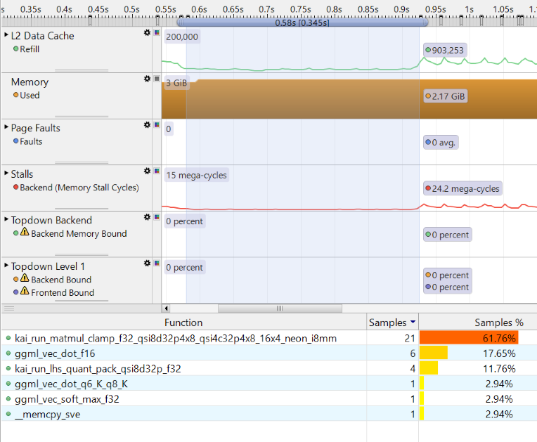

# Analyzing token generation at Prefill and Decode stage
Annotation Marker feature of Streamline is used and the Annotation Marker generation code is integrated to the llama.cpp project. We can have a visible token generation view at Prefill and Decode stage.
You can find more information about Annotation Marker feature here, https://developer.arm.com/documentation/101816/9-7/Annotate-your-code?lang=en. 

## Steps of llama.cpp integration and Streamline setup

### Step 1: Build Streamline Annotation library
Install ArmDS or Arm Streamline on your host PC first. 
You can get Streamline Annotation support code in the installation directory like Arm\Development Studio 2024.1\sw\streamline\gator\annotate. 
You can also get the Annotation support  code here, https://github.com/ARM-software/gator/tree/main , please download the proper code that matches the version of your Streamline tool.

Then you can build the Streamline Annotation Library by running 
```bash
make CROSS_COMPILE=/path/to/aarch64_linux_gcc_tool 
```

for example,
```bash
make CROSS_COMPILE=./Work/arm-gnu-toolchain-13.3.rel1-x86_64-aarch64-none-linux-gnu/bin/aarch64-none-linux-gnu- 
```
The static linked library, libstreamline_annotate.a, will be produced. 

### Step 2: Integrate Annotation Marker code to llama.cpp
Download llama.cpp code from  https://github.com/ggml-org/llama.cpp/archive/refs/tags/b6202.tar.gz 
Go to llama.cpp root directory and create a directory ‘streamline_annotation’ under the llama.cpp root directory 
```bash
cd ./llama.cpp
mkdir streamline_annotation
```

Copy the library ‘libstreamline_annotate.a’ and the header file ‘streamline_annotate.h’ from Step 1 to the directory ‘streamline_annotation’.

To link libstreamline_annotate.a for building llama-cli, change llama.cpp\CMakeLists.txt by adding following lines,

```script
set(STREAMLINE_LIB_PATH  ${CMAKE_SOURCE_DIR}/streamline_annotation/libstreamline_annotate.a)
target_include_directories(llama-cli PRIVATE ${CMAKE_SOURCE_DIR}/streamline_annotation)
target_link_libraries(${TARGET} PRIVATE ${STREAMLINE_LIB_PATH} )
```

To add Annotation Markers to llama-cli, change the llama-cli code ./llama.cpp/tools/main/main.cpp by adding
```c
#include "streamline_annotate.h" 
```
and

```c
          for (int i = 0; i < (int) embd.size(); i += params.n_batch) {
                int n_eval = (int) embd.size() - i;
                if (n_eval > params.n_batch) {
                    n_eval = params.n_batch;
                }

                LOG_DBG("eval: %s\n", string_from(ctx, embd).c_str());
	
               // Add annotation marker code for Streamline 				
	           {
                   char printf_buf[200]; 
                   sprintf(printf_buf, "past %d, n_eval %d", n_past,n_eval ); 
                   ANNOTATE_MARKER_STR(printf_buf);
                 }
              // End of annotation marker 

                if (llama_decode(ctx, llama_batch_get_one(&embd[i], n_eval))) {
                    LOG_ERR("%s : failed to eval\n", __func__);
                    return 1;
                }
```


### Step 3: Build llama-cli executable 
For convenience, we build the llama-cli by using static link. 
You can get the aarch64 gcc compiler toolchain here, https://developer.arm.com/downloads/-/arm-gnu-toolchain-downloads .

Firstly, create a new directory ‘build’ understand llama.cpp directory and go into it.
```bash
mkdir ./build & cd ./build
```
Then configure the project by running 
```bash
cmake .. -DCMAKE_SYSTEM_NAME=Linux  -DCMAKE_SYSTEM_PROCESSOR=arm -DCMAKE_C_COMPILER=aarch64-none-linux-gnu-gcc -DCMAKE_CXX_COMPILER=aarch64-none-linux-gnu-g++ -DLLAMA_NATIVE=OFF -DLLAMA_F16C=OFF  -DLLAMA_GEMM_ARM=ON -DBUILD_SHARED_LIBS=OFF  -DCMAKE_EXE_LINKER_FLAGS="-static -g" -DGGML_OPENMP=OFF -DCMAKE_C_FLAGS="-march=armv8.2-a+i8mm+dotprod -g" -DCMAKE_CXX_FLAGS="-march=armv8.2-a+dotprod+i8mm -g" -DGGML_CPU_KLEIDIAI=ON -DGGML_OPENMP=OFF -DLLAMA_BUILD_TESTS=OFF -DLLAMA_BUILD_EXAMPLES=ON  -DLLAMA_CURL=OFF
```

Set CMAKE_C_COMPILER and DCMAKE_CXX_COMPILER to your cross compiler path. Make sure that “-march” in DCMAKE_C_FLAGS and CMAKE_CXX_FLAGS matches your Arm CPU hardware. 

In this guide, we use an Arm CPU which supports NEON Dotprod and I8MM instructions, so ‘-march’ is specified as ‘armv8.2-a+dotprod+i8mm’. We also specify ‘-static’ and ‘-g’ options so that the produced llama-cli executable is statically linked and with debug info. By doing this, it makes source code/function level profiling easier and the llama-cli executable runnable on various version of Arm64 Linux/Android.

Now, we can build the project by running
```bash
cmake --build ./ --config Release
```

After the building process, you should find the llama-cli executable in ./build/bin/ directory.

### Step 4: Run llama-cli and use Streamline for analysis
Copy following files to your Arm64 platform,
* llama-cli executable 
* the ‘gatord’ executable in ArmDS or Streamline installation folder, such as ‘Arm\Development Studio 2024.1\sw\streamline\bin\linux\arm64’  for Linux and ‘Arm\Development Studio 2024.1\sw\streamline\bin\android\arm64’ for Android
* the LLM model, Qwen1_5-0_5b-chat-q4_0.gguf

Then run the gatord on your Arm64 target
```bash
./gatord
```
You should see some messages below, 

``` bash
Streamline Data Recorder v9.4.0 (Build 9b1e8f8)
Copyright (c) 2010-2024 Arm Limited. All rights reserved.
Gator ready
```

Then launch the Streamline application on your host PC, connect to the gatord running on your Arm64 target with either TCP or ADB connection. You can select PMU events to be monitored at this point. 

<p align="center">
    
</p>

Please set the path of llama-cli executable is specified for Streamline so that the debug info in the executable can be used for analysis.

<p align="center">
    
</p>

You can click ‘Start Capture’ button on Streamline to start collecting data from the Arm64 target.

Note: This guide is not intended to introduce how to use Streamline, if you encounter any issue during setting up gatord or Streamline, please seek for help from Arm support.

Now, run the llama-cli executable as below,

``` bash
./llama-cli -m qwen1_5-0_5b-chat-q4_0.gguf -p "<|im_start|>system\nYou are a helpful AI assistant.<|im_end|>\n<|im_start|>user\nTell me a story about a fox and a crow? Please do not tell the traditional story in Aesop's fables. Please tell me a positive story about friendship and love. The story should have no more than 400 words<|im_end|>\n<|im_start|>assistant\n" -st -t 1
``` 

After a while, you can stop the Streamline data collection by clicking ‘Stop’ button on Streamline. Then Streamline on your host PC will start the data analysis.

## Analyze the data with Streamline
From the timeline view of Streamline, we can see some Annotation Markers, since we add an Annotation Marker before llama_decode function, each Annotation Marker marks the start time of a token generation. 

<p align="center">
    
</p>

We also add a string that includes the position input the tokens and number of input tokens to process in each Annotation Marker. The string can be shown when clicking those Annotation Markers. For example,

<p align="center">
    
</p>

The number after ‘past’ indicates the position of input tokens, the number after ‘n_eval’ indicates the number of tokens to be processed this time.
As shown in the timeline view below, with help of Annotation Markers, we can clearly identify the Prefill stage and Decode stage. 

<p align="center">
    
</p>

We can see that the first token generated at Prefill stage takes more time, since 78 input tokens have to be processed at Prefill stage, it involves a lot of GEMM operations. At Decode stage, tokens are generated one by one at mostly equal speed, each token takes less time, thanks to the effect of KV cache. At Decode stage, it involves many GEMV operations.

We can further investigate it with PMU event counters that are captured by Streamline. At Prefill stage, the amount of computation, which are indicated by PMU event counters counting number of Advanced SIMD (NEON), Floating point, Integer data processing instruction, is large. However, the memory access is relatively low. Especially, the number of L3 cache refill/miss is much lower than that of Decode stage.

At Decode stage, the amount of computation is relatively less (since the time of each token is less), but the number of L3 cache refill/miss goes much higher.
By monitoring more PMU events, Backend Stall Cycles and Backend Stall Cycles due to Memory stall, 

<p align="center">
    
</p>

We can see that at Prefill stage, Backend Stall Cycles due to Memory stall are only about 10% of total Backend Stall Cycles. However, at Decode stage, Backend Stall Cycles due to Memory stall are only around 50% of total Backend Stall Cycles.
All those PMU event counters indicate that it is compute-bound at Prefill stage, and memory-bound at Decode stage.

Now, let us further profile the code execution with Streamline. In the ‘Call Paths’ view of Streamline, we can see the percentage of running time of call stack.

<p align="center">
    
</p>

In the ‘Functions’ view of Streamline, we can see the percentage of running time of functions.

<p align="center">
    
</p>

As we can see, the function, graph_compute, takes the largest part of the running time. With understanding of llama.cpp code, it shows that large amounts of GEMM and GEMV operation take most of the time. 
* The computation (GEMM and GEMV) of Q, K, V vectors and most of FFN layers have weights with Q4_0 data type, and the input activations are with FP32 data type. The computation is forwarded to KleidiAI trait by ggml_cpu_extra_compute_forward. KleidiAI ukernels implemented with NEON Dotprod and I8MM vector instructions are used to accelerate the computation.
    - At Prefill stage, kai_run_matmul_clamp_f32_qsi8d32p4x8_qsi4c32p4x8_16x4_neon_i8mm ukernel is used for GEMM MAT_MUL(Matrix Multiply) operators. It takes the advantage of NEON I8MM instruction. Since Prefill stage only takes small percentage of the whole time, the percentage of this function is small as shown in figures above. However, if we focus on Prefill stage only, with ‘Samplings’ view in Timeline. We can see kai_run_matmul_clamp_f32_qsi8d32p4x8_qsi4c32p4x8_16x4_neon_i8mm takes the largest part of the whole Prefill stage.

    <p align="center">
      
    </p>

    - At Decode stage, kai_run_matmul_clamp_f32_qsi8d32p1x8_qsi4c32p4x8_1x4x32_neon_dotprod ukernel is used for GEMV MAT_MUL operators. It takes advantage of NEON Dotprod instruction. If we focus on Decode stage only, we can see this function takes the second largest percentage. 

    <p align="center">
      
    </p>

* There is a result output linear layer in qwen1_5-0_5b-chat-q4_0 model, the wights are with Q6_K data type. The computation for this layer is a huge [1, 1024] x [1024, 151936] GEMV operation, where 1024 is the embedding size and 151936 is the vocabulary size. This operation cannot be handled by KleidiAI yet, it is handled by the ggml_vec_dot_q6_K_q8_K function in ggml-cpu library.
* The tensor nodes for computation of   for Multi-Head attention are presented as three-dimension matrices with FP16 data type (KV cache also holds FP16 values), they are computed by ggml_vec_dot_f16 function in ggml-cpu library.
* The computation of RoPE, Softmax, RMSNorm layers does not take significant portion of the running time.