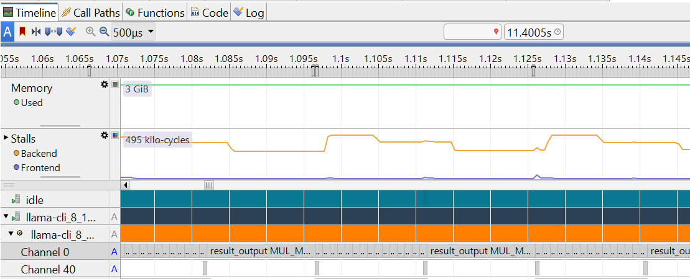
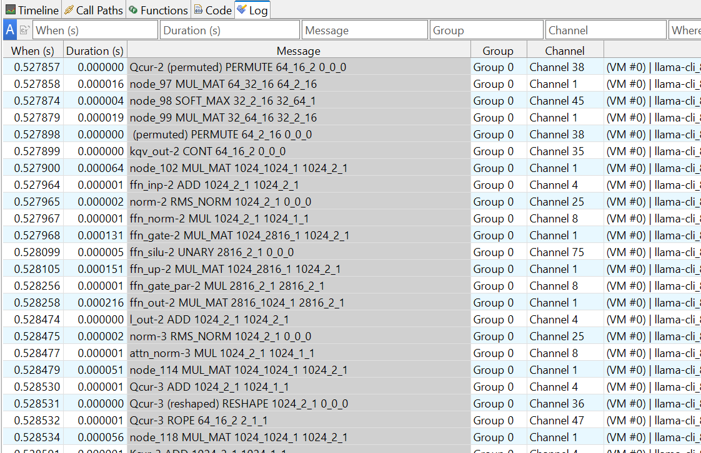

# Deep dive into individual operator
The session provides a guide of how to use the Streamline Annotation Channel feature to analyze running time of each node in the compute graph.
More information about Streamline Annotation Channel can be found here https://developer.arm.com/documentation/101816/9-7/Annotate-your-code/User-space-annotations/Group-and-Channel-annotations?lang=en 

## Integrate Annotation Channel code to llama.cpp 
In llama.cpp project, tensor nodes in compute graph are computed by the function ggml_graph_compute_thread in CPU backend, llama.cpp\ggml\src\ggml-cpu\ggml-cpu.c 
```c
for (int node_n = 0; node_n < cgraph->n_nodes && atomic_load_explicit(&tp->abort, memory_order_relaxed) != node_n; node_n++) {
        struct ggml_tensor * node = cgraph->nodes[node_n];

        ggml_compute_forward(&params, node);
```
To monitor the execution time of each node, we create a annotation channel for each type of operators (GGML_OP_MUL_MAT, GGML_OP_SOFTMAX, GGML_OP_ROPE, GGML_OP_MUL etc), since GGML_OP_MAT_MUL including both GEMM and GEMV operation takes significant portion of execution time, two dedicated annotation channels are created for GEMM and GEMV respectively. 

The annotation channel starts at the beginning of ggml_compute_forward’, it stops at the end of ‘ggml_compute_forward’, so that the computation of tensor node/operator can be monitored. 
Firstly, add Streamline Annotation header file to ggml-cpu.c,
```c
#include "streamline_annotate.h" 
```
Then add annotation channel code in ggml_graph_compute_thread function, 
```c
for (int node_n = 0; node_n < cgraph->n_nodes && atomic_load_explicit(&tp->abort, memory_order_relaxed) != node_n; node_n++) {
        struct ggml_tensor * node = cgraph->nodes[node_n];		
     // Start Annotation Channel for Streamline
        {
             char printf_buf[256]; 
             sprintf(printf_buf," %s, %s", node->name, ggml_get_name(node)); 
             
             if(node->op==GGML_OP_MUL_MAT )
                {
                 if (node->src[1]->ne[1] == 1)
                      ANNOTATE_CHANNEL(0, printf_buf);
                 else
                      ANNOTATE_CHANNEL(1, printf_buf); 
                }               
             else
                 ANNOTATE_CHANNEL((node->op)+2, printf_buf);              
        }       		
		
		

        ggml_compute_forward(&params, node);
		
		
	// End Annotation Channel for Streamline
        {

             if(node->op==GGML_OP_MUL_MAT)
                {
                 if (node->src[1]->ne[1] == 1)
                      ANNOTATE_CHANNEL_END(0);
                 else
                      ANNOTATE_CHANNEL_END(1);
                }                      
                 
             else
                 ANNOTATE_CHANNEL_END((node->op)+2);            
        }      		
```


We also add tensor node names and the names of operation to the string annotation channels. If information of the shape and size of source tensors is required, we can change the code as below,
```c
             sprintf(printf_buf,"%s %s %d_%d_%d %d_%d_%d",  node->name, ggml_get_name(node), \
                                                                    node->src[0]? node->src[0]->ne[0] : 0,  \
                                                                    node->src[0]? node->src[0]->ne[1] : 0 , \
                                                                    node->src[0]? node->src[0]->ne[2] : 0 ,\
                                                                    node->src[1]? node->src[1]->ne[0] : 0, \
                                                                    node->src[1]? node->src[1]->ne[1] : 0, \
                                                                    node->src[1]? node->src[1]->ne[2] : 0 \
                                                                    ); 
```
Then we need to change llama.cpp\ggml\src\ggml-cpu\CMakeLists.txt to include Streamline Annotation header file and libstreamline_annotate.a library by adding codes as below,
```bash
    set(STREAMLINE_LIB_PATH  ${CMAKE_SOURCE_DIR}/streamline_annotation/libstreamline_annotate.a)
    target_include_directories( ${GGML_CPU_NAME} PRIVATE ${CMAKE_SOURCE_DIR}/streamline_annotation)
    target_link_libraries(${GGML_CPU_NAME} PRIVATE ${STREAMLINE_LIB_PATH} )
```

Then build llama-cli executable, run llama-cli and collect profiling data with Streamline as previous session.


## Analyze the data with Streamline
String annotations are displayed as text overlays inside the relevant channels in the details panel of the Timeline view, for example inside Channel 0 in the following screenshot. 
    <p align="center">
      
    </p>

The letter A is displayed in the process list to indicate the presence of annotations. 
String annotations are also displayed in the Message column in the Log view.
    <p align="center">
      
    </p>
### View of individual operators at Prefill stage

The screenshot of annotation channel view at Prefill stage is shown as below,
    <p align="center">
      
    </p>

Note that the name of operator in the screenshot above is manually marked. If the name of operator needs to be shown instead of Channel number by Streamline, ANNOTATE_NAME_CHANNEL can be added to ggml_graph_compute_thread function. 
This annotation macro is defined as,  
```c
ANNOTATE_NAME_CHANNEL(channel, group, string)
```
For example, 
```c
   ANNOTATE_NAME_CHANNEL(0, 0, "MUL_MAT_GEMV");
   ANNOTATE_NAME_CHANNEL(1, 0, "MUL_MAT_GEMM"); 
```
The code above sets the name of annotation channel 0 as ‘MUL_MAT_GEMV’, the name of annotation channel 1 as ‘MUL_MAT_GEMM’.
We can get more detailed information by zooming in the view,
    <p align="center">
      
    </p>

When moving the cursor to the Annotation channel, the tensor node name, the name of operation and the dimension of source tensor nodes will be shown.
    <p align="center">
      
    </p>
The screenshot above shows a GGML_OP_MUL_MAT operator of FFN_UP node, whose source tensors dimension is [1024, 2816] and [1024, 68].
The view clearly shows that the major time was spent on MUL_MAT GEMM operation of attention layers and FFN layers at Prefill stage. There is a large MUL_MAT GEMV operation at result output linear layer. Other operators such as MUL, Softmax, Norm, RoPE do not take significant time. 

### View of individual operators at Decode stage
The screenshot of annotation channel view at Decode stage is shown as below,
    <p align="center">
      
    </p>
We can get more detailed information by zooming in the view,
    <p align="center">
      
    </p>

The view shows that the major time was spent on MUL_MAT GEMV operations of attention layers and FFN layers at Decode stage. Comparing with Prefill stage, there is no GEMM at those layers, GEMV operations are performed instead. The large MUL_MAT GEMV operation at result output linear layer takes more significant portion of time at Decode stage, since the time spent on each token generation at Decode stage is less due to utilization of KV cache. It corresponds to the percentage of execution time of the function ggml_vec_dot_q6_K_q8_K that we observed in previous session.