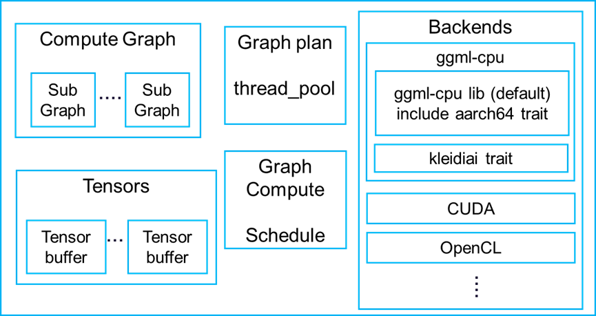
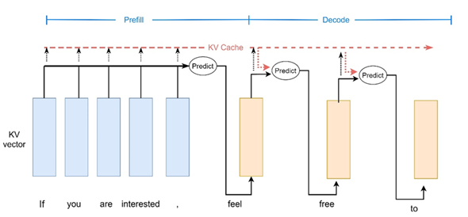

# Introduction to llama.cpp
llama.cpp is an LLM framework implemented in C++ that can be used for both training and inference. This article only covers inference on the CPU.
Llama-cli does work as below,
* Load and interpret large language models in .gguf format.
* Build a compute graph according to the model structure. The compute graph can be divided into subgraphs suitable for different backends, and the subgraphs are assigned to the most suitable backend devices. This step converts the model structure into a compute graph with many tensor nodes and operators (such as ADD, MAT_MUL, NORM, SOFTMAX) that can be actually computed. 
Since this article only focuses on running LLM on the CPU, all backends are set to CPU. 
* Allocate memory for the tensors nodes in the compute graph by the graph planner.
* Compute tensor nodes in the graph compute stage, where the ‘graph_compute’ function forwards the compute subgraphs to the backend devices. Then, it schedules the computation of the subgraph. The compute graph is a tree of nodes. The computation is performed by traversing the nodes in the graph.

The steps above are wrapped in the function ‘llama_decode’. At LLM Prefill and Decode stage, llama-cli calls ‘llama_decode’ repeatedly to generate tokens. However, the parameter ‘llama_batch’ passed to ‘llama_decode' is different at Prefill and Decode stage. ‘llama_batch’ includes information such as input tokens, number of input tokens, the position of input tokens etc.

The components of llama.cpp include

llama.cpp supports various backends such as CPU, GPU, CUDA, OpenCL etc. 
For the CPU backend, it provides an optimized ggml-cpu library (mainly utilizing CPU vector instructions). For Arm CPUs, the ggml-cpu library also offers an aarch64 trait that can leverage the new I8MM instructions for acceleration. The ggml-cpu library also integrates the Arm KleidiAI library as an additional trait.

Most of autoregressive LLMs are Decoder-only model. Let us have a brief introduction to Prefill and Decode stage of autoregressive LLMs.

At the Prefill stage, multiple input tokens of the prompt are processed. It mainly performs GEMM (A matrix is multiplied by another matrix) operations to generate the first output token. 

At the Decode stage, by utilizing the KV cache, it mainly performs GEMV (A vector is multiplied by a matrix) operations to generate subsequent output tokens one by one.

Therefore, the prefill stage is compute-bound, while the decode stage has relatively less computation and is more memory-bound due to KV cache memory access. This can also be seen in the subsequent analysis with Streamline.