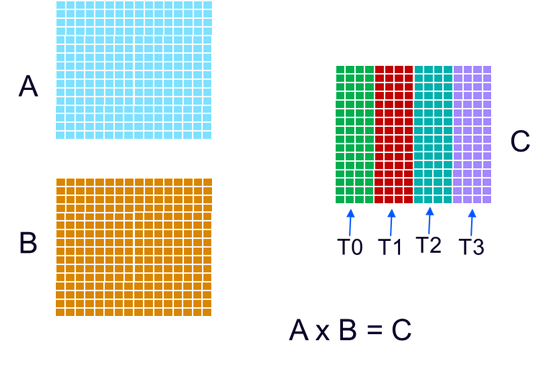
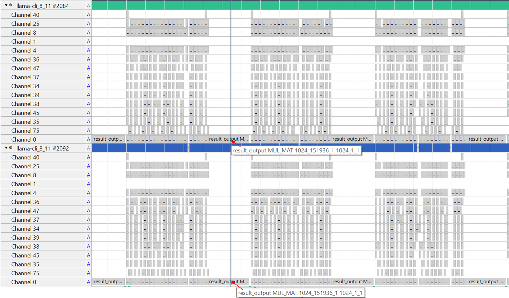

# Use Streamline to analyze multi-core/multi-thread support in llama.cpp
The CPU backend in llama.cpp utilizes multi-core/multi-thread to accelerate the computation of operators.
llama.cpp creates a threadpool. The number of threads in threadpool is decided by ‘-t’  option, if ‘-t’ option is not specified, then it is set as the number of CPU cores in the system by default. 
The entrypoint of secondary thread is ggml_graph_compute_secondary_thread.
When computing one tensor node/operator in the compute graph, if the worksize is big, llama.cpp splits its computation into multiple parts for those threads. 
Here is an example of MUL_MAT operator to demonstrate how the splitting is done. 



In this example, the result matrix C is split equally between four threads, each thread computes a quarter of matrix C.
The execution of multi-threads on CPU cores can be observed by Streamline. Core Map and Cluster Map modes in the Streamline Timeline view map threads to CPU cores. 

More information about Core Map and Cluster Map modes can be found here
https://developer.arm.com/documentation/101816/9-7/Analyze-your-capture/Viewing-application-activity/Core-Map-and-Cluster-Map-modes 

Run llama-cli with ‘-t 2 -C 0x3’ to specify two threads and thread affinity as CPU core0 and core1, 
```bash
./llama-cli -m qwen1_5-0_5b-chat-q4_0.gguf -p "<|im_start|>system\nYou are a helpful AI assistant.<|im_end|>\n<|im_start|>user\nTell me a story about a fox and a crow? Please do not tell the traditional story in Aesop's fables. Please tell me a positive story about friendship and love. The story should have no more than 400 words<|im_end|>\n<|im_start|>assistant\n" -st -t 2 -C 0x3
```

Collect profiling data with Streamline, then select Core Map and Cluster Map modes in the Streamline Timeline view.


As shown in the screenshot above, two threads are created and running on CPU core0 and core1 respectively.
Furthermore, individual operator view with annotation channel can be used to view two threads’ operators in parallel. 
Note that annotation channels are created independently per-thread.



As shown in screenshot above, at the specific time, both threads are computing for the same node. In this example, it is result_output linear node.