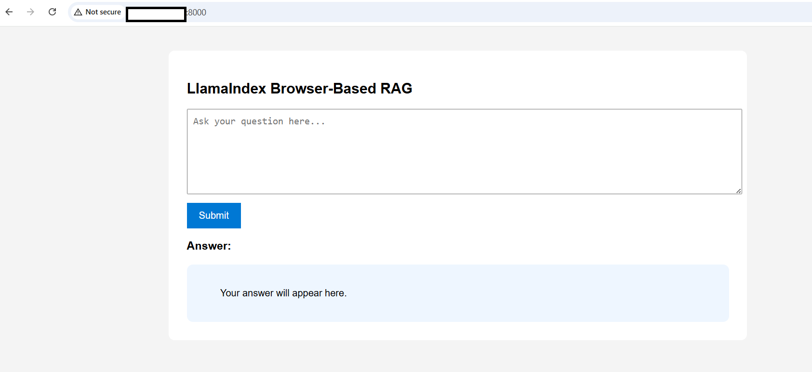
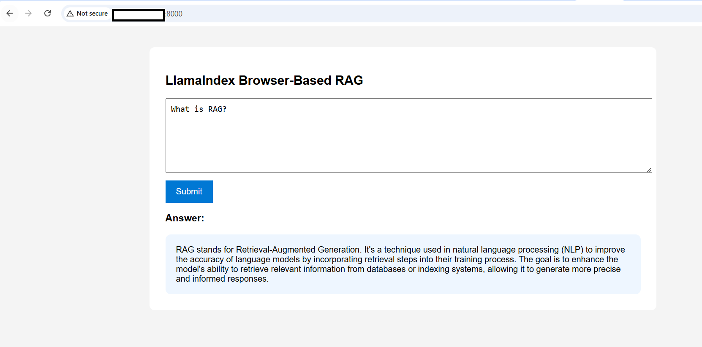
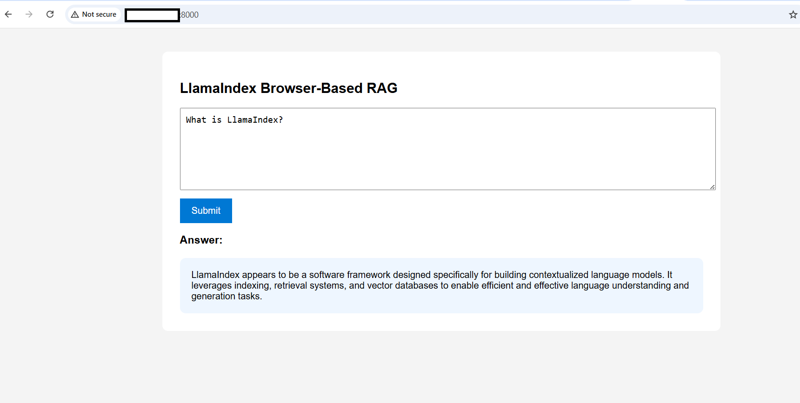
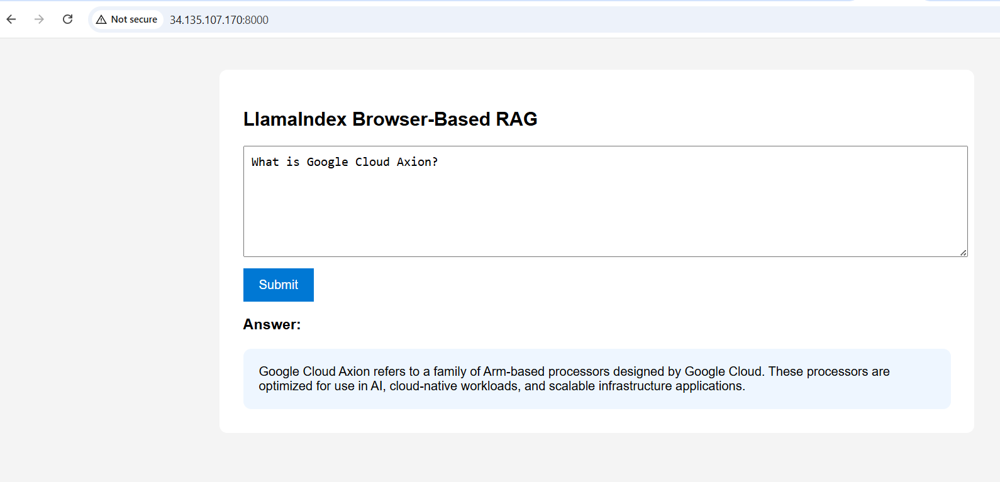

## Build a browser-based RAG application 

In this section, you'll build and test a browser-based Retrieval-Augmented Generation (RAG) application using LlamaIndex.

You'll:

- Create sample documents
- Build a LlamaIndex RAG engine
- Store embeddings in ChromaDB
- Create a browser UI
- Create a FastAPI backend
- Query documents directly from a web browser

### Application architecture

The following flow shows how the application components interact. A request from the browser reaches FastAPI, which calls LlamaIndex to retrieve relevant chunks from ChromaDB and passes them to the Ollama local LLM for answer generation:

```text
Browser UI
    ↓
FastAPI
    ↓
LlamaIndex
    ↓
ChromaDB vector store
    ↓
Ollama local LLM
    ↓
Documents
```

### Activate the Python environment

Activate the Python virtual environment:

```bash
cd ~/llamaindex-rag
source rag-env/bin/activate
```

### Create sample documents

Create the first document:

```bash
cat > data/arm_cloud.txt <<'EOF'
Google Cloud Axion is a family of Arm-based processors optimized for AI, cloud-native workloads, and scalable infrastructure.
EOF
```

Create the second document:

```bash
cat > data/rag.txt <<'EOF'
Retrieval-Augmented Generation combines vector search and large language models to generate grounded responses from custom data.
EOF
```

Create the third document:

```bash
cat > data/llamaindex.txt <<'EOF'
LlamaIndex is a framework for building context-aware LLM applications using indexing, retrieval, query engines, and vector databases.
EOF
```

### Create the RAG engine

Create the main LlamaIndex application:

```bash
cat > rag_app.py <<'EOF'
import chromadb

from llama_index.core import (
    VectorStoreIndex,
    SimpleDirectoryReader,
    StorageContext,
    Settings
)

from llama_index.core.node_parser import SentenceSplitter
from llama_index.llms.ollama import Ollama
from llama_index.embeddings.huggingface import HuggingFaceEmbedding
from llama_index.vector_stores.chroma import ChromaVectorStore


DATA_DIR = "./data"
CHROMA_DIR = "./chroma_db"
COLLECTION_NAME = "llamaindex_demo"


def build_query_engine():

    llm = Ollama(
        model="llama3.2:1b",
        request_timeout=120.0
    )

    embed_model = HuggingFaceEmbedding(
        model_name="BAAI/bge-small-en-v1.5"
    )

    Settings.llm = llm
    Settings.embed_model = embed_model

    Settings.node_parser = SentenceSplitter(
        chunk_size=512,
        chunk_overlap=50
    )

    documents = SimpleDirectoryReader(
        DATA_DIR
    ).load_data()

    chroma_client = chromadb.PersistentClient(
        path=CHROMA_DIR
    )

    chroma_collection = chroma_client.get_or_create_collection(
        COLLECTION_NAME
    )

    vector_store = ChromaVectorStore(
        chroma_collection=chroma_collection
    )

    storage_context = StorageContext.from_defaults(
        vector_store=vector_store
    )

    index = VectorStoreIndex.from_documents(
        documents,
        storage_context=storage_context
    )

    query_engine = index.as_query_engine(
        similarity_top_k=3,
        response_mode="compact"
    )

    return query_engine
EOF
```

### Create browser UI

Create a browser-based interface for asking questions:

```bash
cat > index.html <<'EOF'
<!DOCTYPE html>
<html>
<head>
    <title>LlamaIndex Browser RAG</title>

    <style>
        body {
            font-family: Arial;
            background: #f4f4f4;
            margin: 40px;
        }

        .container {
            max-width: 900px;
            margin: auto;
            background: white;
            padding: 30px;
            border-radius: 10px;
        }

        textarea {
            width: 100%;
            height: 120px;
            padding: 10px;
            font-size: 16px;
        }

        button {
            margin-top: 10px;
            padding: 12px 20px;
            background: #0078d4;
            color: white;
            border: none;
            cursor: pointer;
            font-size: 16px;
        }

        #answer {
            margin-top: 20px;
            padding: 20px;
            background: #eef6ff;
            border-radius: 10px;
            white-space: pre-wrap;
        }
    </style>
</head>

<body>

<div class="container">

    <h2>LlamaIndex Browser-Based RAG</h2>

    <textarea
        id="question"
        placeholder="Ask your question here..."
    ></textarea>

    <br>

    <button onclick="askQuestion()">
        Submit
    </button>

    <h3>Answer:</h3>

    <div id="answer">
        Your answer will appear here.
    </div>

</div>

<script>

async function askQuestion() {

    const question =
        document.getElementById("question").value;

    const answerBox =
        document.getElementById("answer");

    answerBox.innerText =
        "Generating answer...";

    const response = await fetch("/query", {

        method: "POST",

        headers: {
            "Content-Type": "application/json"
        },

        body: JSON.stringify({
            question: question
        })
    });

    const data = await response.json();

    answerBox.innerText =
        data.answer;
}

</script>

</body>
</html>
EOF
```

### Create FastAPI backend

Create the FastAPI backend application:

```bash
cat > api.py <<'EOF'
from fastapi import FastAPI
from fastapi.responses import FileResponse
from pydantic import BaseModel

from rag_app import build_query_engine


app = FastAPI(
    title="LlamaIndex Browser RAG"
)

query_engine = build_query_engine()


class QueryRequest(BaseModel):
    question: str


@app.get("/")
def home():
    return FileResponse("index.html")


@app.post("/query")
def query_rag(request: QueryRequest):

    response = query_engine.query(
        request.question
    )

    return {
        "question": request.question,
        "answer": str(response)
    }
EOF
```

## Start the browser-based RAG application

Verify that Ollama is still running before starting the application:

```bash
sudo systemctl status ollama
```

Activate the virtual environment and navigate to the project directory:

```bash
cd ~/llamaindex-rag
source rag-env/bin/activate
```

Start FastAPI:

```bash
uvicorn api:app --host 0.0.0.0 --port 8000
```

The output is similar to:

```output
INFO:     Started server process [18452]
INFO:     Waiting for application startup.
INFO:     Application startup complete.
INFO:     Uvicorn running on http://0.0.0.0:8000
```
Keep the terminal open for testing the application. 

## Test the browser-based RAG application

After starting the application, test it by opening the UI and asking a few questions. 

### Open browser application UI

Open a browser and navigate to:

```text
http://<VM-EXTERNAL-IP>:8000
```

This opens the browser-based RAG application UI.



### Test browser-based Q&A

Ask the following questions in the browser UI:

```text
What is RAG?
```



```text
What is LlamaIndex?
```



```text
What is Google Cloud Axion?
```



The answers will appear directly in the browser interface.

## (Optional) Add your own documents

After confirming that the application works, you can try adding your own documents.

Copy your own files into the data directory. For example:

```bash
cp yourfile.txt ~/llamaindex-rag/data/
```

Stop the running FastAPI server by pressing `Ctrl + C` in the terminal where Uvicorn is running. Then restart it:

```bash
uvicorn api:app --host 0.0.0.0 --port 8000
```

The `build_query_engine()` function runs on startup and reads all documents from the `data/` directory each time the server starts. Restarting the server causes LlamaIndex to ingest the new file, generate its embeddings, and store them in ChromaDB, making the new document searchable through the browser UI.

## What you've accomplished

You've now built a browser-based RAG application using LlamaIndex on an Arm-based Google Cloud C4A VM. You created sample documents, generated embeddings using Hugging Face models, stored vectors in ChromaDB, exposed the backend using FastAPI, and queried custom documents directly from a browser using Ollama.

You can extend this workflow for your own LlamaIndex RAG applications on Arm-based cloud infrastructure. 
