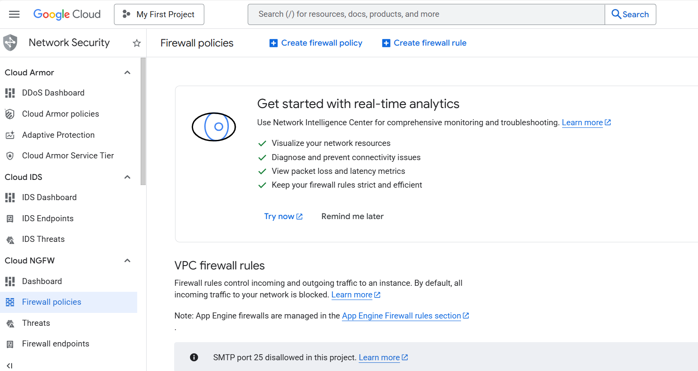
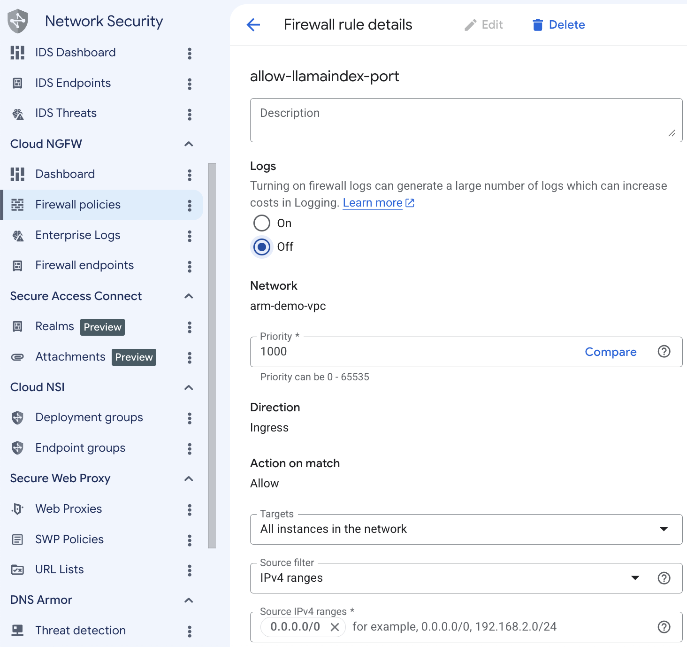
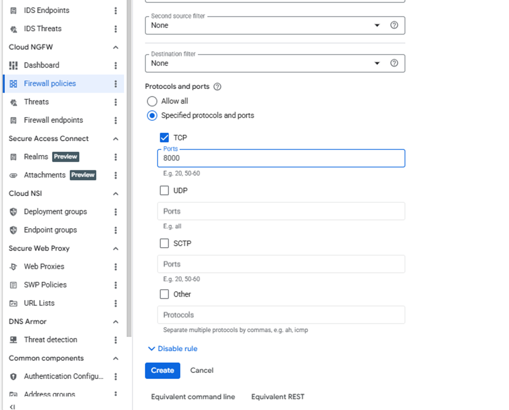

## Allow inbound access to the LlamaIndex browser application

Create a firewall rule in Google Cloud Console to expose the required port for the browser-based LlamaIndex RAG application.

## Configure the firewall rule in Google Cloud Console

To configure a firewall rule for the LlamaIndex browser-based RAG application:

1. Navigate to the [Google Cloud Console](https://console.cloud.google.com/), go to **VPC Network > Firewall**, and select **Create firewall rule**.



2. Create a firewall rule that exposes the port required for the LlamaIndex browser application.

3. Set **Name** to `allow-llamaindex-port`, then select the network you want to bind to your virtual machine.

4. Set **Direction of traffic** to **Ingress**, set **Action on match** to **Allow**, set **Targets** to **All instances in the network**, and set **Source IPv4 ranges** to **0.0.0.0/0**.



5. Under **Protocols and ports**, select **Specified protocols and ports**.

6. Select the **TCP** checkbox. Port **8000** is used by the FastAPI server that backs the browser-based LlamaIndex RAG application. Enter:

```text
8000
```



7. In the same **TCP** field, also add port `22` to allow SSH access to the VM.

8. Select **Create**.

## What you've accomplished and what's next

You've created a firewall rule that exposes port 8000 for the browser-based LlamaIndex RAG application and port 22 for SSH. The firewall rule uses the network tag `allow-llamaindex-port`, which you'll attach to your virtual machine in the next step.

Next, you'll create a Google Cloud Axion C4A virtual machine and connect to it using SSH.
