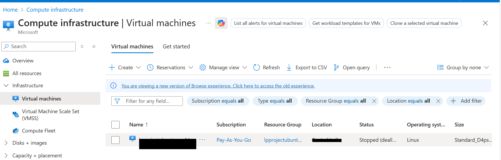

## Configure external traffic for Longhorn and Kubernetes

To allow external traffic for the Longhorn web UI and Kubernetes services on an Azure virtual machine, open the required ports in the Network Security Group (NSG). The NSG can be attached to the virtual machine's network interface or subnet.

{}For more information about Azure setup, see [Getting started with Microsoft Azure Platform](/learning-paths/servers-and-cloud-computing/csp/azure/).{}

### Add inbound firewall rules in Azure

To expose the required TCP ports for Kubernetes and Longhorn, create an inbound firewall rule:

1. Navigate to the [Azure portal](https://portal.azure.com), go to **Virtual Machines**, and select your virtual machine.

2. In the left menu, select **Networking**, then select **Network settings**.

3. Navigate to **Create port rule**, and select **Inbound port rule**.

4. Configure the inbound security rule with the following settings:

- **Source:** My IP address  
- **Source IP addresses:** *(auto-populated with your current public IP)*  
- **Source port ranges:** *  
- **Destination:** Any  
- **Destination port ranges:** `80`,`8080`,`6443`
- **Protocol:** TCP  
- **Action:** Allow  
- **Name:** `allow-longhorn-kubernetes`

This rule allows external access for port `80` for HTTP workloads, port `8080` for the Longhorn web UI, and port `6443` for the Kubernetes API server.

{}Setting **Source** to **My IP address** restricts access to these ports to your current machine only. If your public IP address changes or you access the environment from another system, update the source IP in the NSG rule accordingly.{}

5. After filling in the details, select **Add** to save the rule.

## What you've learned and what's next

You've now configured the Azure Network Security Group to allow external traffic for Kubernetes API access, HTTP workloads, and the Longhorn Web UI. These firewall rules allow secure remote management of the Arm64 Azure VM powered by Azure Cobalt 100 and external access to the Kubernetes storage dashboard.

Next, you'll install K3s Kubernetes and Longhorn on the virtual machine.
