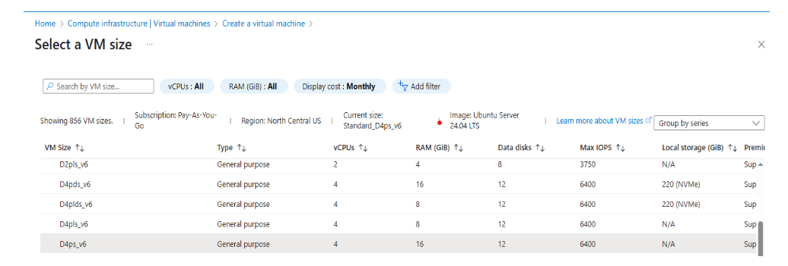

## Set up an Azure virtual machine

In this section, you'll use the Azure portal to create a virtual machine (VM) with the Arm-based Azure Cobalt 100 processor.

The steps in this Learning Path focus on general-purpose virtual machines in the Dpsv6 series. For more information, see the [Microsoft Azure guide for the Dpsv6 size series](https://learn.microsoft.com/en-us/azure/virtual-machines/sizes/general-purpose/dpsv6-series).

While the steps to create this instance are included here for convenience, you can also see the [Deploy an Arm-based virtual machine on Azure with Cobalt 100 Learning Path](/learning-paths/servers-and-cloud-computing/cobalt/).

### Use the Azure portal to create an Arm-based virtual machine 

To create an Azure virtual machine using the Azure portal:

1. Launch the Azure portal and navigate to **Virtual Machines**.
2. Select **Create**, and select **Virtual Machine** from the drop-down list.
3. In the **Basic** tab, fill in the instance details such as **Virtual machine name** and **Region**. Choose a region that supports D4ps_v6 VMs.
4. Select **Ubuntu Pro 24.04 LTS** as the image for your virtual machine, and select **Arm64** as the VM architecture.
5. In the **Size** field, select **See all sizes** and select the D-Series v6 family of VMs.
6. Select **D4ps_v6** from the list as shown in the diagram below:

7. For **Authentication type**, select **SSH public key**.

{}
Azure generates an SSH key pair for you and lets you save it for future use. This method is fast, secure, and easy for connecting to your virtual machine.
{}

8. Fill in the **Administrator username** for your VM.
9. Select **Generate new key pair**, and select **RSA SSH Format** as the SSH Key Type.

{}
RSA offers better security with keys longer than 3072 bits.
{}

10. Give your SSH key a key pair name.
11. In the **Inbound port rules**, select **HTTP (80)** and **SSH (22)** as the inbound ports, as shown in the following image:

12. Select the **Review + Create** tab and review the configuration for your virtual machine. It should look like the following:

13. When you're happy with your selection, select the **Create** button and then **Download Private key and Create Resource**.

Your virtual machine should be ready and running in a few minutes. You can SSH into the virtual machine using the private key, along with the public IP details.

{}To learn more about Arm-based virtual machines in Azure, see "Getting Started with Microsoft Azure" in [Get started with Arm-based cloud instances](/learning-paths/servers-and-cloud-computing/csp/azure/).{}

## What you've accomplished and what's next

You've now created an Arm64 Azure VM powered by Azure Cobalt 100 running Ubuntu 24.04 LTS with SSH and HTTP access configured. You'll use this VM to install Longhorn and manage persistent volumes on Kubernetes.

Next, you'll open the additional ports required for Kubernetes and Longhorn access in the Azure Network Security Group.
