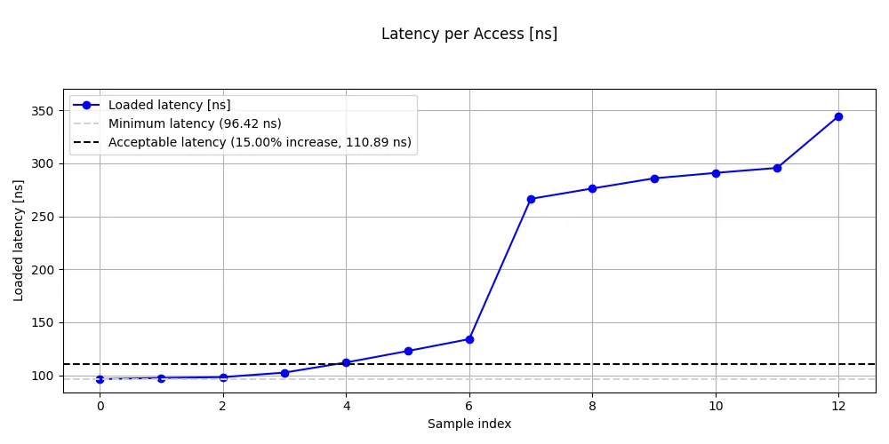
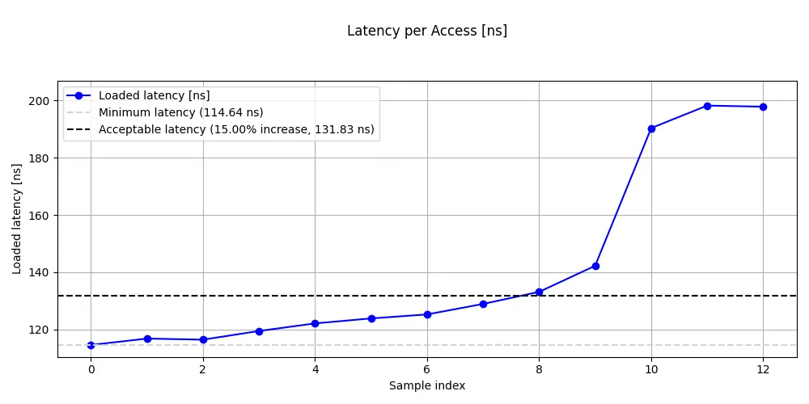

## Why multi-core bandwidth matters

A single core rarely saturates the shared resources in a modern Arm system. The L3 cache, memory controllers, and interconnect fabric are designed to serve many cores simultaneously. Multi-core bandwidth testing reveals how these shared resources scale, or saturate, as more cores become active.

## Measure multi-core bandwidth and loaded latency with ASCT

ASCT includes two benchmarks that characterize multi-core memory behavior:

- `peak-bandwidth` uses all cores on all NUMA nodes to measure the maximum achievable memory bandwidth under multiple traffic patterns.
- `loaded-latency` measures how memory latency degrades as other cores generate increasing bandwidth pressure.

Both benchmarks depend on `latency-sweep` to determine the optimal data size for targeting DRAM. ASCT runs it automatically as a dependency.

## Measure peak system memory bandwidth

The `peak-bandwidth` benchmark makes full use of all cores to measure the maximum system bandwidth. It tests multiple traffic patterns to show how the mix of reads and writes affects peak throughput.

```bash
sudo asct run peak-bandwidth  --output-dir peakbw_results_$(hostname)
```

The Graviton2 output:

```output
Peak memory bandwidth
---------------------
    Traffic type  Peak BW [GB/s]
       All Reads           169.6
3:1 Reads-Writes           160.9
2:1 Reads-Writes           157.3
1:1 Reads-Writes           151.7
```

The Graviton4 output:

```output
Peak memory bandwidth
---------------------
            Traffic type  Peak BW [GB/s]
               All Reads           465.5
        3:1 Reads-Writes           434.7
        2:1 Reads-Writes           430.1
        1:1 Reads-Writes           410.4
2:1 Rd-Wr (Non-Temporal)           402.2
```

### Interpret the peak bandwidth results

Several patterns emerge from the traffic type comparison:

- **All Reads** gives the highest throughput because reads are simpler for the memory controller, with no write-back or write-allocate overhead.
- **Read-write mixes** reduce throughput progressively as the write ratio increases. Writes require the controller to alternate between read and write bus turnarounds, and in write-allocate caches, writes typically trigger a read-for-ownership and eventual eviction, increasing traffic. Non-temporal writes can avoid this overhead.

Graviton4 with DDR5 delivers roughly 2.7x the peak all-reads bandwidth of Graviton2 with DDR4 (465.5 vs 169.6 GB/s). The Graviton4 output also includes a non-temporal traffic pattern (2:1 Rd-Wr Non-Temporal), which can reduce cache allocation, cache pollution, and coherence overhead for streaming writes.

Compare the "All Reads" figure with the theoretical peak bandwidth reported by `asct system-info` to see how close each system gets to its maximum. Well-configured systems typically achieve 85-95% of theoretical peak with all-read traffic.

## Measure memory latency under bandwidth load

The `loaded-latency` benchmark measures how memory latency changes as other cores generate increasing bandwidth pressure. It pins a latency-measuring thread on the last core of the first NUMA node and uses the remaining cores to generate background memory traffic. The traffic intensity is controlled by interleaving memory reads with different numbers of no-operation (NOP) instructions. More NOPs means less bandwidth pressure.

{}
The `loaded-latency` benchmark takes several minutes to complete because it runs multiple measurement phases at different traffic levels.
{}

Run the command on both system and save the output to a specific directory:

```bash
sudo asct run loaded-latency --output-dir loaded_latency_results_$(hostname)
```

The Graviton2 output:

```output
Loaded latency with background memory activity
----------------------------------------------
 Injected NOPs  Loaded latency [ns]  Bandwidth [GB/s]
          3000                 96.4               2.6
           900                 97.5               8.8
           500                 98.3              15.4
           180                102.6              46.4
           100                112.1              85.9
            80                122.9             108.8
            70                134.2             125.6
            50                266.5             169.3
            40                276.3             166.4
            30                285.9             165.4
            20                291.0             165.0
            10                295.7             165.5
             0                344.7             168.5
```



The Graviton4 output:

```output
Loaded latency with background memory activity
----------------------------------------------
 Injected NOPs  Loaded latency [ns]  Bandwidth [GB/s]
          3000                114.6               3.7
           900                116.9              12.1
           500                116.5              21.2
           180                119.5              56.5
           100                122.2             106.3
            80                123.9             131.1
            70                125.3             151.4
            50                128.9             204.9
            40                133.2             254.9
            30                142.3             340.6
            20                190.3             444.8
            10                198.2             464.3
             0                197.8             459.6
```



### Interpret the loaded latency results

The loaded latency results reveal the fundamental tradeoff between bandwidth utilization and access latency.

Look for these patterns in your results:

- **At low load (high NOP count)**: latency should be close to the idle DRAM latency from `latency-sweep`. The memory controllers are nearly idle, so each request is serviced immediately.
- **At moderate load**: latency rises gradually. The memory controllers are handling significant traffic but still have headroom.
- **At the knee**: latency jumps sharply. This is the critical transition point where the memory controllers begin to saturate and queuing delays dominate.
- **At saturation (zero NOPs)**: latency climbs steeply. The system is delivering near-peak bandwidth, but each individual access waits in long queues.

The key insight is that the latency-bandwidth curve has a sharp knee. Below the knee, you get most of the bandwidth with modest latency impact. Above it, small bandwidth gains come at enormous latency cost. For latency-sensitive applications, operating below the knee is the practical limit.

On Graviton2, the knee is clearly visible between 70 and 50 injected NOPs, where latency nearly doubles from 134 ns to 267 ns while bandwidth increases from 126 to 169 GB/s. Beyond the knee, bandwidth barely increases while latency continues to climb to 345 ns at zero NOPs.

On Graviton4, the knee appears between 30 and 20 injected NOPs, where latency jumps from 142 ns to 190 ns as bandwidth rises from 341 to 445 GB/s. Notably, Graviton4's latency plateaus around 190-198 ns at the highest loads rather than continuing to climb steeply like Graviton2, suggesting the memory controllers handle saturation more gracefully.

Graviton4 has higher idle DRAM latency than Graviton2 (approximately 115 ns vs 96 ns), which is consistent with the `latency-sweep` results. Despite this higher baseline latency, Graviton4's knee occurs at a much higher absolute bandwidth (around 340 GB/s vs 126 GB/s), giving significantly more headroom for bandwidth-sensitive workloads before latency degrades.

## What you've learned and what's next

In this section you:
- Measured peak system bandwidth across multiple traffic patterns with `peak-bandwidth`
- Measured the latency-bandwidth tradeoff with `loaded-latency`
- Identified the saturation knee where latency begins to climb steeply

The next section combines all the measurements from the previous sections into a comparative analysis across systems.
