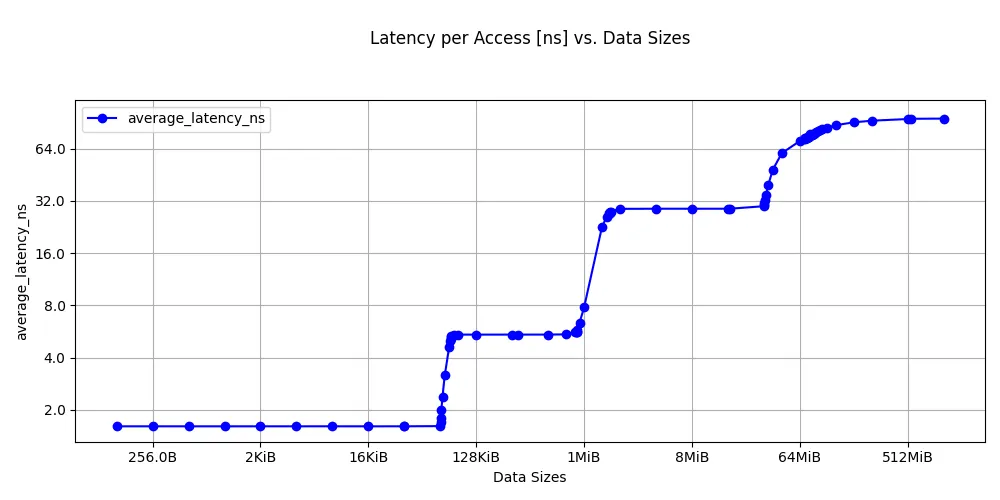
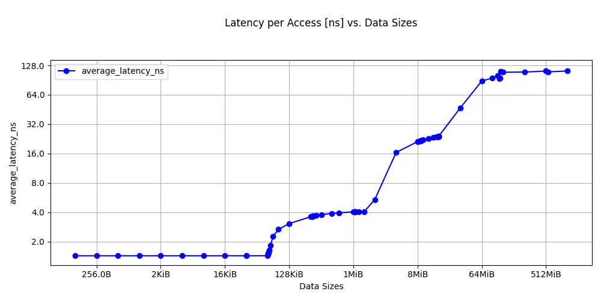

## The pointer-chase technique

Cache and memory latency is the single most important metric for characterizing a memory subsystem. The standard technique is a pointer chase, a linked list where each node points to the next, and the CPU must complete each load before it can issue the next one. Making each load depend on the previous one creates a chain of dependent loads that defeats both hardware prefetching and out-of-order execution, letting you measure the effective dependent-load latency for this access pattern at each level of the memory hierarchy.

## Why pointer chasing works

Hardware prefetchers detect sequential and strided access patterns and fetch data ahead of the CPU. If you write a loop that reads an array sequentially, the prefetcher hides much of the latency. A pointer chase randomizes the order of accesses so the prefetcher can't predict the next address.

Out-of-order execution is the other concern. Modern Arm cores can issue multiple independent loads in parallel, overlapping their latencies. By making each load depend on the result of the previous load (the pointer), you limit memory-level parallelism and prevent the core from overlapping multiple memory accesses. The measured time per access then reflects the true round-trip latency to wherever the data resides.

## Measure cache and memory latency with ASCT

Before running the benchmark, verify that ASCT is installed:

```bash
asct version
```

If ASCT is not installed, follow the [ASCT install guide](/install-guides/asct/) to install it.

The Arm System Characterization Tool (ASCT) includes a `latency-sweep` benchmark that implements a pointer chase. It sweeps data sizes from 128 bytes to 1 GiB, uses randomized linked lists to defeat prefetching, and allocates 1 GiB huge pages to minimize the effect of page table walks on the measurements.

The benchmark automatically identifies cache level boundaries and reports the optimal data size, lower bound, upper bound, and average latency for each level. It also generates a latency-vs-size line graph in the output directory.

ASCT requires `sudo` because it configures huge pages and pins threads to specific cores.

ASCT prints the results to the terminal and saves detailed output (including CSV data and a `latency-sweep.png` plot) in a timestamped directory under the current working directory.

Run the benchmark on both systems and save the output to a specific directory:

```bash
sudo asct run latency-sweep --output-dir latency_results_$(hostname)
```

The output on a Graviton2 instance is shown below:

```output
Latencies at different levels of cache
--------------------------------------
     Lower Bound Upper Bound Optimum Datasize Latency [ns]
L1           128         64K         32.0625K          1.6
L2           64K        512K             288K          5.4
LLC           1M         32M            16.5M         28.8
DRAM         64M          1G             544M         95.0
```

Latency sweep for Graviton2:



The Graviton4 results are below:

```output
Latencies at different levels of cache
--------------------------------------
     Lower Bound Upper Bound Optimum Datasize Latency [ns]
L1           128         64K         32.0625K          1.4
L2          256K          1M             640K          4.0
LLC           8M          8M               8M         21.2
DRAM         64M          1G             544M        110.0
```

Latency sweep for Graviton4:



Your actual numbers will differ. The important pattern is the steps in latency as the working set exceeds each cache level.

## Interpret cache latency measurements

Graviton2 uses Neoverse N1 cores with a 64 KB L1D, 1 MB private L2, and a 32 MB shared L3. DRAM is DDR4.

Graviton4 uses Neoverse V2 cores with a larger 2 MB private L2 and a shared L3. The Neoverse V2 microarchitecture has an improved cache pipeline. DDR5 provides higher bandwidth than DDR4, but its unloaded DRAM latency is slightly higher, which is reflected in the measured results.

The boundaries where latency changes correspond closely to the cache sizes you discovered in the previous section. This is the cross-validation that makes the analysis credible: latency transitions align with known hardware boundaries.

On heterogeneous systems, like the DGX Spark with a mix of Cortex-A725 and Cortex-X925 cores, different core types have different cycle counts and clock speeds, producing visibly different latency numbers at each level.

### Compare results across systems

ASCT includes a `diff` command that compares output directories from different runs. After running the latency sweep on both instances, copy the output directories to the same machine and run:

```bash
asct diff latency_results_c6g/ latency_results_c8g/
```

This produces a side-by-side comparison with percentage differences for each measurement. It also shows system differences, which may be useful when comparing performance.

## Additional ASCT latency benchmarks

The `latency-sweep` benchmark is the direct replacement for a custom pointer chase, but ASCT includes additional latency benchmarks that provide complementary information:

| Benchmark | Command | What it measures |
|-----------|---------|-----------------|
| Latency sweep | `sudo asct run latency-sweep` | Cache and DRAM latency across data sizes |
| Idle latency | `sudo asct run idle-latency` | NUMA node-to-node latency matrix on an idle system |
| Loaded latency | `sudo asct run loaded-latency` | Memory latency under increasing bandwidth pressure |
| Core-to-core latency | `sudo asct run c2c-latency` | Cache line transfer latency between core pairs |

To run all memory latency benchmarks at once:

```bash
sudo asct run latency
```

You can view the full list of available benchmarks and their keywords with:

```bash
asct list
```

## What you've accomplished and what's next

In this section you:
- Ran the ASCT `latency-sweep` benchmark to measure pointer-chase latency across the full cache hierarchy and DRAM
- Observed latency steps corresponding to L1, L2, L3/SLC, and DRAM on both systems
- Cross-validated the cache boundaries against `sysfs` data

The next section measures streaming bandwidth at each level of the hierarchy, showing how many bytes per second the datapath can sustain. This is a complementary dimension to the latency you just measured.
