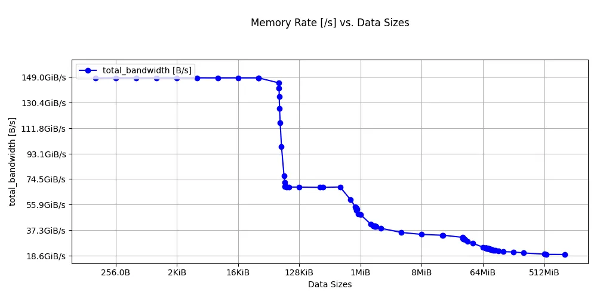
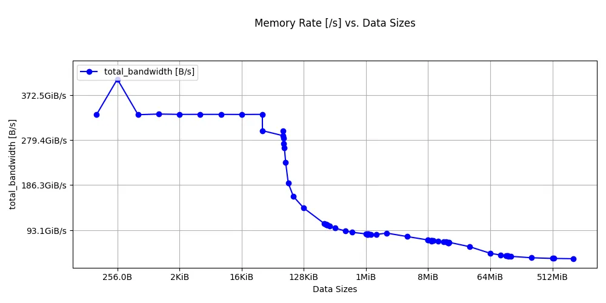

## Why measure bandwidth?

Latency tells you how long one access takes. Bandwidth tells you how many bytes per second the datapath can sustain when the CPU issues many independent accesses. High latency can be tolerable if the core can keep enough requests in flight to saturate the available bandwidth. Measuring both gives you a complete picture of each cache level's capability.

## Measure single-core bandwidth with ASCT

The ASCT `bandwidth-sweep` benchmark measures the average memory bandwidth achieved by a single core at each level of the memory hierarchy (L1, L2, LLC, and DRAM). It sweeps data sizes automatically and reports the bandwidth at each cache level. It also generates a bandwidth-vs-size plot (`bandwidth.png`) in the output directory.

The `bandwidth-sweep` benchmark depends on `latency-sweep` to determine the optimal data size for each cache level. If you haven't already run `latency-sweep`, ASCT runs it automatically as a dependency.

Run the bandwidth sweep on each system and save the results:

```bash
sudo asct run bandwidth-sweep --output-dir bandwidth_results_$(hostname)
```

The output on a Graviton2 instance is shown below:

```output
Bandwidth at different levels of cache
--------------------------------------
Datasize Used Level Bandwidth [GB/s]
     32.0625K    L1            159.4
         288K    L2             73.4
        16.5M   LLC             35.9
         544M  DRAM             20.9
```



The Graviton4 results are below:

```output
Bandwidth at different levels of cache
--------------------------------------
Datasize Used Level Bandwidth [GB/s]
     32.0625K    L1            321.0
         640K    L2             95.1
           8M   LLC             78.0
         544M  DRAM             37.0
```



Look at the stepping pattern: high bandwidth for L1, a lower plateau for L2, a further drop at the LLC, and then the DRAM floor.

## Interpret the results

The `bandwidth-sweep` benchmark reports the bandwidth at the optimal data size for each cache level, using the boundaries that `latency-sweep` identified.

Key differences to look for between Graviton2 and Graviton4:

- **L1 bandwidth**: Graviton4 shows roughly 2x the L1 bandwidth of Graviton2. This likely reflects multiple microarchitecture improvements in Neoverse V2.
- **L2 bandwidth**: Neoverse V2's larger 2 MB L2 keeps more data in the fast private cache, and microarchitecture improvements on Neoverse V2 also increase L2 fill bandwidth.
- **LLC bandwidth**: Graviton4 more than doubles the LLC bandwidth of Graviton2, reflecting improvements in the interconnect and shared cache design on Neoverse V2.
- **DRAM bandwidth (single core)**: Graviton4 achieves higher single-core DRAM throughput because Neoverse V2 supports more outstanding memory requests than Neoverse N1, and DDR5 provides more bandwidth per channel than DDR4.

### Bytes per cycle

To convert GB/s to bytes per cycle, use your core's clock speed:

$$\text{Bytes/cycle} = \frac{\text{GB/s} \times 10^9}{\text{Clock (Hz)}}$$

This normalization lets you compare microarchitectural efficiency independent of clock speed. The benchmark measures combined load and store throughput, so the results reflect both the core's execution throughput and the details of the benchmark's access pattern rather than a simple read-only port limit.

## Additional ASCT bandwidth benchmarks

The `bandwidth-sweep` measures single-core bandwidth at each cache level. ASCT includes additional bandwidth benchmarks for multi-core and system-level measurements:

| Benchmark | Command | What it measures |
|-----------|---------|-----------------|
| Bandwidth sweep | `sudo asct run bandwidth-sweep` | Single-core bandwidth at each cache level |
| Peak bandwidth | `sudo asct run peak-bandwidth` | Maximum system bandwidth using all cores, with multiple traffic patterns (all reads, read-write mixes, non-temporal) |
| Cross-NUMA bandwidth | `sudo asct run cross-numa-bandwidth` | Aggregate bandwidth per NUMA node, local and remote |

To run all bandwidth benchmarks at once:

```bash
sudo asct run bandwidth
```

## What you've accomplished and what's next

In this section you:
- Ran the ASCT `bandwidth-sweep` benchmark to measure single-core streaming bandwidth at each cache level
- Observed bandwidth plateaus corresponding to L1, L2, LLC, and DRAM
- Learned about additional ASCT benchmarks for peak and cross-NUMA bandwidth

The next section extends this to multi-core bandwidth, showing how shared resources like L3 and DRAM behave under contention.
