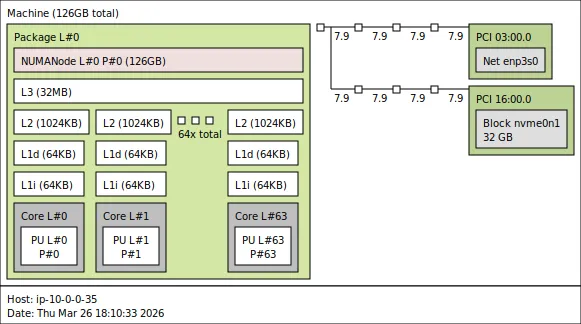
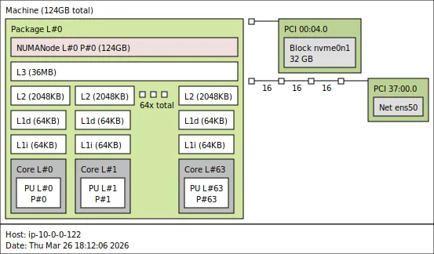

## Identify CPU, cache, and NUMA topology

Before you can characterize a memory subsystem, you need to understand how the system is organized. The number of cores, how they are grouped into clusters, the DRAM type, and the operating system all influence memory behavior. Knowing this topology helps interpret benchmark results.

This Learning Path uses two example AWS Graviton instances:

- AWS Graviton2, `c6g.metal`, instance with Arm Neoverse N1 cores.
- AWS Graviton4, `c8g.16xlarge`, instance with Arm Neoverse V2 cores.

Both systems run Ubuntu 24.04 with 64 CPUs, 128 GB RAM, and 32 GB of storage.

These are just examples, and you can follow the same steps on any Arm Linux system.

## Collect basic system information

Start by recording the kernel version and operating system. Run the following command on your system:

```bash
uname -a && cat /etc/os-release
```

Both systems have the same software:

```output
Linux ip-10-0-0-35 6.17.0-1007-aws #7~24.04.1-Ubuntu SMP Thu Jan 22 20:37:30 UTC 2026 aarch64 aarch64 aarch64 GNU/Linux
PRETTY_NAME="Ubuntu 24.04.4 LTS"
NAME="Ubuntu"
VERSION_ID="24.04"
VERSION="24.04.4 LTS (Noble Numbat)"
VERSION_CODENAME=noble
ID=ubuntu
ID_LIKE=debian
HOME_URL="https://www.ubuntu.com/"
SUPPORT_URL="https://help.ubuntu.com/"
BUG_REPORT_URL="https://bugs.launchpad.net/ubuntu/"
PRIVACY_POLICY_URL="https://www.ubuntu.com/legal/terms-and-policies/privacy-policy"
UBUNTU_CODENAME=noble
LOGO=ubuntu-logo
```

Print the CPU information:

```bash
lscpu
```

Pay close attention to the `lscpu` output — it gives you the CPU model, the number of cores, threads per core, sockets, and NUMA node configuration. Here is an example from a Graviton2 instance:

```output
Architecture:                aarch64
  CPU op-mode(s):            32-bit, 64-bit
  Byte Order:                Little Endian
CPU(s):                      64
  On-line CPU(s) list:       0-63
Vendor ID:                   ARM
  Model name:                Neoverse-N1
    Model:                   1
    Thread(s) per core:      1
    Core(s) per socket:      64
    Socket(s):               1
    Stepping:                r3p1
    BogoMIPS:                243.75
    Flags:                   fp asimd evtstrm aes pmull sha1 sha2 crc32 atomics fphp asimdhp cpuid asimdrdm lrcpc dcpop asimdd
                             p
Caches (sum of all):
  L1d:                       4 MiB (64 instances)
  L1i:                       4 MiB (64 instances)
  L2:                        64 MiB (64 instances)
  L3:                        32 MiB (1 instance)
NUMA:
  NUMA node(s):              1
  NUMA node0 CPU(s):         0-63
```

On the Graviton4 instance, you see Neoverse-V2 cores instead:

```output
Architecture:                aarch64
  CPU op-mode(s):            64-bit
  Byte Order:                Little Endian
CPU(s):                      64
  On-line CPU(s) list:       0-63
Vendor ID:                   ARM
  Model name:                Neoverse-V2
    Model:                   1
    Thread(s) per core:      1
    Core(s) per socket:      64
    Socket(s):               1
    Stepping:                r0p1
    BogoMIPS:                2000.00
    Flags:                   fp asimd evtstrm aes pmull sha1 sha2 crc32 atomics fphp asimdhp cpuid asimdrdm jscvt fcma lrcpc d
                             cpop sha3 asimddp sha512 sve asimdfhm dit uscat ilrcpc flagm sb paca pacg dcpodp sve2 sveaes svep
                             mull svebitperm svesha3 flagm2 frint svei8mm svebf16 i8mm bf16 dgh rng bti
Caches (sum of all):
  L1d:                       4 MiB (64 instances)
  L1i:                       4 MiB (64 instances)
  L2:                        128 MiB (64 instances)
  L3:                        36 MiB (1 instance)
NUMA:
  NUMA node(s):              1
  NUMA node0 CPU(s):         0-63
```

The two systems span two generations of Arm Neoverse server cores. Graviton2 uses Neoverse N1 cores with private 1 MB L2 caches per core and a 32 MB shared L3. Graviton4 uses Neoverse V2 cores with 2 MB private L2 caches per core and a 36 MB shared L3. These differences in cache sizes and memory technology directly impact the memory latency, bandwidth, and scaling behavior you observe in later benchmarks.

## Check DRAM configuration

On AWS Graviton instances, `dmidecode` is unavailable because the hypervisor does not expose SMBIOS memory data to guests. You can confirm the memory size with `free -h`:

```bash
free -h
```

Both systems have 128 GB RAM with similar output:

```output
.              total        used        free      shared  buff/cache   available
Mem:           125Gi       1.8Gi       124Gi       2.4Mi       686Mi       123Gi
```

Graviton2 instances use DDR4 memory. Graviton4 instances use DDR5 memory, which provides higher bandwidth per channel and lower access latency.

Both systems have a single NUMA node, meaning all cores have uniform access to all memory. On multi-socket Arm servers with multiple NUMA nodes, memory access latency depends on which node the data resides on. The ASCT `idle-latency` and `cross-numa-bandwidth` benchmarks are designed for those systems but won't produce interesting results on single-node configurations like these.

## Explore the core and cluster topology

Arm systems often organize cores into clusters that share a last-level cache. Understanding cluster boundaries is critical because latency and bandwidth behavior change when you cross them.

Use the extended `lscpu` output to see per-core details:

```bash
lscpu -e
```

The output is the same for both systems:

```output
CPU NODE SOCKET CORE L1d:L1i:L2:L3 ONLINE
  0    0      0    0 0:0:0:0          yes
  1    0      0    1 1:1:1:0          yes
  2    0      0    2 2:2:2:0          yes
  3    0      0    3 3:3:3:0          yes
  4    0      0    4 4:4:4:0          yes
  5    0      0    5 5:5:5:0          yes
  6    0      0    6 6:6:6:0          yes
  7    0      0    7 7:7:7:0          yes
  8    0      0    8 8:8:8:0          yes
  9    0      0    9 9:9:9:0          yes
 10    0      0   10 10:10:10:0       yes
 11    0      0   11 11:11:11:0       yes
 12    0      0   12 12:12:12:0       yes
 13    0      0   13 13:13:13:0       yes
 14    0      0   14 14:14:14:0       yes
 15    0      0   15 15:15:15:0       yes
 16    0      0   16 16:16:16:0       yes
 17    0      0   17 17:17:17:0       yes
 18    0      0   18 18:18:18:0       yes
 19    0      0   19 19:19:19:0       yes
 20    0      0   20 20:20:20:0       yes
 21    0      0   21 21:21:21:0       yes
 22    0      0   22 22:22:22:0       yes
 23    0      0   23 23:23:23:0       yes
 24    0      0   24 24:24:24:0       yes
 25    0      0   25 25:25:25:0       yes
 26    0      0   26 26:26:26:0       yes
 27    0      0   27 27:27:27:0       yes
 28    0      0   28 28:28:28:0       yes
 29    0      0   29 29:29:29:0       yes
 30    0      0   30 30:30:30:0       yes
 31    0      0   31 31:31:31:0       yes
 32    0      0   32 32:32:32:0       yes
 33    0      0   33 33:33:33:0       yes
 34    0      0   34 34:34:34:0       yes
 35    0      0   35 35:35:35:0       yes
 36    0      0   36 36:36:36:0       yes
 37    0      0   37 37:37:37:0       yes
 38    0      0   38 38:38:38:0       yes
 39    0      0   39 39:39:39:0       yes
 40    0      0   40 40:40:40:0       yes
 41    0      0   41 41:41:41:0       yes
 42    0      0   42 42:42:42:0       yes
 43    0      0   43 43:43:43:0       yes
 44    0      0   44 44:44:44:0       yes
 45    0      0   45 45:45:45:0       yes
 46    0      0   46 46:46:46:0       yes
 47    0      0   47 47:47:47:0       yes
 48    0      0   48 48:48:48:0       yes
 49    0      0   49 49:49:49:0       yes
 50    0      0   50 50:50:50:0       yes
 51    0      0   51 51:51:51:0       yes
 52    0      0   52 52:52:52:0       yes
 53    0      0   53 53:53:53:0       yes
 54    0      0   54 54:54:54:0       yes
 55    0      0   55 55:55:55:0       yes
 56    0      0   56 56:56:56:0       yes
 57    0      0   57 57:57:57:0       yes
 58    0      0   58 58:58:58:0       yes
 59    0      0   59 59:59:59:0       yes
 60    0      0   60 60:60:60:0       yes
 61    0      0   61 61:61:61:0       yes
 62    0      0   62 62:62:62:0       yes
 63    0      0   63 63:63:63:0       yes
```

On both systems, every core has its own unique L1d, L1i, and L2 index, so those caches are private. The L3 index is `0` for all cores, confirming that all 64 cores share a single L3 cache on each system.

### Visualize the topology with hwloc

The `hwloc` package provides a more visual representation. Install it and run:

```bash
sudo apt-get install -y hwloc
```

To generate a graphical representation of the hierarchy, run:

```bash
hwloc-ls --of png > topology.png
```

Here is the `hwloc` output from a Graviton2 c6g instance:



Here is the `hwloc` output from a Graviton4 c8g instance:



The diagrams show the full cache hierarchy at a glance: each core has its own private L1d, L1i, and L2 caches. On Graviton4, all cores share a single L3. On systems with more cores or multiple sockets, the tree branches further, making `hwloc` especially useful for spotting cluster and NUMA boundaries.

### Enumerate caches from sysfs

For detailed cache information, read the kernel's `sysfs` entries directly.

Save the following script to a file named `cache.sh`:

```bash
for c in /sys/devices/system/cpu/cpu0/cache/index*; do
  echo "=== $(basename $c) ==="
  echo "Level: $(cat $c/level)"
  echo "Type:  $(cat $c/type)"
  echo "Size:  $(cat $c/size)"
  echo "Shared CPU list: $(cat $c/shared_cpu_list)"
  echo
done
```

Run the script on each instance:

```bash
bash ./cache.sh
```

On Graviton2 the output is:

```output
=== index0 ===
Level: 1
Type:  Data
Size:  64K
Shared CPU list: 0

=== index1 ===
Level: 1
Type:  Instruction
Size:  64K
Shared CPU list: 0

=== index2 ===
Level: 2
Type:  Unified
Size:  1024K
Shared CPU list: 0

=== index3 ===
Level: 3
Type:  Unified
Size:  32768K
Shared CPU list: 0-63
```

On Graviton4 the output is:

```output
=== index0 ===
Level: 1
Type:  Data
Size:  64K
Shared CPU list: 0

=== index1 ===
Level: 1
Type:  Instruction
Size:  64K
Shared CPU list: 0

=== index2 ===
Level: 2
Type:  Unified
Size:  2048K
Shared CPU list: 0

=== index3 ===
Level: 3
Type:  Unified
Size:  36864K
Shared CPU list: 0-63
```

Both systems have an `index3` entry showing a shared L3 cache. On Graviton2, the 32 MB L3 is shared across all 64 cores. On Graviton4, the 36 MB L3 is shared across all 64 cores. The `shared_cpu_list` of `0-63` confirms this.

Run the same commands on both instances and compare the differences in cache levels, sizes, and sharing patterns.

## Record your system profile

Below is a summary of each system. You'll reference this throughout the Learning Path:

| Property | Graviton2 | Graviton4 |
|----------|-----------|-----------|
| CPU model | Neoverse N1 | Neoverse V2 |
| Core count | 64 | 64 |
| L1D / L1I | 64 KB / 64 KB | 64 KB / 64 KB |
| L2 (private) | 1 MB | 2 MB |
| L3 (shared) | 32 MB | 36 MB |
| DRAM type | DDR4 | DDR5 |

## What you've accomplished and what's next

In this section you:
- Identified the CPU model, core count, and NUMA topology of your test systems
- Explored the cache hierarchy and cluster layout using `lscpu`, `hwloc`, and `sysfs`
- Built a reference table of system properties for later comparison

The next section dives deeper into the cache hierarchy and explains what each level does and why the architectural choices matter for performance.
